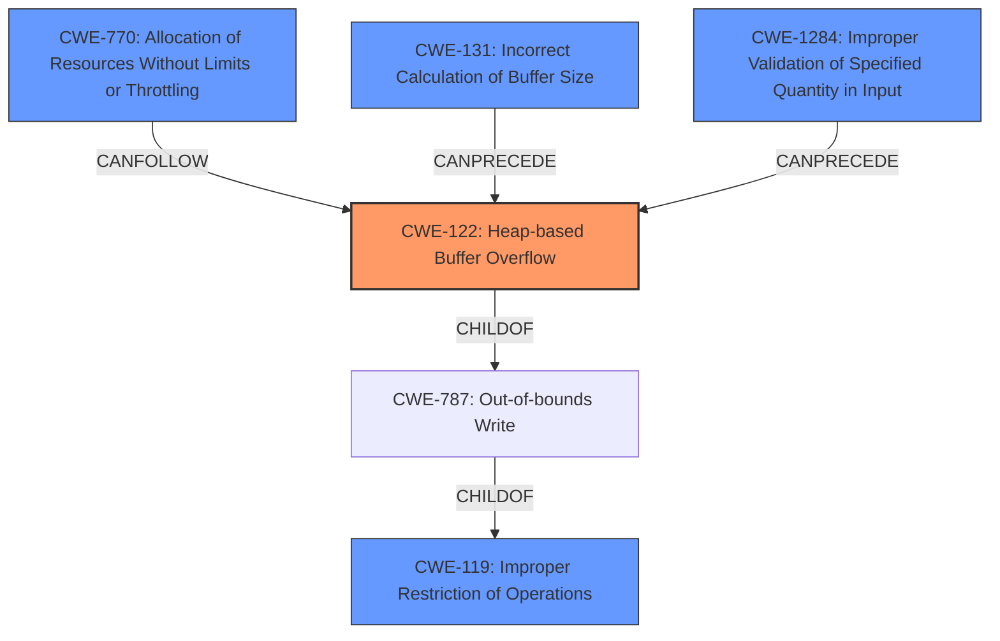

# Enhanced Analysis for CVE-2021-22335

# Summary
| CWE ID  | CWE Name                                                | Confidence | CWE Abstraction Level | CWE Vulnerability Mapping Label | CWE-Vulnerability Mapping Notes |
| :-------- | :------------------------------------------------------ | :--------- | :---------------------- | :------------------------------ | :------------------------------ |
| CWE-122   | Heap-based Buffer Overflow                            | 0.85       | Variant               | Allowed                       | Primary CWE                   |
| CWE-119   | Improper Restriction of Operations within the Bounds of a Memory Buffer | 0.75      | Class               | Allowed-with-Review                       | Secondary Candidate                     |
| CWE-770   | Allocation of Resources Without Limits or Throttling     | 0.65       | Base                  | Allowed                       | Secondary Candidate                     |

## Evidence and Confidence

*   **Confidence Score:** 0.80
*   **Evidence Strength:** MEDIUM

## Relationship Analysis
The primary weakness is a heap-based buffer overflow (CWE-122), a variant of the more general buffer overflow (CWE-787), which is a child of "Improper Restriction of Operations within the Bounds of a Memory Buffer" (CWE-119). Allocation of Resources Without Limits or Throttling (CWE-770) can lead to memory exhaustion. The vulnerability may be triggered by an improper calculation of buffer size (CWE-131) or improper validation of input quantity (CWE-1284).



## Vulnerability Chain
The vulnerability chain starts with a potential improper input validation or **incorrect calculation of buffer size** which leads to a **heap-based buffer overflow**, ultimately causing exceptions in image processing.

## Summary of Analysis
The primary weakness is a **heap overflow vulnerability** that results in **exceptions in image processing**. This aligns with CWE-122 (Heap-based Buffer Overflow). The description indicates an improper memory buffer operation limit, and the CVE reference link confirms a heap overflow.

The analysis is based on the provided evidence from the vulnerability description and CVE reference links content summary:
*   **Vulnerability Description Key Phrases:** **Memory Buffer Improper Operation Limit**
*   **CVE Reference Links Content Summary:** **Root cause of vulnerability:** Heap overflow vulnerability, **Weaknesses/vulnerabilities present:** Heap overflow, **Impact of exploitation:** Successful exploitation may cause exceptions in image processing.

CWE-122 is a variant of CWE-787 (Out-of-bounds Write), which is a child of CWE-119 (Improper Restriction of Operations within the Bounds of a Memory Buffer). CWE-122 is more specific and accurately describes the vulnerability.

CWE-770 (Allocation of Resources Without Limits or Throttling) and CWE-131 (Incorrect Calculation of Buffer Size) were also considered, as memory allocation issues can lead to buffer overflows. However, CWE-122 is the most direct representation of the **heap overflow** vulnerability.
CWE-1284 (Improper Validation of Specified Quantity in Input) was considered but the evidence doesn't show what the root cause is, but it could be part of the root cause.

The selected CWEs are at the optimal level of specificity. CWE-122 (Heap-based Buffer Overflow) is a variant-level CWE that accurately reflects the vulnerability.


## CWE Relationship Analysis

Current CWEs represent these abstraction levels: .


### Vulnerability Chain Analysis

**Chain starting from CWE-787:**
- 787 (Out-of-bounds Write) - ROOT


**Chain starting from CWE-122:**
- 122 (Heap-based Buffer Overflow) - ROOT


### CWE Relationship Diagram

```mermaid
graph TD
    classDef primary fill:#f96,stroke:#333,stroke-width:2px
    classDef secondary fill:#69f,stroke:#333
    classDef tertiary fill:#9e9,stroke:#333
```