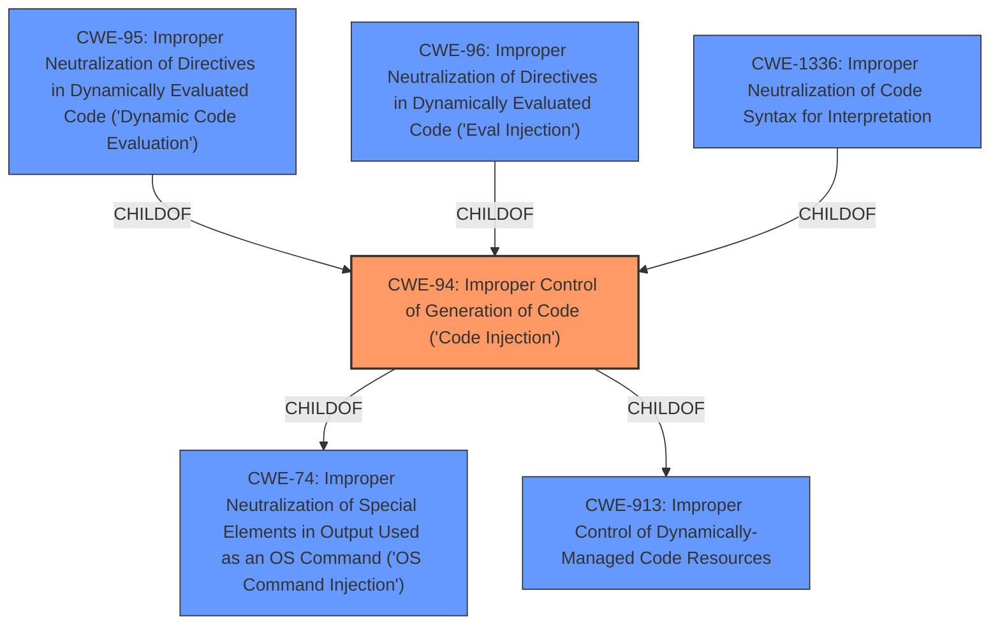

# Enhanced Analysis for CVE-2021-22336

# Summary
| CWE ID | CWE Name | Confidence | CWE Abstraction Level | CWE Vulnerability Mapping Label | CWE-Vulnerability Mapping Notes |
|---|---|---|---|---|---|
| CWE-94 | Improper Control of Generation of Code ('Code Injection') | 1 | Base | Allowed-with-Review | Primary CWE |

## Evidence and Confidence

*   **Confidence Score:** 1
*   **Evidence Strength:** HIGH

## Relationship Analysis
The primary relationship influencing the decision is the direct match of the vulnerability description's root cause to CWE-94. While CWE-94 is a base level CWE, the more specific child CWEs (CWE-95, CWE-96, and CWE-1336) don't fit the description provided.



## Vulnerability Chain
The chain of weaknesses is straightforward:
1.  **Root Cause:** **Improper Control of Generation of Code (CWE-94)**
2.  **Impact:** Denial of security services.

## Summary of Analysis
The primary CWE selected, CWE-94, is based on the explicit statement in the vulnerability description: "There is an **Improper Control of Generation of Code** vulnerability in Huawei Smartphone."

The "Vulnerability Description Key Phrases" section reinforces this by identifying the root cause as "**Improper Control of Generation of Code**".

The "CVE Reference Links Content Summary" states that the bulletin states a "DoS vulnerability".

The retriever results lists CWE-94 as the top result.

CWE-94, while a base level CWE, is the most accurate and specific representation of the vulnerability described. The MITRE mapping guidance marks it as "Allowed-with-Review" and notes that it is frequently misused for vulnerabilities with a technical impact of "code execution," but the description clearly states the weakness involves the generation of code and not just the resulting code execution.

Other CWEs Considered and Rejected:

*   CWE-248 (Uncaught Exception): While this could potentially lead to a denial of service, it's not the stated root cause.
*   CWE-20 (Improper Input Validation): This is a higher-level class and not specific enough. The problem is not just about validating input but about how the input is used to generate code.
*   CWE-131 (Incorrect Calculation of Buffer Size): This is related to buffer overflows, which are not mentioned in the vulnerability description.
*   CWE-284 (Improper Access Control): This is a very high-level pillar and does not fit the specifics of the vulnerability.
*   CWE-926 (Improper Export of Android Application Components): This is specific to Android application components and not clearly related to the described vulnerability.
*   CWE-73 (External Control of File Name or Path): This is related to file path manipulation, which is not mentioned in the vulnerability description.
*   CWE-125 (Out-of-bounds Read): This is related to reading memory outside of allocated buffers and is not mentioned in the vulnerability description.
*   CWE-15 (External Control of System or Configuration Setting): This is not about system settings, but about code generation.
*   CWE-456 (Missing Initialization of a Variable): This is not about variable initialization, but about code generation.

Relevant CWE Information:

# Enhanced Context (25 CWEs)
The following CWEs were identified as potentially relevant to this vulnerability:

## CWE-94: Improper Control of Generation of Code ('Code Injection')
**Abstraction Level**: Base
**Similarity Score**: 0.215
**Source**: sparse

**Description**:
The product constructs all or part of a code segment using externally-influenced input from an upstream component, but it does not neutralize or incorrectly neutralizes special elements that could modify the syntax or behavior of the intended code segment.

## Technical Explanation for CWE-94:

The vulnerability description explicitly states that there is an **Improper Control of Generation of Code**. This aligns directly with the definition of CWE-94, which focuses on scenarios where a product constructs a code segment using externally-influenced input without proper neutralization of special elements.

## Security Implications and Potential Impact:

The successful exploitation of this vulnerability may cause denial of security services on a rooted device. This can disrupt the normal operation of the Huawei Smartphone, potentially leading to data loss, service unavailability, or other security-related issues.

## Parent-Child Relationships and Chain Patterns:

CWE-94 is a child of CWE-74 (Improper Neutralization of Special Elements in Output Used as an OS Command ('OS Command Injection')) and CWE-913 (Improper Control of Dynamically-Managed Code Resources). While these relationships provide context, CWE-94 is the most specific and accurate representation of the vulnerability.

## Primary or Secondary Weakness:

CWE-94 is the primary weakness, as it is the root cause of the vulnerability.

## MITRE Mapping Guidance:

The MITRE mapping guidance for CWE-94 is "Allowed-with-Review," with a note that it is frequently misused for vulnerabilities with a technical impact of "code execution." In this case, the vulnerability description explicitly mentions "Improper Control of Generation of Code," making CWE-94 the most appropriate choice.


## CWE Relationship Analysis

Current CWEs represent these abstraction levels: .


### Vulnerability Chain Analysis

**Chain starting from CWE-248:**
- 248 (Uncaught Exception) - ROOT


**Chain starting from CWE-1336:**
- 1336 (Improper Neutralization of Special Elements Used in a Template Engine) - ROOT


### CWE Relationship Diagram

```mermaid
graph TD
    classDef primary fill:#f96,stroke:#333,stroke-width:2px
    classDef secondary fill:#69f,stroke:#333
    classDef tertiary fill:#9e9,stroke:#333
```