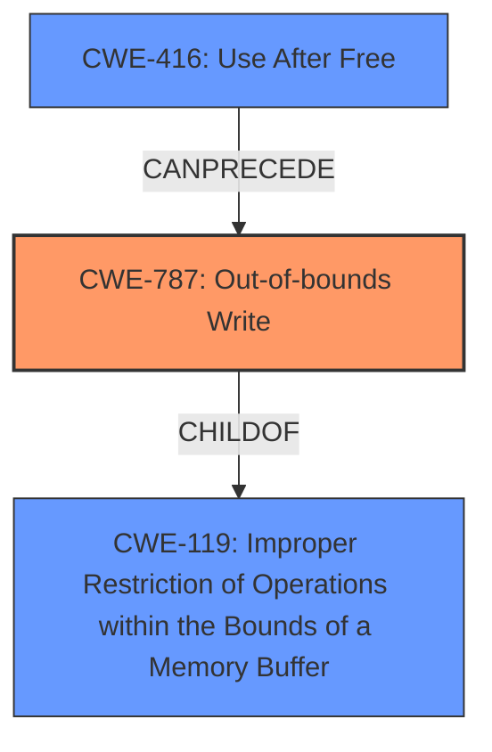

# Enhanced Analysis for CVE-2021-22348

# Summary
| CWE ID | CWE Name | Confidence | CWE Abstraction Level | CWE Vulnerability Mapping Label | CWE-Vulnerability Mapping Notes |
|---|---|---|---|---|---|
| CWE-787 | Out-of-bounds Write | 0.9 | Base | Allowed | Primary CWE |
| CWE-416 | Use After Free | 0.8 | Base | Allowed | Secondary CWE |
| CWE-119 | Improper Restriction of Operations within the Bounds of a Memory Buffer | 0.6 | Class | Discouraged | Secondary CWE |

## Evidence and Confidence

*   **Confidence Score:** 0.8
*   **Evidence Strength:** MEDIUM

## Relationship Analysis
The primary CWE is CWE-787 (**Out-of-bounds Write**). CWE-119 (**Improper Restriction of Operations within the Bounds of a Memory Buffer**) is a parent of CWE-787, but the vulnerability description implies more than just a general memory safety issue, making CWE-787 a more specific and appropriate choice. A secondary issue, implied from the CVE Reference Links Content Summary, is a Use-After-Free condition (CWE-416), which can precede an out-of-bounds write.



## Vulnerability Chain
The vulnerability chain starts with a **Use-After-Free** condition (CWE-416) which leads to an **Out-of-bounds Write** (CWE-787). This chain results in potential code execution, as described in the vulnerability description.

## Summary of Analysis
The initial vulnerability description points to a **Memory Buffer Improper Operation**. The "CWE for similar CVE Descriptions" suggests CWE-NVD-noinfo, CWE-20 (**Improper Input Validation**), and CWE-787 (**Out-of-bounds Write**). The CVE Reference Links Content Summary provides a more specific root cause: a **Use-After-Free (UAF) vulnerability** that can lead to arbitrary code execution.

Based on the evidence:

*   The description mentions "**Memory Buffer Improper Operation**" which is too vague for direct mapping.
*   The CVE Reference Links Content Summary explicitly states a **Use-After-Free** condition and potential for arbitrary code execution.
*   The retriever results suggest multiple CWEs, including CWE-131 (**Incorrect Calculation of Buffer Size**), CWE-119 (**Improper Restriction of Operations within the Bounds of a Memory Buffer**), CWE-190 (**Integer Overflow or Wraparound**), and CWE-125 (**Out-of-bounds Read**).
*   The CVE Reference Links Content Summary suggests "Use-After-Free (UAF) vulnerability".
*   The **Top CWEs** suggests that CWE-787 (**Out-of-bounds Write**) is a possible match for similar vulnerabilities.

Given the more specific information in the CVE Reference Links Content Summary and considering the "Top CWEs", the primary CWE is CWE-787 (**Out-of-bounds Write**), which directly relates to the potential memory corruption, with a secondary CWE of CWE-416 (**Use After Free**).

CWE-119 (**Improper Restriction of Operations within the Bounds of a Memory Buffer**) is considered, but it is a more general class of weakness. While technically correct, CWE-787 provides a more precise characterization of the vulnerability. The usage notes for CWE-119 discourage its use when more specific CWEs are available.

The final selection prioritizes specificity based on the available evidence, particularly the root cause information in the CVE Reference Links Content Summary. The confidence is high because the root cause has been identified as a memory corruption issue.

Relevant CWE Information:

# Enhanced Context (25 CWEs)
The following CWEs were identified as potentially relevant to this vulnerability:

## CWE-1289: Improper Validation of Unsafe Equivalence in Input
**Abstraction Level**: Base
**Similarity Score**: 0.80
**Source**: dense

**Description**:
The product receives an input value that is used as a resource identifier or other type of reference, but it does not validate or incorrectly validates that the input is equivalent to a potentially-unsafe value.

**Mapping Guidance**:
- Usage: Allowed
- Rationale: This CWE entry is at the Base level of abstraction, which is a preferred level of abstraction for mapping to the root causes of vulnerabilities.

## CWE-1288: Improper Validation of Consistency within Input
**Abstraction Level**: Base
**Similarity Score**: 0.78
**Source**: dense

**Description**:
The product receives a complex input with multiple elements or fields that must be consistent with each other, but it does not validate or incorrectly validates that the input is actually consistent.

**Mapping Guidance**:
- Usage: Allowed
- Rationale: This CWE entry is at the Base level of abstraction, which is a preferred level of abstraction for mapping to the root causes of vulnerabilities.

## CWE-606: Unchecked Input for Loop Condition
**Abstraction Level**: Base
**Similarity Score**: 0.76
**Source**: dense

**Description**:
The product does not properly check inputs that are used for loop conditions, potentially leading to a denial of service or other consequences because of excessive looping.

**Mapping Guidance**:
- Usage: Allowed
- Rationale: This CWE entry is at the Base level of abstraction, which is a preferred level of abstraction for mapping to the root causes of vulnerabilities.

## CWE-179: Incorrect Behavior Order: Early Validation
**Abstraction Level**: Base
**Similarity Score**: 0.76
**Source**: dense

**Description**:
The product validates input before applying protection mechanisms that modify the input, which could allow an attacker to bypass the validation via dangerous inputs that only arise after the modification.

**Mapping Guidance**:
- Usage: Allowed
- Rationale: This CWE entry is at the Base level of abstraction, which is a preferred level of abstraction for mapping to the root causes of vulnerabilities.

## CWE-183: Permissive List of Allowed Inputs
**Abstraction Level**: Base
**Similarity Score**: 0.76
**Source**: dense

**Description**:
The product implements a protection mechanism that relies on a list of inputs (or properties of inputs) that are explicitly allowed by policy because the inputs are assumed to be safe, but the list is too permissive - that is, it allows an input that is unsafe, leading to resultant weaknesses.

**Mapping Guidance**:
- Usage: Allowed
- Rationale: This CWE entry is at the Base level of abstraction, which is a preferred level of abstraction for mapping to the root causes of vulnerabilities.

## CWE-807: Reliance on Untrusted Inputs in a Security Decision
**Abstraction Level**: Base
**Similarity Score**: 0.75
**Source**: dense

**Description**:
The product uses a protection mechanism that relies on the existence or values of an input, but the input can be modified by an untrusted actor in a way that bypasses the protection mechanism.

**Mapping Guidance**:
- Usage: Allowed
- Rationale: This CWE entry is at the Base level of abstraction, which is a preferred level of abstraction for mapping to the root causes of vulnerabilities.

## CWE-131: Incorrect Calculation of Buffer Size
**Abstraction Level**: Base
**Similarity Score**: 0.75
**Source**: dense

**Description**:
The product does not correctly calculate the size to be used when allocating a buffer, which could lead to a buffer overflow.

**Mapping Guidance**:
- Usage: Allowed
- Rationale: This CWE entry is at the Base level of abstraction, which is a preferred level of abstraction for mapping to the root causes of vulnerabilities.

## CWE-115: Misinterpretation of Input
**Abstraction Level**: Base
**Similarity Score**: 0.75
**Source**: dense

**Description**:
The product misinterprets an input, whether from an attacker or another product, in a security-relevant fashion.

**Mapping Guidance**:
- Usage: Allowed
- Rationale: This CWE entry is at the Base level of abstraction, which is a preferred level of abstraction for mapping to the root causes of vulnerabilities.

## CWE-1173: Improper Use of Validation Framework
**Abstraction Level**: Base
**Similarity Score**: 0.75
**Source**: dense

**Description**:
The product does not use, or incorrectly uses, an input validation framework that is provided by the source language or an independent library.

**Mapping Guidance**:
- Usage: Allowed
- Rationale: This CWE entry is at the Base level of abstraction, which is a preferred level of abstraction for


## CWE Relationship Analysis

Current CWEs represent these abstraction levels: .


### Vulnerability Chain Analysis

**Chain starting from CWE-787:**
- 787 (Out-of-bounds Write) - ROOT


**Chain starting from CWE-416:**
- 416 (Use After Free) - ROOT


### CWE Relationship Diagram

```mermaid
graph TD
    classDef primary fill:#f96,stroke:#333,stroke-width:2px
    classDef secondary fill:#69f,stroke:#333
    classDef tertiary fill:#9e9,stroke:#333
```