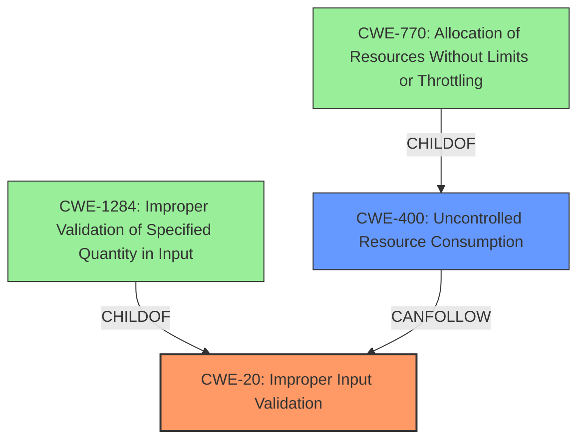

# Enhanced Analysis for CVE-2021-22357

# Summary
| CWE ID | CWE Name | Confidence | CWE Abstraction Level | CWE Vulnerability Mapping Label | CWE-Vulnerability Mapping Notes |
|---|---|---|---|---|---|
| CWE-20 | Improper Input Validation | 0.9 | Class | Primary | Discouraged: Consider lower-level children such as CWE-1284, CWE-1285, CWE-1286, CWE-1287, CWE-1288, or CWE-1289. |
| CWE-400 | Uncontrolled Resource Consumption | 0.7 | Class | Secondary | Discouraged: Closely analyze the specific mistake that is causing resource consumption, and perform a CWE mapping for that mistake. Consider children/descendants such as CWE-770, CWE-771, CWE-410, CWE-772, CWE-834, CWE-405, and others. |

## Evidence and Confidence

*   **Confidence Score:** 0.8
*   **Evidence Strength:** HIGH

## Relationship Analysis
The primary relationship impacting the decision is the hierarchical relationship of CWE-20 **Improper Input Validation** as a parent to more specific input validation flaws. While CWE-20 is a high-level class, the provided information does not give sufficient detail to pinpoint the exact type of **improper input validation**. CWE-400 **Uncontrolled Resource Consumption** is added as a secondary weakness since the impact of the vulnerability is denial of service, which often involves resource exhaustion. However, the root cause is still the **insufficient input validation**.



## Vulnerability Chain
The vulnerability chain starts with the **insufficient input validation** (CWE-20). This leads to a state where specific messages can be sent to the affected module, and due to the lack of proper validation, the module enters a denial-of-service state. This state likely involves some form of **uncontrolled resource consumption** (CWE-400).

## Summary of Analysis
The initial analysis focused on the **insufficient input validation** as the primary root cause, which aligns with the vulnerability description key phrases. The description explicitly states: "**rootcause:** **insufficient input validation**".

The evidence provided in the "CVE Reference Links Content Summary" section reinforces this: "**Root Cause of Vulnerability:** Insufficient input validation when processing specific messages by a module."

While the impact is a denial of service, the root cause is the **improper input validation**. Therefore, CWE-20 **Improper Input Validation** is selected as the primary CWE. However, the mapping guidance discourages the use of CWE-20 because it is a high-level class. While I agree, the information provided is not detailed enough to select a more specific variant.

CWE-400 **Uncontrolled Resource Consumption** is added as a secondary CWE to describe the impact of the **insufficient input validation**.

Relevant CWE Information:

# Enhanced Context (25 CWEs)
The following CWEs were identified as potentially relevant to this vulnerability:

## CWE-1289: Improper Validation of Unsafe Equivalence in Input
**Abstraction Level**: Base
**Similarity Score**: 0.78

This was considered, but there isn't sufficient evidence to suggest the input involves unsafe equivalence.

## CWE-404: Improper Resource Shutdown or Release
**Abstraction Level**: Class
**Similarity Score**: 0.76

This was considered since the impact is DoS, but the **insufficient input validation** is the root cause and a more likely candidate.

## CWE-799: Improper Control of Interaction Frequency
**Abstraction Level**: Class
**Similarity Score**: 0.76

This was considered since the impact is DoS, but the **insufficient input validation** is the root cause and a more likely candidate.

## CWE-807: Reliance on Untrusted Inputs in a Security Decision
**Abstraction Level**: Base
**Similarity Score**: 0.76

This was considered, but there isn't sufficient evidence to suggest that untrusted inputs are used in a security decision.

## CWE-668: Exposure of Resource to Wrong Sphere
**Abstraction Level**: Class
**Similarity Score**: 0.75

This was not chosen as it's a high-level CWE and not specific to the root cause.

## CWE-405: Asymmetric Resource Consumption (Amplification)
**Abstraction Level**: Class
**Similarity Score**: 0.75

This was considered since the impact is DoS, but the **insufficient input validation** is the root cause and a more likely candidate.

## CWE-703: Improper Check or Handling of Exceptional Conditions
**Abstraction Level**: Pillar
**Similarity Score**: 0.75

This was not chosen as it's a high-level CWE and not specific to the root cause.

## CWE-653: Improper Isolation or Compartmentalization
**Abstraction Level**: Class
**Similarity Score**: 0.75

This was not chosen as it's not relevant to the vulnerability.

## CWE-754: Improper Check for Unusual or Exceptional Conditions
**Abstraction Level**: Class
**Similarity Score**: 0.75

This was considered since the impact is DoS, but the **insufficient input validation** is the root cause and a more likely candidate.

## CWE-226: Sensitive Information in Resource Not Removed Before Reuse
**Abstraction Level**: Base
**Similarity Score**: 0.75

This was not chosen as it's not relevant to the vulnerability.

## CWE-770: Allocation of Resources Without Limits or Throttling
**Abstraction Level**: Base
**Similarity Score**: 7406.83

This was considered since the impact is DoS, but the **insufficient input validation** is the root cause and a more likely candidate.

## CWE-1284: Improper Validation of Specified Quantity in Input
**Abstraction Level**: Base
**Similarity Score**: 7370.26

This could be a more specific instance of input validation. However, there is no specific evidence in the description to support this.

## CWE-789: Memory Allocation with Excessive Size Value
**Abstraction Level**: Variant
**Similarity Score**: 7353.32

This could be a more specific instance of resource exhaustion, but there is no specific evidence in the description to support this.

## CWE-190: Integer Overflow or Wraparound
**Abstraction Level**: Base
**Similarity Score**: 7142.51

This was not chosen as it's not relevant to the vulnerability.

## CWE-1333: Inefficient Regular Expression Complexity
**Abstraction Level**: Base
**Similarity Score**: 7083.15

This was not chosen as it's not relevant to the vulnerability.

## CWE-41: Improper Resolution of Path Equivalence
**Abstraction Level**: base
**Similarity Score**: 5.03

This was not chosen as it's not relevant to the vulnerability.

## CWE-22: Improper Limitation of a Pathname to a Restricted Directory ('Path Traversal')
**Abstraction Level**: base
**Similarity Score**: 4.33

This was not chosen as it's not relevant to the vulnerability.

## CWE-770: Allocation of Resources Without Limits or Throttling
**Abstraction Level**: base
**Similarity Score**: 4.33

This was considered since the impact is DoS, but the **insufficient input validation** is the root cause and a more likely candidate.

## CWE-73: External Control of File Name or Path
**Abstraction Level**: base
**Similarity Score**: 4.33

This was not chosen as it's not relevant to the vulnerability.

## CWE-190: Integer Overflow or Wraparound
**Abstraction Level**: base
**Similarity Score**: 4.33

This was not chosen as it's not relevant to the vulnerability.

## CWE-1284: Improper Validation of Specified Quantity in Input
**Abstraction Level**: base
**Similarity Score**: 4.33

This could be a more specific instance of input validation. However, there is no specific evidence in the description to support this.

## CWE-410: Insufficient Resource Pool
**Abstraction Level**: base
**Similarity Score**:


## CWE Relationship Analysis

Current CWEs represent these abstraction levels: .


### Vulnerability Chain Analysis

**Chain starting from CWE-754:**
- 754 (Improper Check for Unusual or Exceptional Conditions) - ROOT


**Chain starting from CWE-404:**
- 404 (Improper Resource Shutdown or Release) - ROOT


### CWE Relationship Diagram

```mermaid
graph TD
    classDef primary fill:#f96,stroke:#333,stroke-width:2px
    classDef secondary fill:#69f,stroke:#333
    classDef tertiary fill:#9e9,stroke:#333
```