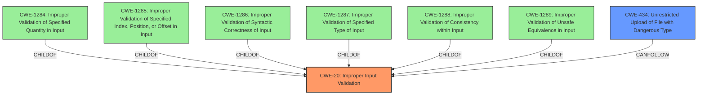

# Analysis Report for CVE-2021-22358

# Vulnerability Analysis Report: CVE-2021-22358

## Description


## Analysis (with Relationship Data)

# Summary
| CWE ID | CWE Name | Confidence | CWE Abstraction Level | CWE Vulnerability Mapping Label | CWE-Vulnerability Mapping Notes |
|---|---|---|---|---|---|
| CWE-20 | Improper Input Validation | 0.9 | Class | Discouraged | See suggested alternatives. |
| CWE-434 | Unrestricted Upload of File with Dangerous Type | 0.7 | Base | Allowed | Secondary candidate because the primary weakness is input validation, leading to the possibility of uploading dangerous file types. |

## Evidence and Confidence

*   **Confidence Score:** 0.8
*   **Evidence Strength:** HIGH

## Relationship Analysis
The primary relationship influencing the CWE selection is the parent-child relationship between CWE-20 and its more specific children. While the description points to **insufficient input validation**, leading to arbitrary file uploads, the direct consequence of this **weakness** is the ability to upload files of dangerous types.



## Vulnerability Chain
The vulnerability chain starts with **insufficient input validation** (CWE-20), which then allows an attacker to upload any files to the device, leading to a potential service abnormality. This can be considered as Unrestricted Upload of File with Dangerous Type (CWE-434).
  - **Root Cause:** Insufficient Input Validation (CWE-20)
  - **Weakness:** Unrestricted Upload of File with Dangerous Type (CWE-434)
  - **Impact:** Service Abnormality

## Summary of Analysis
The initial assessment identified **insufficient input validation** as the primary weakness, which aligns with CWE-20. However, CWE-20 is a Class-level CWE and the MITRE mapping guidance discourages its use, recommending more specific children. Given the vulnerability description explicitly mentions the ability to "upload any files to the device" as a direct result of the **insufficient input validation**, CWE-434 (Unrestricted Upload of File with Dangerous Type) is added as a secondary weakness. This captures the specific risk associated with the **vulnerability**, enhancing the granularity of the classification.

The evidence for this assessment is primarily based on the "Vulnerability Description Key Phrases", which states: "**rootcause:** **insufficient input validation**" and "**impact:** upload any files to the device".

CWE-434 is added as a secondary candidate, to explicitly capture the impact.

Relevant CWE Information:

# Enhanced Context (25 CWEs)

## CWE-20: Improper Input Validation
**Abstraction:** Class
**Status:** Stable

### Description
The product receives input or data, but it does
        not validate or incorrectly validates that the input has the
        properties that are required to process the data safely and
        correctly.

### Extended Description
Input validation is a frequently-used technique for checking potentially dangerous inputs in order to ensure that the inputs are safe for processing within the code, or when communicating with other components. When software does not validate input properly, an attacker is able to craft the input in a form that is not expected by the rest of the application. This will lead to parts of the system receiving unintended input, which may result in altered control flow, arbitrary control of a resource, or arbitrary code execution.

### Mapping Guidance
**Usage:** Discouraged
**Rationale:** CWE-20 is commonly misused in low-information vulnerability reports when lower-level CWEs could be used instead, or when more details about the vulnerability are available [REF-1287]. It is not useful for trend analysis. It is also a level-1 Class (i.e., a child of a Pillar).
**Comments:** Consider lower-level children such as Improper Use of Validation Framework (CWE-1173) or improper validation involving specific types or properties of input such as Specified Quantity (CWE-1284); Specified Index, Position, or Offset (CWE-1285); Syntactic Correctness (CWE-1286); Specified Type (CWE-1287); Consistency within Input (CWE-1288); or Unsafe Equivalence (CWE-1289).
**Reasons:**
- Frequent Misuse
**Suggested Alternatives:**
- CWE-1284: Specified Quantity
- CWE-1285: Specified Index, Position, or Offset
- CWE-1286: Syntactic Correctness
- CWE-1287: Specified Type
- CWE-1288: Consistency within Input
- CWE-1289: Unsafe Equivalence
- CWE-116: Improper Encoding or Escaping of Output


## CWE Relationship Analysis

Current CWEs represent these abstraction levels: .


### Vulnerability Chain Analysis

**Chain starting from CWE-1287:**
- 1287 (Improper Validation of Specified Type of Input) - ROOT


**Chain starting from CWE-1285:**
- 1285 (Improper Validation of Specified Index, Position, or Offset in Input) - ROOT


### CWE Relationship Diagram

```mermaid
graph TD
    classDef primary fill:#f96,stroke:#333,stroke-width:2px
    classDef secondary fill:#69f,stroke:#333
    classDef tertiary fill:#9e9,stroke:#333
```


*Report generated on 2025-04-01 18:21:34*
