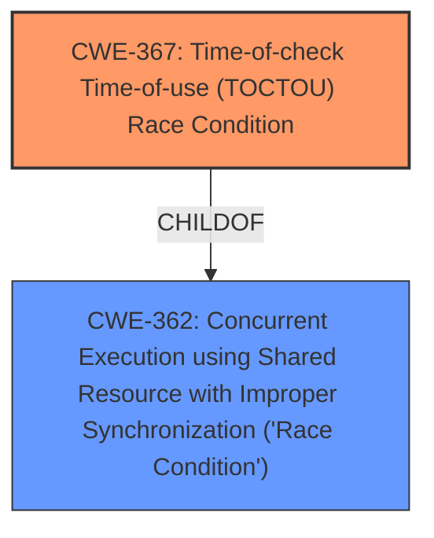

# Raw Analyzer Response for CVE-2021-22369

# Summary
| CWE ID | CWE Name | Confidence | CWE Abstraction Level | CWE Vulnerability Mapping Label | CWE-Vulnerability Mapping Notes |
|---|---|---|---|---|---|
| CWE-367 | Time-of-check Time-of-use (TOCTOU) Race Condition | 1 | Base | Allowed | Primary CWE |
| CWE-362 | Concurrent Execution using Shared Resource with Improper Synchronization ('Race Condition') | 0.7 | Class | Allowed-with-Review | Secondary Candidate |

## Evidence and Confidence

*   **Confidence Score:** 1
*   **Evidence Strength:** HIGH

## Relationship Analysis
The primary CWE is CWE-367, which is a base-level CWE and a child of CWE-362. CWE-362 is a class-level CWE related to concurrent execution with improper synchronization. The relationship suggests that CWE-367 is a specific type of CWE-362.

## Vulnerability Chain
The vulnerability chain starts with a **TOCTOU race condition** (CWE-367) where the state of a resource changes between the check and the use. This can lead to privilege escalation, granting the attacker root user permissions.

## Summary of Analysis
The initial assessment correctly identifies the **TOCTOU race condition** as a primary weakness. This is based on the **Vulnerability Description Key Phrases** that explicitly states "rootcause: **TOCTOU race condition**." The "CVE Reference Links Content Summary" also mentions memory leaks and out-of-bounds access, but the primary identified root cause aligns best with the **TOCTOU race condition**.

The retriever results also support the selection of CWE-367 and CWE-362. CWE-367 is a base-level CWE, and CWE-362 is a class-level CWE. Since CWE-367 is a child of CWE-362, it is more specific and accurately represents the vulnerability.

The graph relationship influenced the decision to choose CWE-367 as the primary CWE, since it is a child of CWE-362 and therefore more specific.

Relevant CWE Information:

# Enhanced Context (25 CWEs)
The following CWEs were identified as potentially relevant to this vulnerability:

## CWE-367: Time-of-check Time-of-use (TOCTOU) Race Condition
**Abstraction Level**: Base
**Similarity Score**: 0.78
**Source**: dense

**Description**:
The product checks the state of a resource before using that resource, but the resource's state can change between the check and the use in a way that invalidates the results of the check. This can cause the product to perform invalid actions when the resource is in an unexpected state.

**Mapping Guidance**:
- Usage: Allowed
- Rationale: This CWE entry is at the Base level of abstraction, which is a preferred level of abstraction for mapping to the root causes of vulnerabilities.

## CWE-362: Concurrent Execution using Shared Resource with Improper Synchronization ('Race Condition')
**Abstraction Level**: Class
**Similarity Score**: 0.76
**Source**: dense

**Description**:
The product contains a concurrent code sequence that requires temporary, exclusive access to a shared resource, but a timing window exists in which the shared resource can be modified by another code sequence operating concurrently.

**Mapping Guidance**:
- Usage: Allowed-with-Review
- Rationale: This CWE entry is a Class and might have Base-level children that would be more appropriate

### CWE Considerations

*   **CWE-367 Time-of-check Time-of-use (TOCTOU) Race Condition**: This is the primary CWE because the "Vulnerability Description" explicitly mentions a **TOCTOU race condition**. The description of CWE-367 perfectly aligns with the vulnerability where the state of a resource is checked but changes before it's used, leading to incorrect actions. The "CVE Reference Links Content Summary" provides further evidence.
*   **CWE-362 Concurrent Execution using Shared Resource with Improper Synchronization ('Race Condition')**: While CWE-367 is more specific, CWE-362 is considered as a secondary candidate because TOCTOU is a type of race condition related to concurrent execution. It represents the broader class of concurrency issues.

### CWEs Not Used and Justification

*   **CWE-364 Signal Handler Race Condition**: This CWE is not selected because the vulnerability description doesn't provide information to suggest that the race condition occurs specifically within a signal handler. The description is more general and doesn't focus on signal handling.
*   **CWE-662 Improper Synchronization**: While synchronization issues can lead to race conditions, the description focuses on the **TOCTOU** aspect, making CWE-367 more appropriate.
*   **CWE-20 Improper Input Validation**: This CWE is too broad. Although input might play a role, the core issue is the race condition, not the validation of the input itself.
*   **CWE-1021 Improper Restriction of Rendered UI Layers or Frames**: This is not relevant as the vulnerability is not related to UI layering or clickjacking.
*   **CWE-476 NULL Pointer Dereference**: There's no indication of null pointer dereference in the vulnerability description.
*   **CWE-59 Improper Link Resolution Before File Access ('Link Following')**: The vulnerability is not specifically about link following.
*   **CWE-248 Uncaught Exception**: There is no mention of exceptions.
*   **CWE-363 Race Condition Enabling Link Following**: Not related to link following.

I am confident in this assessment based on the available evidence and the specificity of the CWE descriptions.