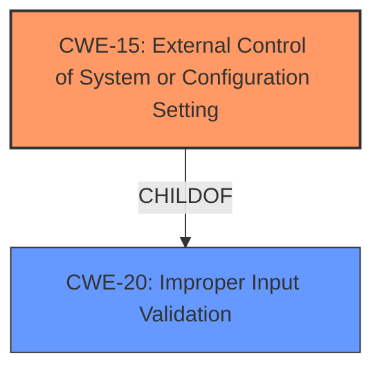

# Raw Analyzer Response for CVE-2021-22385

# Summary
| CWE ID  | CWE Name                                                     | Confidence | CWE Abstraction Level | CWE Vulnerability Mapping Label | CWE-Vulnerability Mapping Notes |
| :-------- | :----------------------------------------------------------- | :---------- | :-------------------- | :------------------------------ | :------------------------------ |
| CWE-15 | External Control of System or Configuration Setting | 0.9      | Base           | Allowed                     | Primary CWE |
| CWE-20 | Improper Input Validation | 0.5      | Class           | Discouraged                    | Secondary CWE |

## Evidence and Confidence

*   **Confidence Score:** 0.7
*   **Evidence Strength:** MEDIUM

## Relationship Analysis

The primary relationship influencing the decision is that CWE-15 is a Base-level CWE, preferred for root cause analysis, and is a child of CWE-20, a Class-level CWE. The vulnerability description mentions **"External Control of System or Configuration Setting vulnerability"**, which directly aligns with CWE-15. While CWE-20 could be a contributing factor, CWE-15 more specifically describes the vulnerability.

## Vulnerability Chain

The vulnerability chain starts with external control over system settings, potentially leading to kernel code execution.

1.  **Root Cause:** CWE-15 (**External Control of System or Configuration Setting**) - The Huawei smartphone component allows external control of system or configuration settings.
2.  **Impact:** Kernel Code Execution

## Summary of Analysis

The initial assessment identified CWE-15 as the primary weakness due to the explicit mention of "**External Control of System or Configuration Setting vulnerability**" in the vulnerability description, coupled with the root cause "The vulnerability lies in the NFC-based connection authentication process," meaning an external factor is influencing the authentication settings. This aligns directly with the description of CWE-15.

CWE-20 (**Improper Input Validation**) was considered because external control often necessitates improper or missing input validation. However, CWE-15 is more specific to the described weakness. The mapping guidance for CWE-20 discourages its use when more specific CWEs are available.

The choice of CWE-15 is justified by its base-level abstraction and direct relevance to the vulnerability description. The retriever results also list CWE-15 as the top candidate.

Relevant CWE Information:

# Enhanced Context (25 CWEs)

## CWE-15: External Control of System or Configuration Setting
**Abstraction:** Base
**Status:** Incomplete

### Description
One or more system settings or configuration elements can be externally controlled by a user.

### Extended Description
Allowing external control of system settings can disrupt service or cause an application to behave in unexpected, and potentially malicious ways.

### Alternative Terms
None

### Relationships
ChildOf -> CWE-642
ChildOf -> CWE-610
ChildOf -> CWE-20

### Mapping Guidance
**Usage:** Allowed
**Rationale:** This CWE entry is at the Base level of abstraction, which is a preferred level of abstraction for mapping to the root causes of vulnerabilities.
**Comments:** Carefully read both the name and description to ensure that this mapping is an appropriate fit. Do not try to 'force' a mapping to a lower-level Base/Variant simply to comply with this preferred level of abstraction.
**Reasons:**
- Acceptable-Use

## CWE-20: Improper Input Validation
**Abstraction:** Class
**Status:** Stable

### Description
The product receives input or data, but it does
        not validate or incorrectly validates that the input has the
        properties that are required to process the data safely and
        correctly.

### Extended Description
Input validation is a frequently-used technique for checking potentially dangerous inputs in order to ensure that the inputs are safe for processing within the code, or when communicating with other components. When software does not validate input properly, an attacker is able to craft the input in a form that is not expected by the rest of the application. This will lead to parts of the system receiving unintended input, which may result in altered control flow, arbitrary control of a resource, or arbitrary code execution.

### Alternative Terms
None

### Relationships
ChildOf -> CWE-707
PeerOf -> CWE-345
CanPrecede -> CWE-22
CanPrecede -> CWE-41
CanPrecede -> CWE-74
CanPrecede -> CWE-119
CanPrecede -> CWE-770

### Mapping Guidance
**Usage:** Discouraged
**Rationale:** CWE-20 is commonly misused in low-information vulnerability reports when lower-level CWEs could be used instead, or when more details about the vulnerability are available [REF-1287]. It is not useful for trend analysis. It is also a level-1 Class (i.e., a child of a Pillar).
**Comments:** Consider lower-level children such as Improper Use of Validation Framework (CWE-1173) or improper validation involving specific types or properties of input such as Specified Quantity (CWE-1284); Specified Index, Position, or Offset (CWE-1285); Syntactic Correctness (CWE-1286); Specified Type (CWE-1287); Consistency within Input (CWE-1288); or Unsafe Equivalence (CWE-1289).
**Reasons:**
- Frequent Misuse
**Suggested Alternatives:**
- CWE-1284: Specified Quantity
- CWE-1285: Specified Index, Position, or Offset
- CWE-1286: Syntactic Correctness
- CWE-1287: Specified Type
- CWE-1288: Consistency within Input
- CWE-1289: Unsafe Equivalence
- CWE-116: Improper Encoding or Escaping of Output