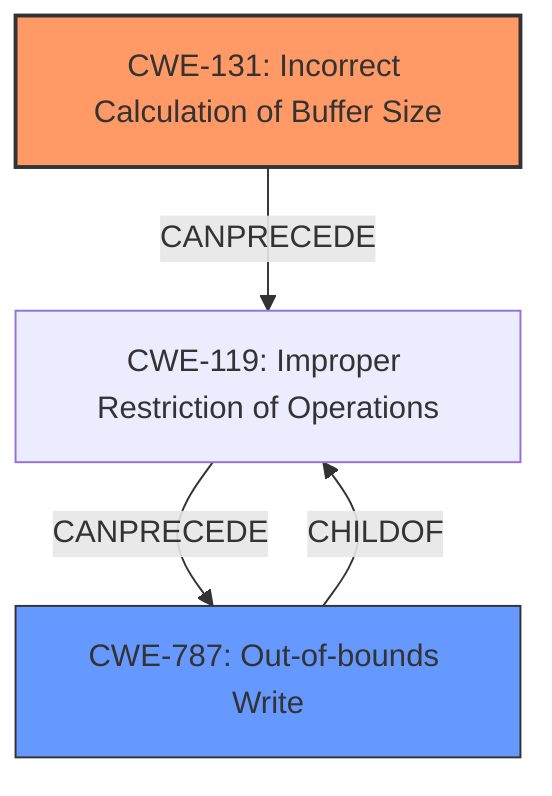

# Analysis Report for CVE-2021-22391

# Vulnerability Analysis Report: CVE-2021-22391

## Description


## Analysis (with Relationship Data)

# Summary
| CWE ID | CWE Name | Confidence | CWE Abstraction Level | CWE Vulnerability Mapping Label | CWE-Vulnerability Mapping Notes |
|---|---|---|---|---|---|
| CWE-131 | Incorrect Calculation of Buffer Size | 0.8 | Base | Primary | Allowed |
| CWE-787 | Out-of-bounds Write | 0.6 | Base | Secondary | Allowed |

## Evidence and Confidence

*   **Confidence Score:** 0.7
*   **Evidence Strength:** MEDIUM

## Relationship Analysis
The primary CWE is CWE-131, which can lead to CWE-119 (Improper Restriction of Operations within the Bounds of a Memory Buffer). CWE-787 (Out-of-bounds Write) is a child of CWE-119. The relationship between CWE-131 and CWE-787 is that an incorrect buffer size calculation (CWE-131) can precede an out-of-bounds write (CWE-787).



## Vulnerability Chain
The vulnerability chain starts with an **Incorrect Calculation of Buffer Size** (CWE-131), which leads to a buffer overflow (CWE-119), and then results in an out-of-bounds write (CWE-787). The impact is a system reset.

## Summary of Analysis
The initial assessment focused on the **rootcause**, which is the **Incorrect Calculation of Buffer Size** as stated in the vulnerability description. The supporting evidence is "There is an **Incorrect Calculation of Buffer Size** in Huawei Smartphone." The retriever results also listed CWE-131 as the top candidate. The relationship analysis shows that CWE-131 can lead to CWE-119, which can then lead to CWE-787. Therefore, CWE-131 is the primary CWE. CWE-787 is a secondary CWE because the stack overflow vulnerability mentioned in the CVE Reference Links Content Summary can result from the incorrect buffer size calculation. The selected CWEs are at the optimal level of specificity because they accurately represent the **rootcause** and the resulting weakness.

Relevant CWE Information:

# Enhanced Context (25 CWEs)
The following CWEs were identified as potentially relevant to this vulnerability:

## CWE-131: Incorrect Calculation of Buffer Size
**Abstraction Level**: Base
**Similarity Score**: 0.81
**Source**: dense

**Description**:
The product does not correctly calculate the size to be used when allocating a buffer, which could lead to a buffer overflow.

**Mapping Guidance**:
- Usage: Allowed
- Rationale: This CWE entry is at the Base level of abstraction, which is a preferred level of abstraction for mapping to the root causes of vulnerabilities.

**Technical Explanation:** The vulnerability description explicitly mentions an **Incorrect Calculation of Buffer Size**. This means the software calculates the size of the buffer incorrectly, leading to a potential buffer overflow. This aligns directly with the description of CWE-131.

**Security Implications:** Incorrect buffer size calculations can lead to buffer overflows, which can allow attackers to overwrite memory, potentially executing arbitrary code or causing a denial-of-service condition.

**Relationship Analysis:** CWE-131 is a base-level CWE and can be a child of CWE-682 (Incorrect Calculation). It can also precede CWE-119 (Improper Restriction of Operations within the Bounds of a Memory Buffer), as an incorrect calculation can lead to memory corruption.

**Mapping Guidance Analysis:** The mapping guidance for CWE-131 states that it is at the Base level of abstraction, which is preferred. The usage is allowed, and the rationale supports using it as a root cause of vulnerabilities.

**Mitigation Analysis:** Mitigations would involve ensuring that buffer sizes are calculated correctly and validated before use.

## CWE-787: Out-of-bounds Write
**Abstraction Level**: base
**Similarity Score**: 4.33
**Source**: graph

**Description**:
CWE-787: Out-of-bounds Write

**Mapping Guidance**:
- Usage: Allowed
- Rationale: This CWE entry is at the Base level of abstraction, which is a preferred level of abstraction for mapping to the root causes of vulnerabilities.

**Technical Explanation:** The **root cause** of the vulnerability, an **incorrect calculation of buffer size**, can lead to an out-of-bounds write. This occurs when data is written beyond the allocated buffer size, overwriting adjacent memory regions.

**Security Implications:** Out-of-bounds writes can lead to arbitrary code execution, privilege escalation, or denial of service. Attackers can exploit this to inject malicious code or corrupt critical system data.

**Relationship Analysis:** CWE-787 is a base-level CWE and a parent of CWE-124. It can follow CWE-131 and is a child of CWE-119 (Improper Restriction of Operations within the Bounds of a Memory Buffer).

**Mapping Guidance Analysis:** The mapping guidance for CWE-787 states that it is at the Base level of abstraction, which is preferred. The usage is allowed.

**Mitigation Analysis:** Mitigations include proper bounds checking, input validation, and secure memory management techniques.

## Other CWE Considerations

*   **CWE-190: Integer Overflow or Wraparound:** While integer overflows can lead to buffer overflows, the primary issue described is the **incorrect calculation** itself, not necessarily an integer overflow. Therefore, it is not selected as a primary CWE but could be related.
*   **CWE-193: Off-by-one Error:** This is a specific type of calculation error but the description doesn't provide enough detail to confirm that this is an off-by-one error.
*   **CWE-805: Buffer Access with Incorrect Length Value:** This is similar to CWE-131, but CWE-131 is more directly related to the initial calculation, whereas CWE-805 is related to the access using the incorrect length.
*   **CWE-456: Missing Initialization of a Variable:** The provided information does not suggest missing initialization as a primary factor.
*   **CWE-1285: Improper Validation of Specified Index, Position, or Offset in Input:** This weakness focuses on validation of user-supplied indices, which is not the primary issue described in the vulnerability.
*   **CWE-125: Out-of-bounds Read:** While an out-of-bounds read could occur, the description specifically points to an **incorrect calculation**, which is more related to a write.


## CWE Relationship Analysis

Current CWEs represent these abstraction levels: .


### Vulnerability Chain Analysis

**Chain starting from CWE-787:**
- 787 (Out-of-bounds Write) - ROOT


**Chain starting from CWE-805:**
- 805 (Buffer Access with Incorrect Length Value) - ROOT


### CWE Relationship Diagram

```mermaid
graph TD
    classDef primary fill:#f96,stroke:#333,stroke-width:2px
    classDef secondary fill:#69f,stroke:#333
    classDef tertiary fill:#9e9,stroke:#333
```


*Report generated on 2025-04-01 18:11:38*
