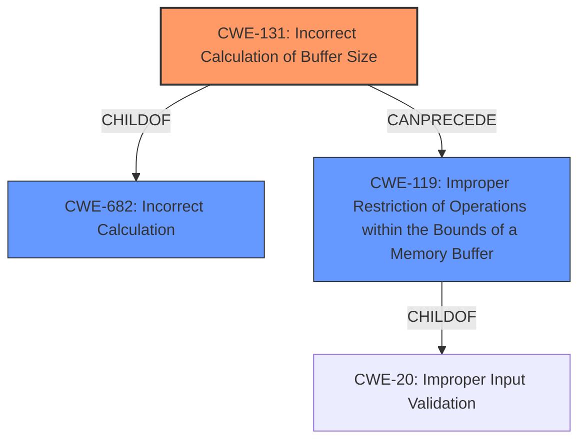

# Analysis for CVE-2021-22392

# Summary
| CWE ID | CWE Name | Confidence | CWE Abstraction Level | CWE Vulnerability Mapping Label | CWE-Vulnerability Mapping Notes |
|---|---|---|---|---|---|
| CWE-131 | Incorrect Calculation of Buffer Size | 1 | Base | Allowed | Primary CWE |
| CWE-119 | Improper Restriction of Operations within the Bounds of a Memory Buffer | 0.5 | Class | Discouraged | Secondary Candidate |

## Evidence and Confidence

*   **Confidence Score:** 1
*   **Evidence Strength:** HIGH

## Relationship Analysis
The primary CWE is CWE-131, which is a Base level CWE and a child of CWE-682 (Incorrect Calculation). The vulnerability description clearly states "**incorrect calculation of buffer size**", which aligns directly with CWE-131.

CWE-119 is a Class level CWE that represents a broad category of memory buffer errors. It is a parent of CWE-131. While the vulnerability could potentially lead to out-of-bounds access (CWE-119), the root cause is the incorrect buffer size calculation (CWE-131).

## Vulnerability Chain
The vulnerability chain starts with an **incorrect calculation of buffer size** (CWE-131). This can lead to a buffer overflow or other memory corruption issues (CWE-119), ultimately resulting in verification bypass and directions to abnormal addresses.

## Summary of Analysis
The initial analysis identified CWE-131 as the primary candidate due to the explicit mention of "**incorrect calculation of buffer size**" in the vulnerability description and the "Vulnerability Description Key Phrases". The "CVE Reference Links Content Summary" further supports this by highlighting "**Weaknesses/vulnerabilities present: The vulnerability lies in improper verification within the affected Huawei devices**" which could be caused by the incorrect size calculation.

CWE-119 was considered but determined to be too general, as it describes the consequence rather than the root cause. CWE-131 is more specific and accurately reflects the root cause of the vulnerability. The retriever results also list CWE-131 as the top candidate.

The selected CWE, CWE-131, is at the optimal level of specificity (Base) as it directly addresses the "**incorrect calculation of buffer size**".

Relevant CWE Information:

# Enhanced Context (25 CWEs)
The following CWEs were identified as potentially relevant to this vulnerability:

## CWE-131: Incorrect Calculation of Buffer Size
**Abstraction Level**: Base
**Similarity Score**: 0.81
**Source**: dense

**Description**:
The product does not correctly calculate the size to be used when allocating a buffer, which could lead to a buffer overflow.

**Mapping Guidance**:
- Usage: Allowed
- Rationale: This CWE entry is at the Base level of abstraction, which is a preferred level of abstraction for mapping to the root causes of vulnerabilities.

## CWE-119: Improper Restriction of Operations within the Bounds of a Memory Buffer
**Abstraction Level**: Class
**Similarity Score**: 0.78
**Source**: dense

**Description**:
The product performs operations on a memory buffer, but it reads from or writes to a memory location outside the buffer's intended boundary. This may result in read or write operations on unexpected memory locations that could be linked to other variables, data structures, or internal program data.

**Mapping Guidance**:
- Usage: Discouraged
- Rationale: CWE-119 is commonly misused in low-information vulnerability reports when lower-level CWEs could be used instead, or when more details about the vulnerability are available.