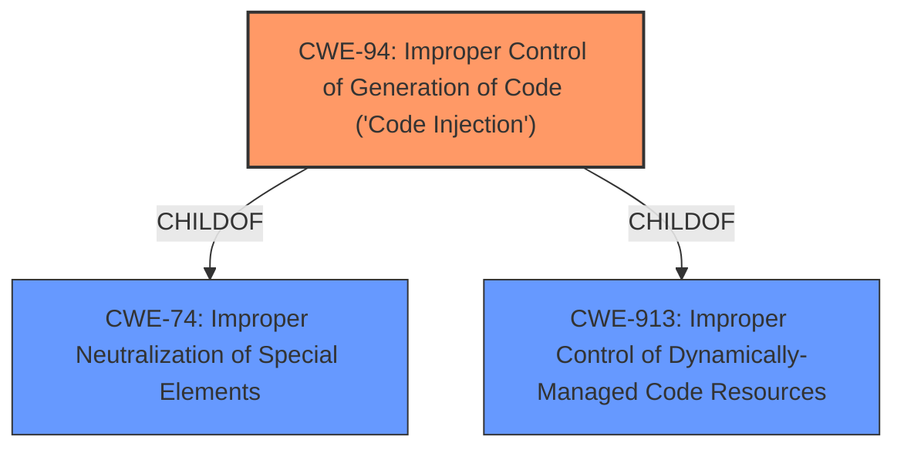

# Raw Analyzer Response for CVE-2021-22395

# Summary
| CWE ID | CWE Name | Confidence | CWE Abstraction Level | CWE Vulnerability Mapping Label | CWE-Vulnerability Mapping Notes |
|---|---|---|---|---|---|
| CWE-94 | Improper Control of Generation of Code ('Code Injection') | 0.9 | Base | Allowed-with-Review | Primary CWE |

## Evidence and Confidence

*   **Confidence Score:** 0.9
*   **Evidence Strength:** HIGH

## Relationship Analysis
The primary CWE is CWE-94, which is a Base level CWE. CWE-94 is a child of CWE-74 (Improper Neutralization of Special Elements in Output Used as an Injection Vector) and CWE-913 (Improper Control of Dynamically-Managed Code Resources). This indicates that code injection is a specific type of injection vulnerability involving dynamically-managed code resources.

## Vulnerability Chain
The vulnerability chain starts with the **code injection** vulnerability itself (CWE-94), which leads to the impact of affecting service confidentiality. There is no clear indication of prior steps like input validation or data sanitization.

## Summary of Analysis
The initial assessment identified a **code injection** vulnerability. The primary evidence is the "Vulnerability Description Key Phrases" which includes the **weakness** of **code injection**. The "CVE Reference Links Content Summary" also mentions "**Root cause of vulnerability**: Code injection vulnerability" and "**Weaknesses/vulnerabilities present**: Code injection".

The retriever results also support this, with CWE-94 (Improper Control of Generation of Code ('Code Injection')) being the top result. CWE-94 is a Base level CWE, which is the preferred level of abstraction. The Usage is "Allowed-with-Review", with the comment that it is frequently misused for vulnerabilities with a technical impact of "code execution," and the comment "This weakness only applies when the product's functionality intentionally constructs all or part of a code segment". The provided text does not offer enough information to rule out this condition, and the provided examples for CWE-94 appear to be a good match with the description.

The other CWEs were considered but deemed less relevant:
*   CWE-20 (Improper Input Validation) is too general.
*   CWE-119 (Improper Restriction of Operations within the Bounds of a Memory Buffer) is not directly related to code injection.
*   CWE-78 (Improper Neutralization of Special Elements used in an OS Command ('OS Command Injection')) is specific to OS commands, which is not indicated in the description.
*   CWE-95 (Improper Neutralization of Directives in Dynamically Evaluated Code ('Eval Injection')) is more specific variant of code injection, but the description does not have enough evidence to support this.
*   CWE-927 (Use of Implicit Intent for Sensitive Communication) is specific to Android applications and implicit intents, which is not indicated in the description.

Based on the provided evidence and the retriever results, CWE-94 is the most appropriate CWE for this vulnerability.