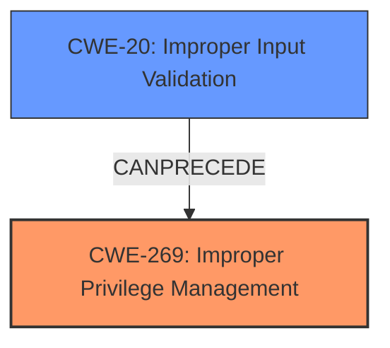

# Enhanced Analysis for CVE-2021-22397

# Summary
| CWE ID | CWE Name | Confidence | CWE Abstraction Level | CWE Vulnerability Mapping Label | CWE-Vulnerability Mapping Notes |
|---|---|---|---|---|---|
| CWE-269 | Improper Privilege Management | 0.8 | Class | Primary | Discouraged |
| CWE-20 | Improper Input Validation | 0.6 | Class | Secondary | Discouraged |

## Evidence and Confidence

*   **Confidence Score:** 0.7
*   **Evidence Strength:** MEDIUM

## Relationship Analysis
The primary relationship influencing the choice of CWE-269 (Improper Privilege Management) is its connection to privilege escalation, a stated impact of the vulnerability. While CWE-269 is a class-level CWE and generally discouraged, the vulnerability description clearly points to a problem in how privileges are managed, making it a reasonable fit despite its broad nature. The secondary CWE, CWE-20 (Improper Input Validation), is related because the **lack of verification** of external parameters is a specific instance of improper input handling that leads to the privilege management issue. The relationship here is that improper input validation *can precede* privilege management issues.



## Vulnerability Chain
The vulnerability chain starts with the **lack of verification of external parameters** (CWE-20), which then leads to the **improper privilege management** (CWE-269), ultimately resulting in privilege escalation and potential compromise of normal service. The chain is:

1.  Improper Input Validation (CWE-20)
2.  Improper Privilege Management (CWE-269)
3.  Privilege Escalation (Impact)

## Summary of Analysis
The initial assessment considered CWE-20 (Improper Input Validation) due to the "**lack of verification** of external parameters". However, the ultimate impact of privilege escalation led to the selection of CWE-269 (Improper Privilege Management) as the primary weakness, even though it's a class-level CWE and discouraged. The provided evidence from the "Vulnerability Description Key Phrases" and "CVE Reference Links Content Summary" supports this decision. The vulnerability description explicitly states a "**lack of verification of external parameters**" as the root cause, which aligns with CWE-20's description of "The product receives input or data, but it does not validate or incorrectly validates that the input has the properties that are required to process the data safely and correctly." The privilege escalation impact further strengthens the choice of CWE-269.

While CWE-269 is discouraged due to its broad nature, the absence of a more specific CWE that directly addresses the root cause of privilege management issues makes it the most appropriate choice given the available information. The decision is largely based on the provided evidence that highlights both the root cause (**lack of verification**) and the impact (privilege escalation).

The selected CWEs are at the optimal level of specificity given the information provided. Although more specific CWEs related to input validation (children of CWE-20) could be considered if more details about the specific input validation failure were available, the current description does not provide that level of detail. Similarly, while there are more specific CWEs that might be related to privilege escalation, the description clearly states that the **lack of verification** leads to a privilege management issue, making CWE-269 the most appropriate choice.

Relevant CWE Information:

# Enhanced Context (25 CWEs)
The following CWEs were identified as potentially relevant to this vulnerability:

## CWE-131: Incorrect Calculation of Buffer Size
**Abstraction Level**: Base
**Similarity Score**: 0.75
**Source**: dense

**Description**:
The product does not correctly calculate the size to be used when allocating a buffer, which could lead to a buffer overflow.

**Mapping Guidance**:
- Usage: Allowed
- Rationale: This CWE entry is at the Base level of abstraction, which is a preferred level of abstraction for mapping to the root causes of vulnerabilities.

*Not considered because there is no mention of buffer size calculation.*

## CWE-667: Improper Locking
**Abstraction Level**: Class
**Similarity Score**: 0.74
**Source**: dense

**Description**:
The product does not properly acquire or release a lock on a resource, leading to unexpected resource state changes and behaviors.

**Mapping Guidance**:
- Usage: Allowed-with-Review
- Rationale: This CWE entry is a Class and might have Base-level children that would be more appropriate

*Not considered because there is no mention of locking mechanisms.*

## CWE-653: Improper Isolation or Compartmentalization
**Abstraction Level**: Class
**Similarity Score**: 0.74
**Source**: dense

**Description**:
The product does not properly compartmentalize or isolate functionality, processes, or resources that require different privilege levels, rights, or permissions.

**Mapping Guidance**:
- Usage: Allowed
- Rationale: This CWE entry is at the Base level of abstraction, which is a preferred level of abstraction for mapping to the root causes of vulnerabilities.

*Not considered because there is no explicit mention of isolation or compartmentalization problems, although privilege escalation could imply a failure in this area.*

## CWE-691: Insufficient Control Flow Management
**Abstraction Level**: Pillar
**Similarity Score**: 0.74
**Source**: dense

**Description**:
The code does not sufficiently manage its control flow during execution, creating conditions in which the control flow can be modified in unexpected ways.

**Mapping Guidance**:
- Usage: Discouraged
- Rationale: This CWE entry is extremely high-level, a Pillar. However, classification research is limited for weaknesses of this type, so there can be gaps or organizational difficulties within CWE that force use of this weakness, even at such a high level of abstraction.

*Not considered because it is too high-level and doesn't directly relate to the root cause.*

## CWE-404: Improper Resource Shutdown or Release
**Abstraction Level**: Class
**Similarity Score**: 0.74
**Source**: dense

**Description**:
The product does not release or incorrectly releases a resource before it is made available for re-use.

**Mapping Guidance**:
- Usage: Allowed-with-Review
- Rationale: This CWE entry is a Class and might have Base-level children that would be more appropriate

*Not considered because there is no mention of resource release issues.*

## CWE-1289: Improper Validation of Unsafe Equivalence in Input
**Abstraction Level**: Base
**Similarity Score**: 0.74
**Source**: dense

**Description**:
The product receives an input value that is used as a resource identifier or other type of reference, but it does not validate or incorrectly validates that the input is equivalent to a potentially-unsafe value.

**Mapping Guidance**:
- Usage: Allowed
- Rationale: This CWE entry is at the Base level of abstraction, which is a preferred level of abstraction for mapping to the root causes of vulnerabilities.

*Not considered because there's no indication about unsafe equivalence.*

## CWE-125: Out-of-bounds Read
**Abstraction Level**: Base
**Similarity Score**: 0.74
**Source**: dense

**Description**:
The product reads data past the end, or before the beginning, of the intended buffer.

**Mapping Guidance**:
- Usage: Allowed
- Rationale: This CWE entry is at the Base level of abstraction, which is a preferred level of abstraction for mapping to the root causes of vulnerabilities.

*Not considered because there is no mention of out-of-bounds reads.*

## CWE-129: Improper Validation of Array Index
**Abstraction Level**: Variant
**Similarity Score**: 0.73
**Source**: dense

**Description**:
The product uses untrusted input when calculating or using an array index, but the product does not validate or incorrectly validates the index to ensure the index references a valid position within the array.

**Mapping Guidance**:
- Usage: Allowed
- Rationale: This CWE entry is at the Variant level of abstraction, which is a preferred level of abstraction for mapping to the root causes of vulnerabilities.

*Not considered because there is no mention of array index validation.*

## CWE-274: Improper Handling of Insufficient Privileges
**Abstraction Level**: Base
**Similarity Score**: 0.73
**Source**: dense

**Description**:
The product does not handle or incorrectly handles when it has insufficient privileges to perform an operation, leading to resultant weaknesses.

**Mapping Guidance**:
- Usage: Discouraged
- Rationale: This CWE entry could be deprecated in a future version of CWE.

*Not considered because the issue isn't about handling insufficient privileges but about gaining excessive privileges.*

## CWE-754: Improper Check for Unusual or Exceptional Conditions
**Abstraction Level**: Class
**Similarity Score**: 0.73
**Source**: dense

**Description**:
The product does not check or incorrectly checks for unusual or exceptional conditions that are not expected to occur frequently during day to day operation of the


## CWE Relationship Analysis

Current CWEs represent these abstraction levels: .


### Vulnerability Chain Analysis

**Chain starting from CWE-667:**
- 667 (Improper Locking) - ROOT


**Chain starting from CWE-691:**
- 691 (Insufficient Control Flow Management) - ROOT


### CWE Relationship Diagram

```mermaid
graph TD
    classDef primary fill:#f96,stroke:#333,stroke-width:2px
    classDef secondary fill:#69f,stroke:#333
    classDef tertiary fill:#9e9,stroke:#333
```