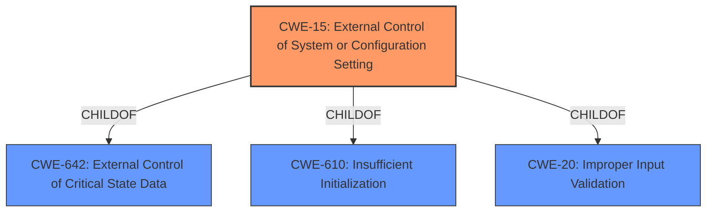

# Enhanced Analysis for CVE-2021-22420

# Summary
| CWE ID | CWE Name | Confidence | CWE Abstraction Level | CWE Vulnerability Mapping Label | CWE-Vulnerability Mapping Notes |
|---|---|---|---|---|---|
| CWE-15 | External Control of System or Configuration Setting | 1.0 | Base | Allowed | Primary CWE |

## Evidence and Confidence

*   **Confidence Score:** 1.0
*   **Evidence Strength:** HIGH

## Relationship Analysis
The primary CWE, CWE-15, is a Base level CWE which makes it appropriate. It is a child of CWE-642, **External Control of Critical State Data** (Class level) and CWE-610, **Insufficient Initialization** (Class level) and CWE-20, **Improper Input Validation** (Class level).



## Vulnerability Chain
The vulnerability involves **External Control of System or Configuration Setting**, which leads to the underlying trust of the application trustlist mechanism being missing.

## Summary of Analysis
The vulnerability description clearly states that the HarmonyOS component has an **External Control of System or Configuration Setting vulnerability**. This is a direct match for CWE-15. The impact is that local attackers may exploit this vulnerability to cause the underlying trust of the application trustlist mechanism to be missing.

The evidence provided in the "Vulnerability Description Key Phrases" section highlights "**weakness:** **External Control of System or Configuration Setting vulnerability**," which directly supports the selection of CWE-15.

The Retriever Results list CWE-15 as the top result, further supporting its selection. The "Usage" for CWE-15 is "Allowed," and the rationale states that "This CWE entry is at the Base level of abstraction, which is a preferred level of abstraction for mapping to the root causes of vulnerabilities."

The other CWEs were considered but were not as direct a match as CWE-15:

*   CWE-611 (**Improper Restriction of XML External Entity Reference**) - While relevant to external control, it is specific to XML and not applicable here.
*   CWE-269 (**Improper Privilege Management**) - This is a broader class and not as specific as CWE-15.
*   CWE-22 (**Improper Limitation of a Pathname to a Restricted Directory ('Path Traversal')**) and CWE-73 (**External Control of File Name or Path**) - These are file-related weaknesses, not directly related to system or configuration settings.

The selection of CWE-15 is at the optimal level of specificity because it directly reflects the stated vulnerability.


## CWE Relationship Analysis

Current CWEs represent these abstraction levels: .


### Vulnerability Chain Analysis

**Chain starting from CWE-73:**
- 73 (External Control of File Name or Path) - ROOT


**Chain starting from CWE-15:**
- 15 (External Control of System or Configuration Setting) - ROOT


### CWE Relationship Diagram

```mermaid
graph TD
    classDef primary fill:#f96,stroke:#333,stroke-width:2px
    classDef secondary fill:#69f,stroke:#333
    classDef tertiary fill:#9e9,stroke:#333
```