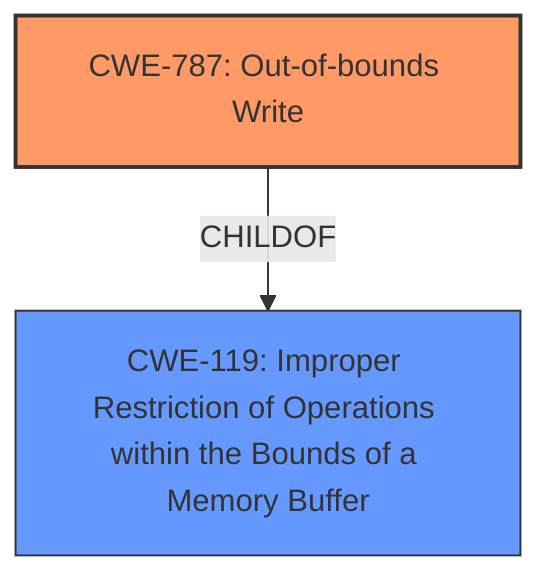

# Raw Analyzer Response for CVE-2021-22433

# Summary
| CWE ID | CWE Name | Confidence | CWE Abstraction Level | CWE Vulnerability Mapping Label | CWE-Vulnerability Mapping Notes |
|---|---|---|---|---|---|
| CWE-787 | Out-of-bounds Write | 0.9 | Base | Allowed | Primary CWE |
| CWE-119 | Improper Restriction of Operations within the Bounds of a Memory Buffer | 0.6 | Class | Discouraged | Secondary Candidate |

## Evidence and Confidence

*   **Confidence Score:** 0.8
*   **Evidence Strength:** HIGH

## Relationship Analysis
The primary CWE, CWE-787 (Out-of-bounds Write), is a child of CWE-119 (Improper Restriction of Operations within the Bounds of a Memory Buffer). This hierarchical relationship indicates that CWE-787 is a more specific instance of the more general CWE-119. The selection of CWE-787 is based on the vulnerability description explicitly mentioning a "memory address out of bounds" issue, which aligns closely with the definition of an out-of-bounds write.

## Vulnerability Chain
The vulnerability chain consists of a root cause (**memory address out of bounds**) leading to a potential impact (**malicious code execution**). The provided description does not specify what led to the out-of-bounds write condition.

## Summary of Analysis
Initially, the analysis focused on the provided description, which mentions a "**memory address out of bounds**" issue in smartphones that can lead to malicious code execution. The **Vulnerability Description Key Phrases** section reinforces this by explicitly stating "**weakness: memory address out of bounds**". The CVE Reference Links Content Summary confirms that "**The vulnerability is due to a memory address out-of-bounds issue**" and that "**An out-of-bounds read/write vulnerability exists**".

The Retriever Results suggest several possible CWEs, including CWE-119 (Improper Restriction of Operations within the Bounds of a Memory Buffer), CWE-125 (Out-of-bounds Read), CWE-131 (Incorrect Calculation of Buffer Size), and CWE-787 (Out-of-bounds Write). Given that the vulnerability description specifically mentions "**memory address out of bounds**" and the CVE reference link confirms an "out-of-bounds read/write vulnerability", CWE-787 (Out-of-bounds Write) and CWE-125 (Out-of-bounds Read) are the most relevant.

Since the description does not explicitly state whether the vulnerability is related to reading or writing out of bounds, CWE-787 has been chosen because it is the most likely cause of malicious code execution.

CWE-119 is a Class-level CWE and is discouraged because more specific CWEs exist.

CWE-125 (Out-of-bounds Read) was considered. While an out-of-bounds read could lead to information disclosure, the description specifically mentions the potential for malicious code execution, which is more commonly associated with out-of-bounds writes.

CWE-131 (Incorrect Calculation of Buffer Size) was also considered, but the evidence does not directly point to an incorrect buffer size calculation as the root cause.

CWE-787 (Out-of-bounds Write) is a Base-level CWE and is allowed. It directly addresses the "**memory address out of bounds**" issue described in the vulnerability. This CWE accurately reflects the technical details provided and aligns with the potential impact of malicious code execution.

The final decision is based on the available evidence and the specificity of the CWE descriptions. CWE-787 is the most accurate and specific representation of the vulnerability.

Relevant CWE Information:

# Enhanced Context (25 CWEs)
The following CWEs were identified as potentially relevant to this vulnerability:

## CWE-681: Incorrect Conversion between Numeric Types
**Abstraction Level**: Base
**Similarity Score**: 0.77
**Source**: dense

**Description**:
When converting from one data type to another, such as long to integer, data can be omitted or translated in a way that produces unexpected values. If the resulting values are used in a sensitive context, then dangerous behaviors may occur.

**Mapping Guidance**:
- Usage: Allowed
- Rationale: This CWE entry is at the Base level of abstraction, which is a preferred level of abstraction for mapping to the root causes of vulnerabilities.

## CWE-704: Incorrect Type Conversion or Cast
**Abstraction Level**: Class
**Similarity Score**: 0.76
**Source**: dense

**Description**:
The product does not correctly convert an object, resource, or structure from one type to a different type.

**Mapping Guidance**:
- Usage: Allowed-with-Review
- Rationale: This CWE entry is a Class and might have Base-level children that would be more appropriate

## CWE-1289: Improper Validation of Unsafe Equivalence in Input
**Abstraction Level**: Base
**Similarity Score**: 0.76
**Source**: dense

**Description**:
The product receives an input value that is used as a resource identifier or other type of reference, but it does not validate or incorrectly validates that the input is equivalent to a potentially-unsafe value.

**Mapping Guidance**:
- Usage: Allowed
- Rationale: This CWE entry is at the Base level of abstraction, which is a preferred level of abstraction for mapping to the root causes of vulnerabilities.

## CWE-197: Numeric Truncation Error
**Abstraction Level**: Base
**Similarity Score**: 0.74
**Source**: dense

**Description**:
Truncation errors occur when a primitive is cast to a primitive of a smaller size and data is lost in the conversion.

**Mapping Guidance**:
- Usage: Allowed
- Rationale: This CWE entry is at the Base level of abstraction, which is a preferred level of abstraction for mapping to the root causes of vulnerabilities.

## CWE-131: Incorrect Calculation of Buffer Size
**Abstraction Level**: Base
**Similarity Score**: 0.73
**Source**: dense

**Description**:
The product does not correctly calculate the size to be used when allocating a buffer, which could lead to a buffer overflow.

**Mapping Guidance**:
- Usage: Allowed
- Rationale: This CWE entry is at the Base level of abstraction, which is a preferred level of abstraction for mapping to the root causes of vulnerabilities.

## CWE-682: Incorrect Calculation
**Abstraction Level**: Pillar
**Similarity Score**: 0.73
**Source**: dense

**Description**:
The product performs a calculation that generates incorrect or unintended results that are later used in security-critical decisions or resource management.

**Mapping Guidance**:
- Usage: Discouraged
- Rationale: This CWE entry is extremely high-level, a Pillar. In many cases, lower-level children or descendants are more appropriate. However, sometimes this weakness is forced to be used due to the lack of in-depth weakness research. See Research Gaps.

## CWE-191: Integer Underflow (Wrap or Wraparound)
**Abstraction Level**: Base
**Similarity Score**: 0.73
**Source**: dense

**Description**:
The product subtracts one value from another, such that the result is less than the minimum allowable integer value, which produces a value that is not equal to the correct result.

**Mapping Guidance**:
- Usage: Allowed
- Rationale: This CWE entry is at the Base level of abstraction, which is a preferred level of abstraction for mapping to the root causes of vulnerabilities.

## CWE-843: Access of Resource Using Incompatible Type ('Type Confusion')
**Abstraction Level**: Base
**Similarity Score**: 0.72
**Source**: dense

**Description**:
The product allocates or initializes a resource such as a pointer, object, or variable using one type, but it later accesses that resource using a type that is incompatible with the original type.

**Mapping Guidance**:
- Usage: Allowed
- Rationale: This CWE entry is at the Base level of abstraction, which is a preferred level of abstraction for mapping to the root causes of vulnerabilities.

## CWE-125: Out-of-bounds Read
**Abstraction Level**: Base
**Similarity Score**: 0.72
**Source**: dense

**Description**:
The product reads data past the end, or before the beginning, of the intended buffer.

**Mapping Guidance**:
- Usage: Allowed
- Rationale: This CWE entry is at the Base level of abstraction, which is a preferred level of abstraction for mapping to the root causes of vulnerabilities.

## CWE-805: Buffer Access with Incorrect Length Value
**Abstraction Level**: Base
**Similarity Score**: 0.72
**Source**: dense

**Description**:
The product uses a sequential operation to read or write a buffer, but it uses an incorrect length value that causes it to access memory that is outside of the bounds of the buffer.