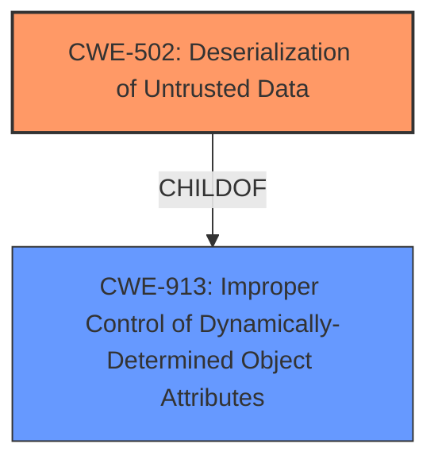

# Analysis Report for CVE-2021-22439

# Vulnerability Analysis Report: CVE-2021-22439

## Description


## Analysis (with Relationship Data)

# Summary
| CWE ID | CWE Name | Confidence | CWE Abstraction Level | CWE Vulnerability Mapping Label | CWE-Vulnerability Mapping Notes |
|---|---|---|---|---|---|
| CWE-502 | Deserialization of Untrusted Data | 1.0 | Base | Allowed | Primary CWE |

## Evidence and Confidence

*   **Confidence Score:** 1.0
*   **Evidence Strength:** HIGH

## Relationship Analysis
The primary relationship considered here is the ChildOf relationship, where CWE-502 is a child of CWE-913 (Improper Control of Dynamically-Determined Object Attributes). While CWE-913 is a broader category, CWE-502 specifically addresses the **deserialization** aspect, which is the core of the vulnerability described. No other relationships significantly influence the decision in this case. The abstraction level of Base for CWE-502 is appropriate as it directly represents the **deserialization** **weakness**.



## Vulnerability Chain
The vulnerability chain starts with the **deserialization of untrusted data** (CWE-502), leading to the **impact** of remote code execution and device control. The chain is:
1.  **Deserialization of Untrusted Data (CWE-502):** The Huawei AnyOffice product deserializes untrusted data without proper validation.
2.  **Remote Code Execution:** The **deserialization** **vulnerability** allows for remote malicious code injection.
3.  **Device Control:** Successful exploitation leads to the attacker gaining control of the device.

## Summary of Analysis
The initial analysis and resulting conclusion are based on the evidence provided in the vulnerability description and the CVE reference links. The core **weakness** identified is the **deserialization of untrusted data**, which directly aligns with CWE-502.

The vulnerability description states: "There is a **deserialization vulnerability** in Huawei AnyOffice V200R006C10."
The CVE Reference Links Content Summary reinforces this: "Root cause of vulnerability: **Deserialization vulnerability** in Huawei AnyOffice product."

The graph relationships, particularly the ChildOf relationship with CWE-913, were considered, but CWE-502 was chosen for its specificity in addressing the **deserialization** aspect.

CWE-502 is at the optimal level of specificity because it accurately captures the **root cause** of the vulnerability, which is the **deserialization of untrusted data**. This **weakness** directly enables remote code execution, allowing an attacker to control the device.

Other CWEs Considered:

*   **CWE-20: Improper Input Validation:** While input validation is a broad concern, the more specific issue here is the **deserialization** process itself, making CWE-502 a better fit. Also, the Mapping Guidance for CWE-20 discourages its use when lower-level CWEs are available.
*   **CWE-917: Improper Neutralization of Special Elements used in an Expression Language Statement ('Expression Language Injection'):** This CWE is related to expression language injection, which is not explicitly mentioned in the vulnerability description. While **deserialization** can sometimes lead to expression language injection, the primary **weakness** here is the **deserialization** itself.
*   **CWE-94: Improper Control of Generation of Code ('Code Injection'):** While the **impact** of the **vulnerability** is code injection, the **root cause** is the **deserialization of untrusted data**. CWE-94 is more appropriate when the product constructs a code segment from external input, which is not the case here.


## CWE Relationship Analysis

Current CWEs represent these abstraction levels: .


### Vulnerability Chain Analysis

**Chain starting from CWE-502:**
- 502 (Deserialization of Untrusted Data) - ROOT


**Chain starting from CWE-917:**
- 917 (Improper Neutralization of Special Elements used in an Expression Language Statement ('Expression Language Injection')) - ROOT


### CWE Relationship Diagram

```mermaid
graph TD
    classDef primary fill:#f96,stroke:#333,stroke-width:2px
    classDef secondary fill:#69f,stroke:#333
    classDef tertiary fill:#9e9,stroke:#333
```


*Report generated on 2025-04-02 06:02:28*
