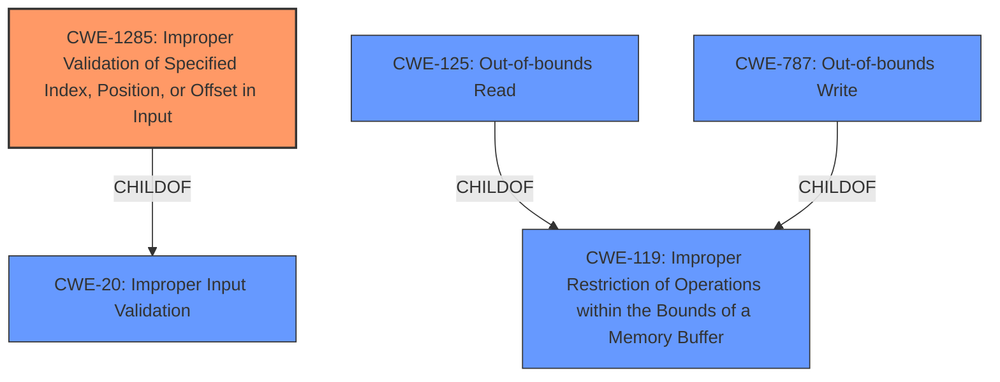

# Enhanced Analysis for CVE-2021-22443

# Summary
| CWE ID | CWE Name | Confidence | CWE Abstraction Level | CWE Vulnerability Mapping Label | CWE-Vulnerability Mapping Notes |
|---|---|---|---|---|---|
| CWE-1285 | Improper Validation of Specified Index, Position, or Offset in Input | 0.8 | Base | Allowed | Primary CWE |
| CWE-125 | Out-of-bounds Read | 0.5 | Base | Allowed | Secondary Candidate |
| CWE-787 | Out-of-bounds Write | 0.5 | Base | Allowed | Secondary Candidate |
| CWE-119 | Improper Restriction of Operations within the Bounds of a Memory Buffer | 0.3 | Class | Discouraged | Secondary Candidate |
| CWE-20 | Improper Input Validation | 0.3 | Class | Discouraged | Secondary Candidate |

## Evidence and Confidence

*   **Confidence Score:** 0.7
*   **Evidence Strength:** MEDIUM

## Relationship Analysis
The primary CWE, CWE-1285, is a child of CWE-20, indicating a more specific type of input validation issue. CWE-125 (Out-of-bounds Read) and CWE-787 (Out-of-bounds Write) are both children of CWE-119 (Improper Restriction of Operations within the Bounds of a Memory Buffer). The retriever results suggested a few possible CWEs including CWE-1285, CWE-125, CWE-119, and CWE-20. Given the description mentions random address access, this suggests that either a read or write operation is performed outside the bounds of the intended memory location.



## Vulnerability Chain
The vulnerability chain starts with **Improper Verification** of input, potentially a specified index, position, or offset. This leads to random address access, which can manifest as either an out-of-bounds read or write.

## Summary of Analysis
The initial analysis identified a potential **Input Verification Vulnerability** leading to random address access. The description points to an issue where the program does not properly validate input, which allows an attacker to cause random address access.

The selection of CWE-1285 is based on the "Root cause of vulnerability" being "Improper verification" as well as the impact "Successful exploitation of this vulnerability may cause random address access". CWE-1285 captures the essence of **improper validation** of an index, position, or offset. Given that the vulnerability leads to random address access, it's reasonable to consider CWE-125 and CWE-787 as potential consequences. However, without more detail it's difficult to determine if the vulnerability is related to an out-of-bounds read or write.

The evidence provided states:
- Vulnerability Description Key Phrases:
  - **rootcause:** **Input Verification Vulnerability**
  - **impact:** random address access
- CVE Reference Links Content Summary:
  - "Root cause of vulnerability": "Improper verification"
  - "Impact of exploitation": "Successful exploitation of this vulnerability may cause random address access."

CWE-1285 is at the optimal level of specificity, as it directly addresses the improper validation of index/position/offset, which aligns with the provided evidence. CWE-20 and CWE-119 are too general, and CWE-125 and CWE-787 require more information to confirm their applicability.


## CWE Relationship Analysis

Current CWEs represent these abstraction levels: .


### Vulnerability Chain Analysis

**Chain starting from CWE-787:**
- 787 (Out-of-bounds Write) - ROOT


**Chain starting from CWE-125:**
- 125 (Out-of-bounds Read) - ROOT


### CWE Relationship Diagram

```mermaid
graph TD
    classDef primary fill:#f96,stroke:#333,stroke-width:2px
    classDef secondary fill:#69f,stroke:#333
    classDef tertiary fill:#9e9,stroke:#333
```