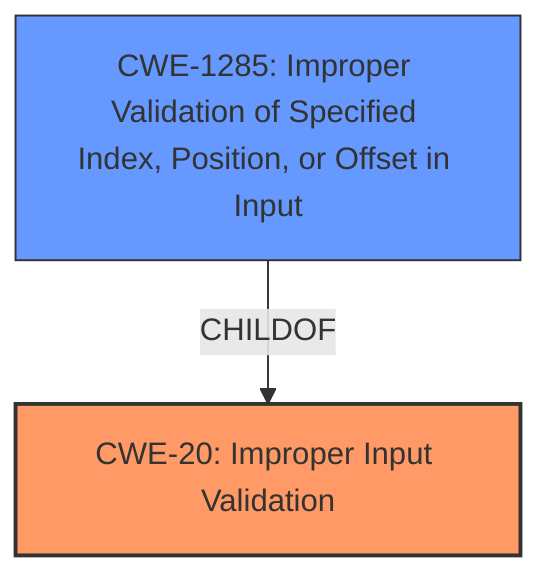

# Analysis for CVE-2021-22445

# Summary
| CWE ID    | CWE Name                                                     | Confidence | CWE Abstraction Level | CWE Vulnerability Mapping Label | CWE-Vulnerability Mapping Notes |
| :-------- | :----------------------------------------------------------- | :--------- | :---------------------- | :------------------------------ | :------------------------------ |
| CWE-20    | Improper Input Validation                                    | 0.75       | Class                   | Primary                         | Discouraged                   |
| CWE-1285  | Improper Validation of Specified Index, Position, or Offset in Input | 0.65       | Base                    | Secondary                       | Allowed                       |

## Evidence and Confidence

*   **Confidence Score:** 0.70
*   **Evidence Strength:** MEDIUM

## Relationship Analysis
The primary CWE is CWE-20 (Improper Input Validation), which is a class-level CWE. This is related to CWE-1285 (Improper Validation of Specified Index, Position, or Offset in Input) through a child-of relationship, where CWE-1285 is a more specific base-level weakness related to input validation. CWE-20 is a high level class and CWE-1285 is a base.

## Vulnerability Chain
The vulnerability chain starts with the **improper input validation** (CWE-20), which leads to a system reset. It can be specified to **improper validation of specified index, position, or offset in input (CWE-1285)**

## Summary of Analysis
The initial assessment points towards CWE-20 (Improper Input Validation) as the primary weakness, due to the **Input Verification Vulnerability** and **Improper verification** descriptions. The retriever results also list CWE-20 as one of the top candidates. However, CWE-20 is a Class-level CWE and the description indicates that a more specific CWE might be appropriate.

The vulnerability description highlights an **Input Verification Vulnerability** leading to a system reset. The CVE Reference Links Content Summary confirms this, stating the **root cause of vulnerability** is **Improper verification** and the **weaknesses/vulnerabilities present** are **improper verification of input/data**.

Given the nature of the vulnerability, CWE-1285 (Improper Validation of Specified Index, Position, or Offset in Input) is considered as a more specific Base-level CWE that falls under the umbrella of CWE-20. However, there is not enough information to confirm index, position, or offset.

The mapping guidance for CWE-20 discourages its use when lower-level CWEs are applicable. Therefore, the decision is to keep CWE-20 as the primary due to the generic nature of the vulnerability description, but keep CWE-1285 as a secondary candidate for a more specific validation issue.

Relevant CWE Information:

# Enhanced Context (25 CWEs)

## CWE-1289: Improper Validation of Unsafe Equivalence in Input
**Abstraction Level**: Base
**Similarity Score**: 0.77
**Source**: dense

**Description**:
The product receives an input value that is used as a resource identifier or other type of reference, but it does not validate or incorrectly validates that the input is equivalent to a potentially-unsafe value.
**Rationale for not selecting**: This CWE is too specific; the provided information doesn't indicate that the input is being used as a resource identifier or reference.

## CWE-457: Use of Uninitialized Variable
**Abstraction Level**: Variant
**Similarity Score**: 0.77
**Source**: dense

**Description**:
The code uses a variable that has not been initialized, leading to unpredictable or unintended results.
**Rationale for not selecting**: There is no evidence in the description to suggest that an uninitialized variable is involved.

## CWE-665: Improper Initialization
**Abstraction Level**: Class
**Similarity Score**: 0.77
**Source**: dense

**Description**:
The product does not initialize or incorrectly initializes a resource, which might leave the resource in an unexpected state when it is accessed or used.
**Rationale for not selecting**: Similar to CWE-457, there's no indication of initialization issues in the provided vulnerability details.

## CWE-252: Unchecked Return Value
**Abstraction Level**: Base
**Similarity Score**: 0.76
**Source**: dense

**Description**:
The product does not check the return value from a method or function, which can prevent it from detecting unexpected states and conditions.
**Rationale for not selecting**: The description does not mention any unchecked return values.

## CWE-667: Improper Locking
**Abstraction Level**: Class
**Similarity Score**: 0.75
**Source**: dense

**Description**:
The product does not properly acquire or release a lock on a resource, leading to unexpected resource state changes and behaviors.
**Rationale for not selecting**: There's no mention of locking mechanisms or related issues.

## CWE-807: Reliance on Untrusted Inputs in a Security Decision
**Abstraction Level**: Base
**Similarity Score**: 0.75
**Source**: dense

**Description**:
The product uses a protection mechanism that relies on the existence or values of an input, but the input can be modified by an untrusted actor in a way that bypasses the protection mechanism.
**Rationale for not selecting**: There is no evidence of a protection mechanism being bypassed due to reliance on untrusted inputs.

## CWE-456: Missing Initialization of a Variable
**Abstraction Level**: Variant
**Similarity Score**: 0.75
**Source**: dense

**Description**:
The product does not initialize critical variables, which causes the execution environment to use unexpected values.
**Rationale for not selecting**: No indication of missing variable initialization.

## CWE-703: Improper Check or Handling of Exceptional Conditions
**Abstraction Level**: Pillar
**Similarity Score**: 0.75
**Source**: dense

**Description**:
The product does not properly anticipate or handle exceptional conditions that rarely occur during normal operation of the product.
**Rationale for not selecting**: This is a very high-level CWE (Pillar), and the vulnerability is more specific than this.

## CWE-754: Improper Check for Unusual or Exceptional Conditions
**Abstraction Level**: Class
**Similarity Score**: 0.75
**Source**: dense

**Description**:
The product does not check or incorrectly checks for unusual or exceptional conditions that are not expected to occur frequently during day to day operation of the product.
**Rationale for not selecting**: The vulnerability isn't necessarily related to "unusual or exceptional conditions."

## CWE-691: Insufficient Control Flow Management
**Abstraction Level**: Pillar
**Similarity Score**: 0.75
**Source**: dense

**Description**:
The code does not sufficiently manage its control flow during execution, creating conditions in which the control flow can be modified in unexpected ways.
**Rationale for not selecting**: This is a very high-level CWE (Pillar), and the vulnerability description doesn't provide enough information to suggest control flow management issues.

## CWE-125: Out-of-bounds Read
**Abstraction Level**: Base
**Similarity Score**: 6584.53
**Source**: sparse

**Description**:
The product reads data past the end, or before the beginning, of the intended buffer.
**Rationale for not selecting**: There is no evidence of out-of-bounds reads.

## CWE-119: Improper Restriction of Operations within the Bounds of a Memory Buffer
**Abstraction Level**: Class
**Similarity Score**: 6476.01
**Source**: sparse

**Description**:
The product performs operations on a memory buffer, but it reads from or writes to a memory location outside the buffer's intended boundary. This may result in read or write operations on unexpected memory locations that could be linked to other variables, data structures, or internal program data.
**Rationale for not selecting**: While memory corruption could be an impact, the root cause is more related to **improper input validation**.

## CWE-190: Integer Overflow or Wraparound
**Abstraction Level**: Base
**Similarity Score**: 6411.51
**Source**: sparse

**Description**:
The product performs a calculation that can
         produce an integer overflow or wraparound when the logic
         assumes that the resulting value will always be larger than
         the original value. This occurs when an integer value is
         incremented to a value that is too large to store in the
         associated representation. When this occurs, the value may
         become a very small or negative number.
**Rationale for not selecting**: There is no evidence of integer overflow or wraparound issues.

## CWE-1284: Improper Validation of Specified Quantity in Input
**Abstraction Level**: Base
**Similarity Score**: 6338