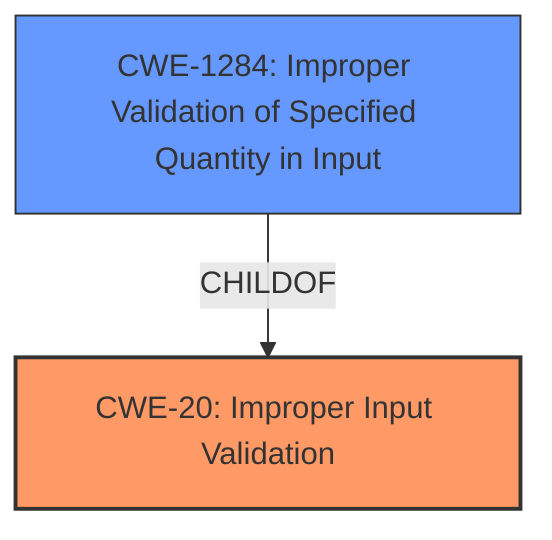

# Analysis Report for CVE-2021-22453

# Vulnerability Analysis Report: CVE-2021-22453

## Description


## Analysis (with Relationship Data)

# Summary
| CWE ID | CWE Name | Confidence | CWE Abstraction Level | CWE Vulnerability Mapping Label | CWE-Vulnerability Mapping Notes |
|---|---|---|---|---|---|
| CWE-20 ([CWE-20: Improper Input Validation](https://cwe.mitre.org/data/definitions/20.html)) | Improper Input Validation | 0.8 | Class | Primary | Discouraged |
| CWE-1284 ([CWE-1284: Improper Validation of Specified Quantity in Input](https://cwe.mitre.org/data/definitions/1284.html)) | Improper Validation of Specified Quantity in Input | 0.6 | Base | Secondary | Allowed |

## Evidence and Confidence

*   **Confidence Score:** 0.7
*   **Evidence Strength:** MEDIUM

## Relationship Analysis
The primary relationship impacting the decision is the parent-child relationship between CWE-20 ([CWE-20: Improper Input Validation](https://cwe.mitre.org/data/definitions/20.html)) and CWE-1284 ([CWE-1284: Improper Validation of Specified Quantity in Input](https://cwe.mitre.org/data/definitions/1284.html)). CWE-1284 ([CWE-1284: Improper Validation of Specified Quantity in Input](https://cwe.mitre.org/data/definitions/1284.html)) is a child of CWE-20 ([CWE-20: Improper Input Validation](https://cwe.mitre.org/data/definitions/20.html)), indicating that the vulnerability could be a more specific case of improper input validation. However, the description does not provide enough information to confidently select CWE-1284 ([CWE-1284: Improper Validation of Specified Quantity in Input](https://cwe.mitre.org/data/definitions/1284.html)) as the primary CWE, so CWE-20 ([CWE-20: Improper Input Validation](https://cwe.mitre.org/data/definitions/20.html)) is selected.



## Vulnerability Chain
The vulnerability chain starts with **Improper Input Validation**, which leads to a nearby process crash.
  - Root Cause: **Improper Input Validation**
  - Impact: nearby process crash

## Summary of Analysis
The initial assessment identified **Improper Input Validation** as the root cause of the vulnerability, leading to a nearby process crash. The primary decision is based on the vulnerability description key phrases that identify **Improper Input Validation**.

The graph relationships show that CWE-1284 ([CWE-1284: Improper Validation of Specified Quantity in Input](https://cwe.mitre.org/data/definitions/1284.html)) is a child of CWE-20 ([CWE-20: Improper Input Validation](https://cwe.mitre.org/data/definitions/20.html)). While CWE-1284 ([CWE-1284: Improper Validation of Specified Quantity in Input](https://cwe.mitre.org/data/definitions/1284.html)) could be a more specific match if the input validation issue relates to quantity, there is insufficient information.

The selected CWE, CWE-20 ([CWE-20: Improper Input Validation](https://cwe.mitre.org/data/definitions/20.html)), is at a class level. It is recommended to choose a base or variant level CWE where possible, but insufficient information is available to choose a more specific CWE.

Relevant CWE Information:

**CWE-20 ([CWE-20: Improper Input Validation](https://cwe.mitre.org/data/definitions/20.html))**: This CWE is chosen as the primary weakness because the vulnerability description explicitly states "**Improper Input Validation**". The security implication is that an attacker can craft unexpected input, leading to altered control flow or arbitrary code execution. The CWE description aligns with the **rootcause** described in the vulnerability. MITRE mapping guidance discourages the usage of CWE-20 ([CWE-20: Improper Input Validation](https://cwe.mitre.org/data/definitions/20.html)) and suggests considering lower-level children. Given the limited information, a class-level CWE is more appropriate.

**CWE-1284 ([CWE-1284: Improper Validation of Specified Quantity in Input](https://cwe.mitre.org/data/definitions/1284.html))**: This CWE was considered because the vulnerability description could imply that the improper input validation is related to a specified quantity. The CWE description states that it covers cases where "the product receives input that is expected to specify a quantity (such as size or length), but it does not validate or incorrectly validates that the quantity has the required properties." However, this is not stated explicitly in the Vulnerability Description, so it is a secondary candidate.


## CWE Relationship Analysis

Current CWEs represent these abstraction levels: .


### Vulnerability Chain Analysis

**Chain starting from CWE-20:**
- 20 (Improper Input Validation) - ROOT


**Chain starting from CWE-1284:**
- 1284 (Improper Validation of Specified Quantity in Input) - ROOT


### CWE Relationship Diagram

```mermaid
graph TD
    classDef primary fill:#f96,stroke:#333,stroke-width:2px
    classDef secondary fill:#69f,stroke:#333
    classDef tertiary fill:#9e9,stroke:#333
```


*Report generated on 2025-04-02 05:21:46*
