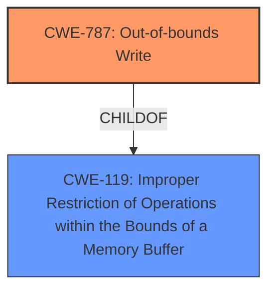

# Enhanced Analysis for CVE-2021-22458

# Summary
| CWE ID  | CWE Name | Confidence | CWE Abstraction Level | CWE Vulnerability Mapping Label | CWE-Vulnerability Mapping Notes |
|-----------------|--------------------------------------------------------------------------|-------------------|--------------------------|-------------------------------------|-------------------------------------------------------------------------------------------------------------------------------------------------------------------------------------------------------------------------------------------------------------------------------------------------------------------------------------------------------------------------------------------------------|
| CWE-787 | Out-of-bounds Write | 0.8 | Base | Primary | Allowed. The vulnerability involves writing data past the intended buffer, which directly matches the description of CWE-787. |
| CWE-119 | Improper Restriction of Operations within the Bounds of a Memory Buffer | 0.6 | Class | Secondary | Discouraged. While CWE-119 is a broader category that includes out-of-bounds write, CWE-787 provides a more specific classification. CWE-119 is the parent of CWE-787. |

## Evidence and Confidence

*   **Confidence Score:** 0.8
*   **Evidence Strength:** HIGH

## Relationship Analysis
The primary relationship impacting the decision is the ChildOf relationship between CWE-787 and CWE-119. CWE-787 (Out-of-bounds Write) is a specific type of CWE-119 (Improper Restriction of Operations within the Bounds of a Memory Buffer). Since the vulnerability description clearly indicates an out-of-bounds write, CWE-787 is the more appropriate and specific choice.



## Vulnerability Chain
The chain of events for this vulnerability is relatively straightforward:
1.  **Root Cause:** **Improper Restriction of Operations within the Bounds of a Memory Buffer** (Specifically an Out-of-bounds Write).
2.  **Impact:** Arbitrary code execution.

## Summary of Analysis
The vulnerability description explicitly states that the HarmonyOS component has a **Improper Restriction of Operations within the Bounds of a Memory Buffer** vulnerability which leads to arbitrary code execution. The key phrase points directly to memory corruption issues.

The retriever results list CWE-119 as the top candidate but recommends considering more specific children. CWE-787 (Out-of-bounds Write) is a child of CWE-119 and a more precise description of the root cause. The description also mentions that local attackers can achieve arbitrary code execution, which is a typical consequence of out-of-bounds write vulnerabilities.

CWE-119 is a class-level CWE and is discouraged when more specific CWEs exist. CWE-787 is a base-level CWE, offering more detail about the vulnerability.

Therefore, the primary CWE is CWE-787 (Out-of-bounds Write), and a secondary CWE is CWE-119 (Improper Restriction of Operations within the Bounds of a Memory Buffer). The selection of CWE-787 is based on the direct evidence from the vulnerability description and the hierarchical relationship between CWE-787 and CWE-119.

Relevant CWE Information:
# Enhanced Context (25 CWEs)
The following CWEs were identified as potentially relevant to this vulnerability:

## CWE-1289: Improper Validation of Unsafe Equivalence in Input
**Abstraction Level**: Base
**Similarity Score**: 0.76

## CWE-1288: Improper Validation of Consistency within Input
**Abstraction Level**: Base
**Similarity Score**: 0.75

## CWE-197: Numeric Truncation Error
**Abstraction Level**: Base
**Similarity Score**: 0.75

## CWE-191: Integer Underflow (Wrap or Wraparound)
**Abstraction Level**: Base
**Similarity Score**: 0.74

## CWE-131: Incorrect Calculation of Buffer Size
**Abstraction Level**: Base
**Similarity Score**: 0.74

## CWE-681: Incorrect Conversion between Numeric Types
**Abstraction Level**: Base
**Similarity Score**: 0.74

## CWE-606: Unchecked Input for Loop Condition
**Abstraction Level**: Base
**Similarity Score**: 0.73

## CWE-130: Improper Handling of Length Parameter Inconsistency
**Abstraction Level**: Base
**Similarity Score**: 0.72

## CWE-125: Out-of-bounds Read
**Abstraction Level**: Base
**Similarity Score**: 0.72

## CWE-805: Buffer Access with Incorrect Length Value
**Abstraction Level**: Base
**Similarity Score**: 0.72

## CWE-190: Integer Overflow or Wraparound
**Abstraction Level**: Base
**Similarity Score**: 7418.39

## CWE-197: Numeric Truncation Error
**Abstraction Level**: Base
**Similarity Score**: 7059.99

## CWE-125: Out-of-bounds Read
**Abstraction Level**: Base
**Similarity Score**: 7015.87

## CWE-1284: Improper Validation of Specified Quantity in Input
**Abstraction Level**: Base
**Similarity Score**: 6858.26

## CWE-119: Improper Restriction of Operations within the Bounds of a Memory Buffer
**Abstraction Level**: Class
**Similarity Score**: 6765.04

## CWE-128: Wrap-around Error
**Abstraction Level**: base
**Similarity Score**: 5.03

## CWE-190: Integer Overflow or Wraparound
**Abstraction Level**: base
**Similarity Score**: 5.03

## CWE-41: Improper Resolution of Path Equivalence
**Abstraction Level**: base
**Similarity Score**: 5.03

## CWE-195: Signed to Unsigned Conversion Error
**Abstraction Level**: variant
**Similarity Score**: 4.53

## CWE-1260: Improper Handling of Overlap Between Protected Memory Ranges
**Abstraction Level**: base
**Similarity Score**: 4.33

## CWE-22: Improper Limitation of a Pathname to a Restricted Directory ('Path Traversal')
**Abstraction Level**: base
**Similarity Score**: 4.33

## CWE-770: Allocation of Resources Without Limits or Throttling
**Abstraction Level**: base
**Similarity Score**: 4.33

## CWE-73: External Control of File Name or Path
**Abstraction Level**: base
**Similarity Score**: 4.33

## CWE-170: Improper Null Termination
**Abstraction Level**: base
**Similarity Score**: 4.33

## CWE-1284: Improper Validation of Specified Quantity in Input
**Abstraction Level**: base
**Similarity Score**: 4.33

CWEs Considered but Not Used:

*   CWE-125 (Out-of-bounds Read): This CWE was considered but not selected because the vulnerability description specifically mentions an **Improper Restriction of Operations within the Bounds of a Memory Buffer** which is typically associated with writing, not reading, outside buffer boundaries.
*   CWE-190 (Integer Overflow or Wraparound): While integer overflows can sometimes lead to buffer overflows, there is no direct evidence of this in the vulnerability description.
*   CWE-122 (Heap-based Buffer Overflow): This is a more specific variant of a buffer overflow, but the description doesn't provide information about whether the buffer is heap-based or not. Therefore, it's not possible to confirm this with the available evidence.
*   CWE-1260 (Improper Handling of Overlap Between Protected Memory Ranges): There's no mention of overlapping memory regions or memory protection issues in the vulnerability description.
* CWE-128, CWE-197, CWE-20, CWE-1284, CWE-41, CWE-195, CWE-22, CWE-770, CWE-73, CWE-170: These CWEs were not selected because they do not directly relate to the **Improper Restriction of Operations within the Bounds of a Memory Buffer** as described in the vulnerability. They address different types of weaknesses, such as input validation, path traversal, or resource management, which are not evident in the provided information.


## CWE Relationship Analysis

Current CWEs represent these abstraction levels: .


### Vulnerability Chain Analysis

**Chain starting from CWE-787:**
- 787 (Out-of-bounds Write) - ROOT


**Chain starting from CWE-1260:**
- 1260 (Improper Handling of Overlap Between Protected Memory Ranges) - ROOT


### CWE Relationship Diagram

```mermaid
graph TD
    classDef primary fill:#f96,stroke:#333,stroke-width:2px
    classDef secondary fill:#69f,stroke:#333
    classDef tertiary fill:#9e9,stroke:#333
```