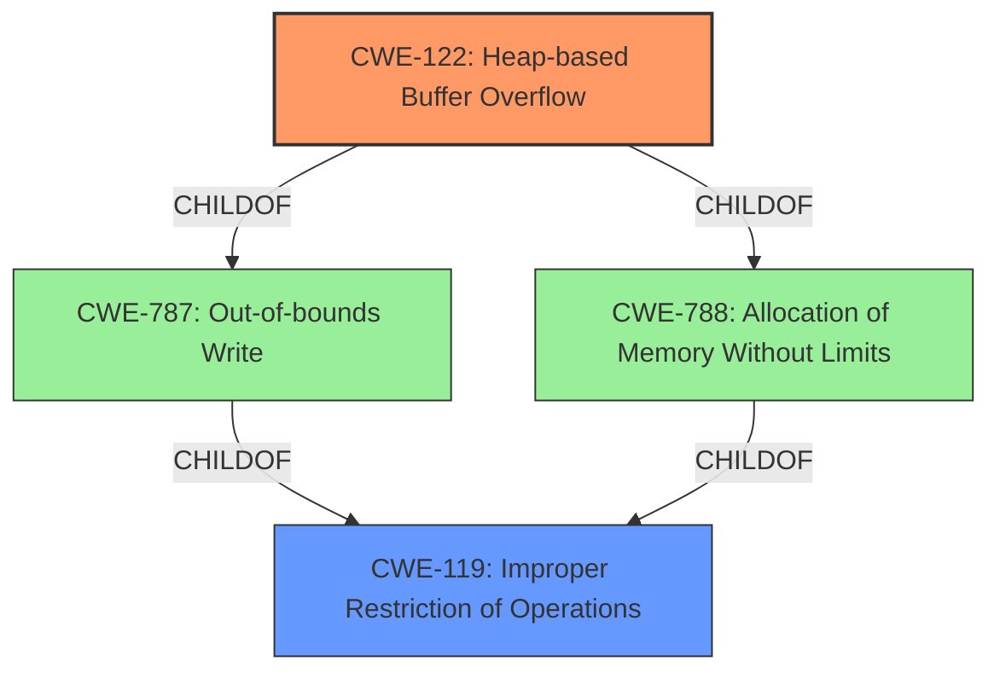

# Enhanced Analysis for CVE-2021-22465

# Summary
| CWE ID | CWE Name | Confidence | CWE Abstraction Level | CWE Vulnerability Mapping Label | CWE-Vulnerability Mapping Notes |
|---|---|---|---|---|---|
| CWE-122 | Heap-based Buffer Overflow | 1.0 | Variant | Allowed | Primary CWE |
| CWE-119 | Improper Restriction of Operations within the Bounds of a Memory Buffer | 0.5 | Class | Discouraged | Secondary Candidate |

## Evidence and Confidence

*   **Confidence Score:** 0.8
*   **Evidence Strength:** HIGH

## Relationship Analysis
The primary CWE is CWE-122, which is a variant of CWE-788 (Allocation of Memory Without Limits) and CWE-787 (Out-of-bounds Write). CWE-119 (Improper Restriction of Operations within the Bounds of a Memory Buffer) is a class-level CWE that is often misused when more specific CWEs are available.



## Vulnerability Chain
The vulnerability chain starts with a **heap-based buffer overflow** (CWE-122) which leads to a kernel system becoming unavailable.

## Summary of Analysis
The vulnerability description explicitly states that the **weakness** is a **heap-based buffer overflow**. This directly maps to CWE-122.

The evidence is:
"A component of the HarmonyOS has a **Heap-based Buffer Overflow** vulnerability. Local attackers may exploit this vulnerability to cause Kernel System unavailable."

CWE-122 is the optimal level of specificity because it clearly defines the type of buffer overflow (heap-based) and aligns with the provided vulnerability information. Other CWEs like CWE-119 are too general.

Relevant CWE Information:

# Enhanced Context (25 CWEs)
The following CWEs were identified as potentially relevant to this vulnerability:

## CWE-131: Incorrect Calculation of Buffer Size
**Abstraction Level**: Base
**Similarity Score**: 0.79

This CWE was considered but is not appropriate because the description does not provide any information about an incorrect calculation of buffer size. It only mentions a **heap-based buffer overflow**.

## CWE-805: Buffer Access with Incorrect Length Value
**Abstraction Level**: Base
**Similarity Score**: 0.79

This CWE was considered but is not appropriate because the description does not provide any information about the length value. It only mentions a **heap-based buffer overflow**.

## CWE-191: Integer Underflow (Wrap or Wraparound)
**Abstraction Level**: Base
**Similarity Score**: 0.78

This CWE was considered but is not appropriate because the description does not provide any information about integer underflow. It only mentions a **heap-based buffer overflow**.

## CWE-124: Buffer Underwrite ('Buffer Underflow')
**Abstraction Level**: Base
**Similarity Score**: 0.78

This CWE was considered but is not appropriate because the description specifically mentions a buffer overflow, not an underflow.

## CWE-126: Buffer Over-read
**Abstraction Level**: Variant
**Similarity Score**: 0.77

This CWE was considered but is not appropriate because the description specifies a buffer overflow, implying a write, not a read.

## CWE-193: Off-by-one Error
**Abstraction Level**: Base
**Similarity Score**: 0.76

This CWE was considered but is not appropriate because the description does not mention an off-by-one error. It only mentions a **heap-based buffer overflow**.

## CWE-680: Integer Overflow to Buffer Overflow
**Abstraction Level**: Compound
**Similarity Score**: 0.76

This CWE was considered but is not appropriate because the description does not mention integer overflow. It only mentions a **heap-based buffer overflow**.

## CWE-125: Out-of-bounds Read
**Abstraction Level**: Base
**Similarity Score**: 0.76

This CWE was considered but is not appropriate because the description specifies a buffer overflow, implying a write, not a read.

## CWE-127: Buffer Under-read
**Abstraction Level**: Variant
**Similarity Score**: 0.76

This CWE was considered but is not appropriate because the description specifies a buffer overflow, implying a write, not a read.

## CWE-190: Integer Overflow or Wraparound
**Abstraction Level**: Base
**Similarity Score**: 0.75

This CWE was considered but is not appropriate because the description does not mention integer overflow. It only mentions a **heap-based buffer overflow**.

## CWE-190: Integer Overflow or Wraparound
**Abstraction Level**: Base
**Similarity Score**: 6044.38

This CWE was considered but is not appropriate because the description does not mention integer overflow. It only mentions a **heap-based buffer overflow**.

## CWE-125: Out-of-bounds Read
**Abstraction Level**: Base
**Similarity Score**: 5692.61

This CWE was considered but is not appropriate because the description specifies a buffer overflow, implying a write, not a read.

## CWE-193: Off-by-one Error
**Abstraction Level**: Base
**Similarity Score**: 5613.13

This CWE was considered but is not appropriate because the description does not mention an off-by-one error. It only mentions a **heap-based buffer overflow**.

## CWE-1284: Improper Validation of Specified Quantity in Input
**Abstraction Level**: Base
**Similarity Score**: 5421.56

This CWE was considered but is not appropriate because the description does not mention quantity validation issues. It only mentions a **heap-based buffer overflow**.

## CWE-197: Numeric Truncation Error
**Abstraction Level**: Base
**Similarity Score**: 5416.20

This CWE was considered but is not appropriate because the description does not mention numeric truncation. It only mentions a **heap-based buffer overflow**.

## CWE-128: Wrap-around Error
**Abstraction Level**: base
**Similarity Score**: 5.03

This CWE was considered but is not appropriate because the description does not mention wrap-around error. It only mentions a **heap-based buffer overflow**.

## CWE-170: Improper Null Termination
**Abstraction Level**: base
**Similarity Score**: 5.03

This CWE was considered but is not appropriate because the description does not mention null termination. It only mentions a **heap-based buffer overflow**.

## CWE-195: Signed to Unsigned Conversion Error
**Abstraction Level**: variant
**Similarity Score**: 4.53

This CWE was considered but is not appropriate because the description does not mention signed to unsigned conversion. It only mentions a **heap-based buffer overflow**.

## CWE-1284: Improper Validation of Specified Quantity in Input
**Abstraction Level**: base
**Similarity Score**: 4.33

This CWE was considered but is not appropriate because the description does not mention quantity validation issues. It only mentions a **heap-based buffer overflow**.

## CWE-617: Reachable Assertion
**Abstraction Level**: base
**Similarity Score**: 4.33

This CWE was considered but is not appropriate because the description does not mention reachable assertion. It only mentions a **heap-based buffer overflow**.

## CWE-123: Write-what-where Condition
**Abstraction Level**: base
**Similarity Score**: 3.89

This CWE was considered but is not appropriate because the description does not provide enough information to conclude that the vulnerability leads to an arbitrary write.

## CWE-463: Deletion of Data Structure Sentinel
**Abstraction Level**: base
**Similarity Score**: 3.64

This CWE was considered but is not appropriate because the description does not mention deletion of data structure sentinel. It only mentions a **heap-based buffer overflow**.

## CWE-1339: Insufficient Precision or Accuracy of a Real Number
**Abstraction Level**: base
**Similarity Score**: 3.57

This CWE was considered but is not appropriate because the description does not mention insufficient precision or accuracy of a real number. It only mentions a **heap-based buffer overflow**.

## CWE-120: Buffer Copy without Checking Size of Input ('Classic Buffer Overflow')


## CWE Relationship Analysis

Current CWEs represent these abstraction levels: .


### Vulnerability Chain Analysis

**Chain starting from CWE-787:**
- 787 (Out-of-bounds Write) - ROOT


**Chain starting from CWE-680:**
- 680 (Integer Overflow to Buffer Overflow) - ROOT


### CWE Relationship Diagram

```mermaid
graph TD
    classDef primary fill:#f96,stroke:#333,stroke-width:2px
    classDef secondary fill:#69f,stroke:#333
    classDef tertiary fill:#9e9,stroke:#333
```