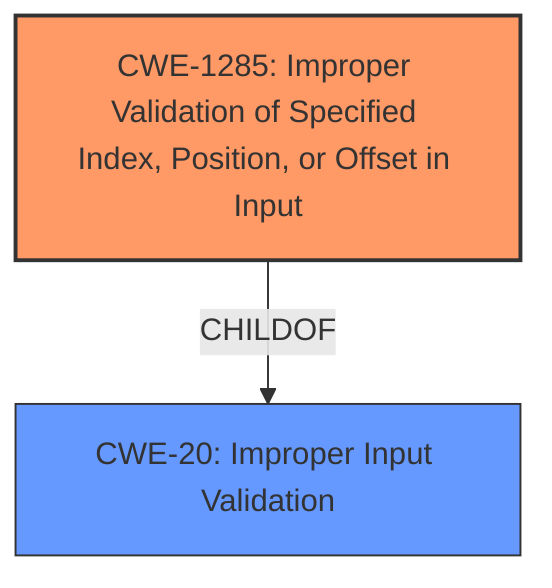

# Analysis Report for CVE-2021-22467

# Vulnerability Analysis Report: CVE-2021-22467

## Description


## Analysis (with Relationship Data)

# Summary
| CWE ID | CWE Name | Confidence | CWE Abstraction Level | CWE Vulnerability Mapping Label | CWE-Vulnerability Mapping Notes |
|---|---|---|---|---|---|
| CWE-1285 | Improper Validation of Specified Index, Position, or Offset in Input | 0.75 | Base | Allowed | Primary CWE |
| CWE-20 | Improper Input Validation | 0.65 | Class | Discouraged | Secondary Candidate |

## Evidence and Confidence

*   **Confidence Score:** 0.7
*   **Evidence Strength:** MEDIUM

## Relationship Analysis
The primary relationship influencing the CWE selection is the ChildOf relationship between CWE-1285 and CWE-20. CWE-1285 is a more specific case of CWE-20, dealing with the validation of index, position, or offset inputs. Because the vulnerability description mentions the ability to "read at any address," this suggests a problem with how an address (which can be considered an index or offset) is validated. Therefore, CWE-1285 is favored.



## Vulnerability Chain
The vulnerability chain starts with **Improper Input Validation** which leads to the ability to "read at any address".

## Summary of Analysis
The initial analysis identified **Improper Input Validation** as the root cause. The retriever results suggested CWE-20, CWE-1285, and others. After reviewing the details, and considering the ability to read at "any address", CWE-1285 (Improper Validation of Specified Index, Position, or Offset in Input) was chosen as the primary CWE because it more specifically describes the vulnerability compared to the more general CWE-20.

The vulnerability description states: "A component of the HarmonyOS has a **Improper Input Validation** vulnerability. Local attackers may exploit this vulnerability to read at any address."

CWE-20 is a Class-level CWE and is discouraged. Mapping guidance suggests considering lower-level children. CWE-1285 is a Base-level CWE and is allowed.
Therefore, CWE-1285 is a more precise and appropriate choice.

Relevant CWE Information:

# Enhanced Context (25 CWEs)

## CWE-20: Improper Input Validation
**Abstraction:** Class
**Status:** Stable

### Description
The product receives input or data, but it does
        not validate or incorrectly validates that the input has the
        properties that are required to process the data safely and
        correctly.
## CWE-1285: Improper Validation of Specified Index, Position, or Offset in Input
**Abstraction:** Base
**Status:** Incomplete

### Description
The product receives input that is expected to specify an index, position, or offset into an indexable resource such as a buffer or file, but it does not validate or incorrectly validates that the specified index/position/offset has the required properties.

**CWE-1284:** Improper Validation of Specified Quantity in Input was considered, but is less descriptive because the vulnerability specifically relates to memory addresses.
**CWE-125:** Out-of-bounds Read was considered, but it describes the *impact* of the vulnerability, not the root cause.
**CWE-823:** Use of Out-of-range Pointer Offset was considered, but lacks explicit evidence.

**CWE-1285** aligns well with the vulnerability, as the ability to "read at any address" directly implies a failure to properly validate the specified address (index, position, or offset).

---
**CWE-1285: Improper Validation of Specified Index, Position, or Offset in Input**

*   **Technical Explanation:** The vulnerability allows reading data at any memory address, indicating that the input representing the memory address is not properly validated. This lack of validation enables attackers to access arbitrary memory locations, potentially exposing sensitive information.
*   **Security Implications:** This vulnerability can lead to information disclosure, allowing attackers to read sensitive data such as cryptographic keys, user credentials, or other confidential information stored in memory.
*   **Parent-Child Relationships:** CWE-1285 is a child of CWE-20 (Improper Input Validation), representing a specific case of input validation failure related to indices, positions, or offsets.
*   **Chain Patterns:** An improper validation of an index, position, or offset (CWE-1285) can lead to an out-of-bounds read (CWE-125).
*   **Primary/Secondary:** This is the primary weakness, as the **Improper Input Validation** is the root cause that leads to the ability to "read at any address".
*   **Mapping Guidance Influence:** The MITRE mapping guidance recommends using the most specific CWE available. Since CWE-1285 directly addresses the improper validation of indices, positions, or offsets, it is a more appropriate choice than the more general CWE-20.

**CWE-20: Improper Input Validation**

*   **Technical Explanation:** While the vulnerability stems from **Improper Input Validation**, CWE-20 is too general. It simply states that the product receives input but does not validate or incorrectly validates it.
*   **Security Implications:** The security implication is broad, but in this case leads to reading data at an arbitrary address.
*   **Parent-Child Relationships:** CWE-20 is a class-level CWE. The mapping guidance discourages using it and suggests using its lower-level children instead.
*   **Chain Patterns:** The **Improper Input Validation** can lead to other weaknesses such as out-of-bounds reads or writes.
*   **Primary/Secondary:** This is a secondary candidate because the description is too generic.
*   **Mapping Guidance Influence:** The MITRE mapping guidance discourages the use of CWE-20 due to its generality and suggests using more specific child CWEs.


## CWE Relationship Analysis

Current CWEs represent these abstraction levels: .


### Vulnerability Chain Analysis

**Chain starting from CWE-823:**
- 823 (Use of Out-of-range Pointer Offset) - ROOT


**Chain starting from CWE-125:**
- 125 (Out-of-bounds Read) - ROOT


### CWE Relationship Diagram

```mermaid
graph TD
    classDef primary fill:#f96,stroke:#333,stroke-width:2px
    classDef secondary fill:#69f,stroke:#333
    classDef tertiary fill:#9e9,stroke:#333
```


*Report generated on 2025-04-02 14:24:51*
