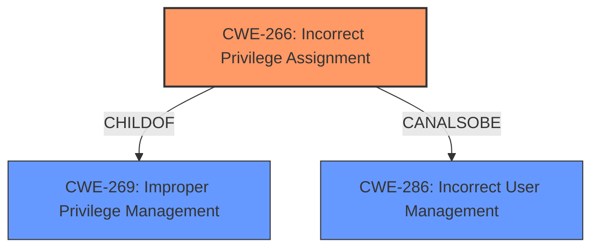

# Enhanced Analysis for CVE-2021-22490

# Summary
| CWE ID | CWE Name | Confidence | CWE Abstraction Level | CWE Vulnerability Mapping Label | CWE-Vulnerability Mapping Notes |
|---|---|---|---|---|---|
| CWE-266 | Incorrect Privilege Assignment | 0.75 | Base | Allowed | Primary CWE |

## Evidence and Confidence

*   **Confidence Score:** 0.75
*   **Evidence Strength:** MEDIUM

## Relationship Analysis
The primary relationship considered was the direct match of the **Permission verification vulnerability** to the CWE-266 description of "A product incorrectly assigns a privilege to a particular actor, creating an unintended sphere of control for that actor." While other CWEs like CWE-285 (Improper Authorization) were considered, CWE-266's base-level abstraction and direct correlation made it a more suitable choice. The other CWEs have weaker relationships to the description, and are too generic.



## Vulnerability Chain
The chain for this vulnerability begins with a **Permission verification vulnerability**, leading to an incorrect privilege assignment, which can ultimately affect the device performance.

## Summary of Analysis
The analysis is based on the "Permission verification vulnerability" and "Successful exploitation of this vulnerability may affect the device performance."

CWE-266 (Incorrect Privilege Assignment) is selected because the vulnerability description specifically mentions "Permission verification vulnerability," which aligns with the concept of incorrect privilege assignment. The reference material indicates that the root cause involves a "permission verification vulnerability".

CWE-285 (Improper Authorization) was considered but deemed less specific than CWE-266. While authorization and privilege management are related, the description's emphasis on "Permission verification vulnerability" leans more towards an assignment issue rather than a broader authorization failure. CWE-266 is at the optimal level of specificity because it directly addresses the root cause described in the vulnerability report.

Relevant CWE Information:

# Enhanced Context (25 CWEs)
The following CWEs were identified as potentially relevant to this vulnerability:

## CWE-266: Incorrect Privilege Assignment
**Abstraction Level**: Base
**Similarity Score**: 0.77
**Source**: dense

**Description**:
A product incorrectly assigns a privilege to a particular actor, creating an unintended sphere of control for that actor.

**Mapping Guidance**:
- Usage: Allowed
- Rationale: This CWE entry is at the Base level of abstraction, which is a preferred level of abstraction for mapping to the root causes of vulnerabilities.


## CWE Relationship Analysis

Current CWEs represent these abstraction levels: .


### Vulnerability Chain Analysis

**Chain starting from CWE-286:**
- 286 (Incorrect User Management) - ROOT


**Chain starting from CWE-285:**
- 285 (Improper Authorization) - ROOT


### CWE Relationship Diagram

```mermaid
graph TD
    classDef primary fill:#f96,stroke:#333,stroke-width:2px
    classDef secondary fill:#69f,stroke:#333
    classDef tertiary fill:#9e9,stroke:#333
```