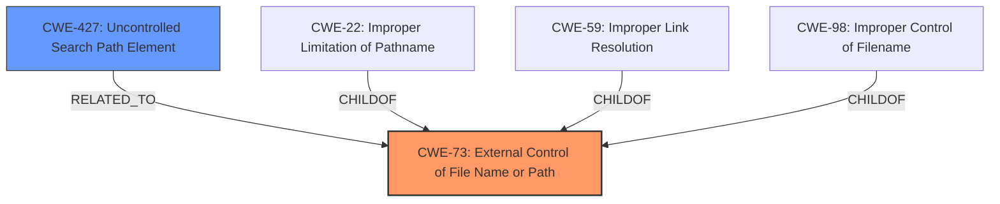

# Raw Analyzer Response for CVE-2021-22539

# Summary
| CWE ID | CWE Name | Confidence | CWE Abstraction Level | CWE Vulnerability Mapping Label | CWE-Vulnerability Mapping Notes |
|---|---|---|---|---|---|
| CWE-73 | External Control of File Name or Path | 0.9 | Base | Allowed | Primary CWE |
| CWE-427 | Uncontrolled Search Path Element | 0.7 | Base | Allowed | Secondary Candidate |

## Evidence and Confidence

*   **Confidence Score:** 0.8
*   **Evidence Strength:** HIGH

## Relationship Analysis
The primary CWE is CWE-73, which indicates that the vulnerability involves external control of a file name or path. CWE-427 is a related weakness where the product uses a fixed search path, but one or more elements in that path are under the control of unintended actors. The relationship is that external control over a path (CWE-73) can lead to an uncontrolled search path (CWE-427) if the controlled path is then used in a search operation. CWE-73 is a parent of CWE-22 (Improper Limitation of a Pathname to a Restricted Directory ('Path Traversal')), CWE-59 (Improper Link Resolution Before File Access ('Link Following')), and CWE-98 (Improper Control of Filename for Include/Require Statement in PHP Program ('PHP Remote File Inclusion')).

## Vulnerability Chain
The vulnerability chain starts with the attacker's ability to place a crafted JSON config file (external control of file name/path - CWE-73). This file points to a custom executable. Because `vscode-bazel` allows the workspace path to lint *.bzl files to be set via this config file, the attacker can execute any executable on the system.

## Summary of Analysis
The initial assessment identified **external control of file name/path** as the primary weakness. The `vscode-bazel` extension allows the `bazel.buildifierExecutable` setting to be modified through a crafted JSON config file placed in the project folder. This allows an attacker to specify an arbitrary executable, leading to code execution.

The analysis is based on the following evidence from the "CVE Reference Links Content Summary":
- "**Root cause of vulnerability:** The `vscode-bazel` extension allows workspace settings to modify the path of an executable file used for linting `.bzl` files (specifically the `bazel.buildifierExecutable` setting). This setting can be altered by placing a crafted JSON config file within the project folder."
- "**Weaknesses/vulnerabilities present:** The vulnerability lies in the ability to modify the executable path used by the extension, allowing execution of arbitrary programs."
- "**Impact of exploitation:** An attacker can achieve arbitrary code execution by placing a malicious JSON config file within a project that is opened using `vscode-bazel`."

The graph relationships confirm that external control of file name/path can lead to various file-related weaknesses, making it a suitable primary classification.

The selected CWEs are at the optimal level of specificity because they directly address the **root cause** (external control of file name/path) and a related condition (uncontrolled search path element).

Relevant CWE Information:

# Enhanced Context (25 CWEs)
The following CWEs were identified as potentially relevant to this vulnerability:

## CWE-73: External Control of File Name or Path
**Abstraction Level**: Base
**Similarity Score**: 0.80
**Source**: dense

**Description**:
The product allows user input to control or influence paths or file names that are used in filesystem operations.

**Mapping Guidance**:
- Usage: Allowed
- Rationale: This CWE entry is at the Base level of abstraction, which is a preferred level of abstraction for mapping to the root causes of vulnerabilities.

## CWE-427: Uncontrolled Search Path Element
**Abstraction Level**: Base
**Similarity Score**: 0.78
**Source**: dense

**Description**:
The product uses a fixed or controlled search path to find resources, but one or more locations in that path can be under the control of unintended actors.

**Mapping Guidance**:
- Usage: Allowed
- Rationale: This CWE entry is at the Base level of abstraction, which is a preferred level of abstraction for mapping to the root causes of vulnerabilities.

**CWE-73: External Control of File Name or Path**
- **Technical Explanation:** The vulnerability allows an attacker to control the path of the executable used for linting `.bzl` files. This control is achieved by placing a crafted JSON config file within the project folder. The `vscode-bazel` extension reads this configuration and uses the specified path to execute the linter.
- **Security Implications:** This allows an attacker to execute arbitrary code on the system. By pointing the linter path to a malicious executable, the attacker can gain full control over the affected machine when the project is opened in VS Code with the vulnerable extension.
- **Relationships:** CWE-73 is a base-level CWE. It can lead to other weaknesses like path traversal (CWE-22) or remote file inclusion (CWE-98). In this case, it directly leads to arbitrary code execution because the controlled path is used to launch an executable.
- **Mapping Guidance Influence:** The MITRE mapping guidance allows the use of CWE-73 at the Base level of abstraction, which is the preferred level.
- **Confidence:** 0.9

**CWE-427: Uncontrolled Search Path Element**
- **Technical Explanation:** The extension uses a search path to find the linter executable, and the attacker can inject a malicious path into this search path via the crafted JSON file.
- **Security Implications:** Similar to CWE-73, this can lead to arbitrary code execution. If the attacker can place a malicious executable in a directory that is part of the search path, the extension will execute it.
- **Relationships:** CWE-427 is also a base-level CWE. It is related to CWE-73 because the external control over the file name/path allows the attacker to inject an uncontrolled element into the search path.
- **Mapping Guidance Influence:** The MITRE mapping guidance allows the use of CWE-427 at the Base level of abstraction.
- **Confidence:** 0.7

**CWEs Considered but Not Used:**
- CWE-22 (Improper Limitation of a Pathname to a Restricted Directory ('Path Traversal')): While path traversal could be a factor if the attacker uses ".." sequences, the primary issue is the ability to specify an arbitrary executable path, not necessarily to traverse directories.
- CWE-88 (Improper Neutralization of Argument Delimiters in a Command ('Argument Injection')): Argument injection is not the primary issue, as the attacker is controlling the entire executable path, not just injecting arguments.
- CWE-98 (Improper Control of Filename for Include/Require Statement in PHP Program ('PHP Remote File Inclusion')): This is specific to PHP programs, which is not relevant to this vulnerability.
- CWE-732 (Incorrect Permission Assignment for Critical Resource): While incorrect permissions could exacerbate the issue, the primary weakness is the external control over the executable path.
- CWE-918 (Server-Side Request Forgery (SSRF)): This is not relevant as there are no server-side requests involved in the vulnerability.
- CWE-23 (Relative Path Traversal): This is a specific case of CWE-22 and not the primary weakness.