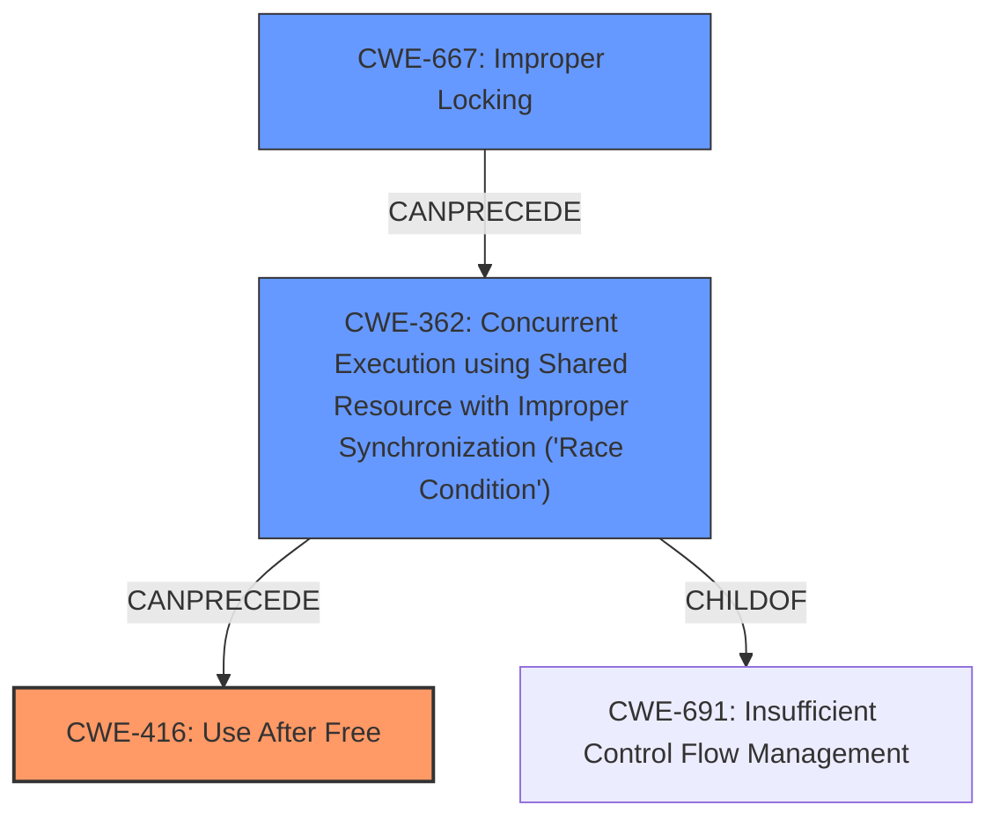

# Raw Analyzer Response for CVE-2021-22543

# Summary
| CWE ID | CWE Name | Confidence | CWE Abstraction Level | CWE Vulnerability Mapping Label | CWE-Vulnerability Mapping Notes |
|---|---|---|---|---|---|
| CWE-416 | Use After Free | 0.9 | Variant | Allowed | Primary CWE |
| CWE-667 | Improper Locking | 0.7 | Class | Allowed-with-Review | Secondary CWE |
| CWE-362 | Concurrent Execution using Shared Resource with Improper Synchronization ('Race Condition') | 0.6 | Class | Allowed-with-Review | Secondary CWE |

## Evidence and Confidence

*   **Confidence Score:** 0.8
*   **Evidence Strength:** HIGH

## Relationship Analysis
The primary CWE identified is CWE-416 (Use After Free), which is a Variant-level CWE. CWE-416 can be reached via a race condition, meaning CWE-362 (Concurrent Execution using Shared Resource with Improper Synchronization) can precede CWE-416. CWE-362 is a child of CWE-691 (Insufficient Control Flow Management). Furthermore, the root cause **Improper handling of VM_IO|VM_PFNMAP vmas in KVM** suggests a synchronization issue, leading to the consideration of CWE-667 (Improper Locking), which could lead to a race condition (CWE-362).

## Vulnerability Chain
The vulnerability chain starts with **Improper handling of VM_IO|VM_PFNMAP vmas in KVM**, which can lead to bypassing RO checks. This can then lead to pages being freed while still accessible, resulting in a use-after-free condition. An alternative chain could involve **Improper Locking (CWE-667)** leading to a **Race Condition (CWE-362)**, which then leads to the **Use After Free (CWE-416)**.

## Summary of Analysis
The analysis focuses on the root cause and impact of the vulnerability in Linux KVM. The key phrase, "**Improper handling of VM_IO|VM_PFNMAP vmas in KVM**" indicates a memory management issue. The vulnerability allows bypassing RO checks, which results in premature freeing of memory pages while they are still accessible, leading to a use-after-free condition. This is supported by the "CVE Reference Links Content Summary" which lists "Use-after-free vulnerability due to incorrect reference counting of pages."

CWE-416 (Use After Free) is selected as the primary CWE because it directly represents the core vulnerability where memory is accessed after it has been freed. The "CVE Reference Links Content Summary" explicitly states "Use-after-free vulnerability due to incorrect reference counting of pages." This provides strong evidence for this classification.

CWE-667 (Improper Locking) is considered as a secondary CWE because the **Improper handling** could be due to a locking issue which is mentioned in the "CVE Reference Links Content Summary" "reference counting on the pages might not be set up to handle this."

CWE-362 (Concurrent Execution using Shared Resource with Improper Synchronization ('Race Condition')) is also considered as a secondary CWE since race conditions often lead to use-after-free vulnerabilities.

Other CWEs were considered but ultimately not selected:

*   CWE-125 (Out-of-bounds Read): While memory corruption is mentioned, the primary issue is freeing memory prematurely, not reading out of bounds.
*   CWE-732 (Incorrect Permission Assignment for Critical Resource), CWE-862 (Missing Authorization), and CWE-863 (Incorrect Authorization): These are related to access control, but the primary issue is memory management. The RO check bypass is a consequence of the memory management flaw.
*   CWE-226 (Sensitive Information in Resource Not Removed Before Reuse): This is not the primary issue, as the vulnerability is more about memory management than exposing sensitive data.
*   CWE-1260 (Improper Handling of Overlap Between Protected Memory Ranges): This is related to memory management, but it's not the core issue here. The problem is premature freeing, not necessarily overlapping regions.

The selected CWEs are at the optimal level of specificity because CWE-416 is a Variant that directly describes the use-after-free condition. The secondary CWEs provide additional context about potential causes, such as locking issues and race conditions.

Relevant CWE Information:

# Enhanced Context (25 CWEs)
The following CWEs were identified as potentially relevant to this vulnerability:

## CWE-404: Improper Resource Shutdown or Release
**Abstraction Level**: Class
**Similarity Score**: 0.78
**Source**: dense

**Description**:
The product does not release or incorrectly releases a resource before it is made available for re-use.

**Mapping Guidance**:
- Usage: Allowed-with-Review
- Rationale: This CWE entry is a Class and might have Base-level children that would be more appropriate

## CWE-667: Improper Locking
**Abstraction Level**: Class
**Similarity Score**: 0.78
**Source**: dense

**Description**:
The product does not properly acquire or release a lock on a resource, leading to unexpected resource state changes and behaviors.

**Mapping Guidance**:
- Usage: Allowed-with-Review
- Rationale: This CWE entry is a Class and might have Base-level children that would be more appropriate

## CWE-226: Sensitive Information in Resource Not Removed Before Reuse
**Abstraction Level**: Base
**Similarity Score**: 0.78
**Source**: dense

**Description**:
The product releases a resource such as memory or a file so that it can be made available for reuse, but it does not clear or "zeroize" the information contained in the resource before the product performs a critical state transition or makes the resource available for reuse by other entities.

**Mapping Guidance**:
- Usage: Allowed
- Rationale: This CWE entry is at the Base level of abstraction, which is a preferred level of abstraction for mapping to the root causes of vulnerabilities.

## CWE-362: Concurrent Execution using Shared Resource with Improper Synchronization ('Race Condition')
**Abstraction Level**: Class
**Similarity Score**: 0.77
**Source**: dense

**Description**:
The product contains a concurrent code sequence that requires temporary, exclusive access to a shared resource, but a timing window exists in which the shared resource can be modified by another code sequence operating concurrently.

**Mapping Guidance**:
- Usage: Allowed-with-Review
- Rationale: This CWE entry is a Class and might have Base-level children that would be more appropriate

## CWE-668: Exposure of Resource to Wrong Sphere
**Abstraction Level**: Class
**Similarity Score**: 0.76
**Source**: dense

**Description**:
The product exposes a resource to the wrong control sphere, providing unintended actors with inappropriate access to the resource.

**Mapping Guidance**:
- Usage: Discouraged
- Rationale: CWE-668 is high-level and is often misused as a catch-all when lower-level CWE IDs might be applicable. It is sometimes used for low-information vulnerability reports [REF-1287]. It is a level-1 Class (i.e., a child of a Pillar). It is not useful for trend analysis.

## CWE-754: Improper Check for Unusual or Exceptional Conditions
**Abstraction Level**: Class
**Similarity Score**: 0.76
**Source**: dense

**Description**:
The product does not check or incorrectly checks for unusual or exceptional conditions that are not expected to occur frequently during day to day operation of the product.

**Mapping Guidance**:
- Usage: Allowed-with-Review
- Rationale: This CWE entry is a Class and might have Base-level children that would be more appropriate

## CWE-662: Improper Synchronization
**Abstraction Level**: Class
**Similarity Score**: 0.76
**Source**: dense

**Description**:
The product utilizes multiple threads or processes to allow temporary access to a shared resource that can only be exclusive to one process at a time, but it does not properly synchronize these actions, which might cause simultaneous accesses of this resource by multiple threads or processes.

**Mapping Guidance**:
- Usage: Discouraged
- Rationale: This CWE entry is a level-1 Class (i.e., a child of a Pillar). It might have lower-level