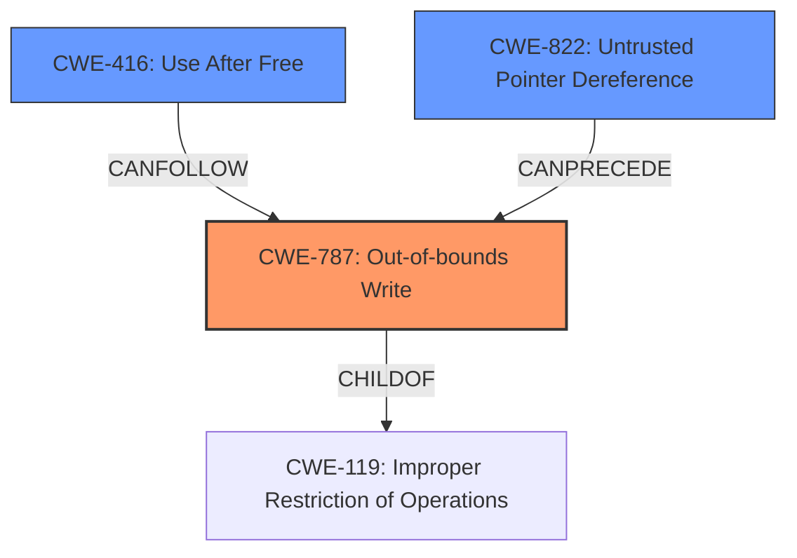

# Raw Analyzer Response for CVE-2021-22549

# Summary
| CWE ID | CWE Name | Confidence | CWE Abstraction Level | CWE Vulnerability Mapping Label | CWE-Vulnerability Mapping Notes |
|---|---|---|---|---|---|
| CWE-787 | Out-of-bounds Write | 0.9 | Base | Allowed | Primary CWE |
| CWE-416 | Use After Free | 0.5 | Variant | Allowed | Secondary Candidate |
| CWE-822 | Untrusted Pointer Dereference | 0.5 | Base | Allowed | Secondary Candidate |

## Evidence and Confidence

*   **Confidence Score:** 0.7
*   **Evidence Strength:** MEDIUM

## Relationship Analysis
The primary CWE is CWE-787 **(Out-of-bounds Write)**. Several other CWEs were considered, especially those related to pointer manipulation and memory management.

-   CWE-787 is a base-level CWE and a child of CWE-119 **(Improper Restriction of Operations Within the Bounds of a Memory Buffer)**.
-   CWE-416 **(Use After Free)** and CWE-822 **(Untrusted Pointer Dereference)** were considered due to the potential for memory corruption.
-   CWE-123 **(Write-what-where Condition)**, CWE-825 **(Expired Pointer Dereference)**, and CWE-1260 **(Improper Handling of Overlap Between Protected Memory Ranges)** were considered but ultimately deemed less applicable.

## Vulnerability Chain
The vulnerability chain starts with a TOCTOU race condition and leads to the ability to **overwrite arbitrary trusted memory**.

1.  **TOCTOU Race Condition:** The initial check of the untrusted input pointer and size occurs before the actual use of the pointer.
2.  **Improper Input Handling:** The validated untrusted input pointer is not immediately stored into a trusted variable, creating a window for modification.
3.  **Out-of-bounds Write (CWE-787):** By modifying the address after the check, an attacker can cause the program to write to an arbitrary memory location.

The root cause is the TOCTOU vulnerability arising from **improper input handling**. The direct result is the ability to **overwrite arbitrary trusted memory**, which aligns with CWE-787.

## Summary of Analysis
The primary weakness is CWE-787 **(Out-of-bounds Write)** because the vulnerability allows an attacker to **overwrite arbitrary trusted memory**.

The "CVE Reference Links Content Summary" indicates a TOCTOU vulnerability: "The untrusted input pointer should be stored to trusted variable before checking to avoid unexpected modifications after checking." This **improper input handling** allows an attacker to modify the address to point to trusted memory. The result is an **out-of-bounds write** to trusted memory, which directly corresponds to CWE-787.

Other CWEs considered:

*   CWE-416 **(Use After Free)** was considered because **overwriting memory** can potentially lead to a use-after-free condition if the overwritten memory contains pointers to freed resources.
*   CWE-822 **(Untrusted Pointer Dereference)** was considered because the attacker is able to **modify the address to point to trusted memory**, effectively creating an untrusted pointer that is then dereferenced.

CWE-787 is the most specific and appropriate mapping because it directly describes the ability to **overwrite arbitrary trusted memory**. The other CWEs are secondary possibilities that could arise as a consequence of the primary weakness. The final decision is based on the fact that the attacker can directly **overwrite arbitrary trusted memory**, and CWE-787 captures that behavior.