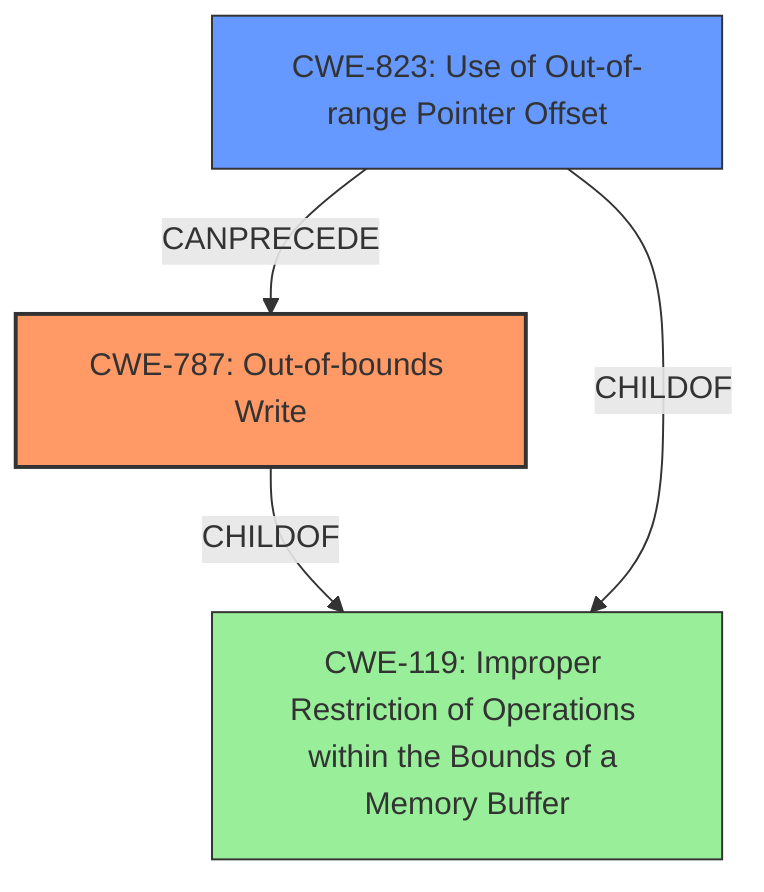

# Analysis Report for CVE-2021-22550

# Vulnerability Analysis Report: CVE-2021-22550

## Description


## Analysis (with Relationship Data)

# Summary
| CWE ID | CWE Name | Confidence | CWE Abstraction Level | CWE Vulnerability Mapping Label | CWE-Vulnerability Mapping Notes |
|---|---|---|---|---|---|
| CWE-787 | Out-of-bounds Write | 0.8 | Base | Allowed | Primary CWE |
| CWE-823 | Use of Out-of-range Pointer Offset | 0.7 | Base | Allowed | Secondary Candidate |
| CWE-119 | Improper Restriction of Operations within the Bounds of a Memory Buffer | 0.6 | Class | Discouraged | Secondary Candidate |

## Evidence and Confidence

*   **Confidence Score:** 0.8
*   **Evidence Strength:** HIGH

## Relationship Analysis
The primary CWE is CWE-787, which represents the out-of-bounds write condition resulting from the ability to modify pointers in enclave memory. CWE-823 is considered a secondary candidate because the **out-of-range** pointer offset leads to the out-of-bounds write. CWE-119 is a parent Class of both CWE-787 and CWE-823 but is more general.



## Vulnerability Chain
The vulnerability chain starts with the **improper handling of pointers** in enclave memory. An attacker can modify these pointers (CWE-823: Use of Out-of-range Pointer Offset) to overwrite arbitrary memory addresses within the secure enclave. This leads to an **out-of-bounds write** (CWE-787).

## Summary of Analysis
The primary weakness is the ability to overwrite arbitrary memory addresses, best captured by CWE-787 (Out-of-bounds Write). The vulnerability description clearly states that "An attacker can modify the pointers in enclave memory to overwrite arbitrary memory addresses within the secure enclave." This directly aligns with the definition of CWE-787. CWE-823 is a contributing factor because manipulating pointers with **out-of-range** offsets is how the **out-of-bounds write** is achieved.

The analysis is heavily based on the provided evidence, particularly the vulnerability description and the CVE Reference Links Content Summary. The commit message confirms this analysis: "The pointer array is stored in untrusted memory, so we cannot trust the value even after validation. We should validate the pointer is pointing to untrusted memory after it's stored inside the enclave."

The chosen CWEs are at the optimal level of specificity. CWE-787 directly describes the **out-of-bounds write** condition, while CWE-823 explains how the **out-of-bounds write** is achieved via pointer manipulation. More general CWEs like CWE-119 would not capture the specific nature of this vulnerability.

Relevant CWE Information:

# Enhanced Context (25 CWEs)
The following CWEs were identified as potentially relevant to this vulnerability:

## CWE-131: Incorrect Calculation of Buffer Size
**Abstraction Level**: Base
**Similarity Score**: 0.79
**Source**: dense
**Description**: The product does not correctly calculate the size to be used when allocating a buffer, which could lead to a buffer overflow.
**Rationale for not selecting**: This CWE does not fit because the vulnerability is not about calculating buffer sizes, but about manipulating pointers to write to arbitrary memory locations.

## CWE-404: Improper Resource Shutdown or Release
**Abstraction Level**: Class
**Similarity Score**: 0.78
**Source**: dense
**Description**: The product does not release or incorrectly releases a resource before it is made available for re-use.
**Rationale for not selecting**: This CWE does not fit because the vulnerability is not about resource release.

## CWE-667: Improper Locking
**Abstraction Level**: Class
**Similarity Score**: 0.78
**Source**: dense
**Description**: The product does not properly acquire or release a lock on a resource, leading to unexpected resource state changes and behaviors.
**Rationale for not selecting**: This CWE does not fit because the vulnerability is not about locking mechanisms.

## CWE-125: Out-of-bounds Read
**Abstraction Level**: Base
**Similarity Score**: 0.78
**Source**: dense
**Description**: The product reads data past the end, or before the beginning, of the intended buffer.
**Rationale for not selecting**: While an **out-of-bounds read** could occur as a result of the **out-of-bounds write**, the primary vulnerability is the write itself.

## CWE-824: Access of Uninitialized Pointer
**Abstraction Level**: Base
**Similarity Score**: 0.77
**Source**: dense
**Description**: The product accesses or uses a pointer that has not been initialized.
**Rationale for not selecting**: The vulnerability is not due to the use of uninitialized pointers, but rather the manipulation of valid pointers to point to incorrect memory locations.

## CWE-823: Use of Out-of-range Pointer Offset
**Abstraction Level**: Base
**Similarity Score**: 0.77
**Source**: dense
**Description**: The product performs pointer arithmetic on a valid pointer, but it uses an offset that can point outside of the intended range of valid memory locations for the resulting pointer.
**Rationale for selecting**: This CWE contributes to the exploit. Modifying pointers with **out-of-range** offsets enables the **out-of-bounds write**.

## CWE-226: Sensitive Information in Resource Not Removed Before Reuse
**Abstraction Level**: Base
**Similarity Score**: 0.77
**Source**: dense
**Description**: The product releases a resource such as memory or a file so that it can be made available for reuse, but it does not clear or "zeroize" the information contained in the resource before the product performs a critical state transition or makes the resource available for reuse by other entities.
**Rationale for not selecting**: This CWE does not fit because the vulnerability is not about releasing resources with sensitive information.

## CWE-805: Buffer Access with Incorrect Length Value
**Abstraction Level**: Base
**Similarity Score**: 0.77
**Source**: dense
**Description**: The product uses a sequential operation to read or write a buffer, but it uses an incorrect length value that causes it to access memory that is outside of the bounds of the buffer.
**Rationale for not selecting**: This CWE does not fit because the vulnerability is not about incorrect length values during buffer access.

## CWE-191: Integer Underflow (Wrap or Wraparound)
**Abstraction Level**: Base
**Similarity Score**: 0.77
**Source**: dense
**Description**: The product subtracts one value from another, such that the result is less than the minimum allowable integer value, which produces a value that is not equal to the correct result.
**Rationale for not selecting**: This CWE does not fit because the vulnerability is not about integer underflow.

## CWE-129: Improper Validation of Array Index
**Abstraction Level**: Variant
**Similarity Score**: 0.77
**Source**: dense
**Description**: The product uses untrusted input when calculating or using an array index, but the product does not validate or incorrectly validates the index to ensure the index references a valid position within the array.
**Rationale for not selecting**: This CWE does not fit because the vulnerability is not directly related to array index validation.

## CWE-190: Integer Overflow or Wraparound
**Abstraction Level**: Base
**Similarity Score**: 6307.87
**Source**: sparse
**Description**: The product performs a calculation that can produce an integer overflow or wraparound when the logic assumes that the resulting value will always be larger than the original value.
**Rationale for not selecting**: This CWE does not fit because the vulnerability is not about integer overflows or wraparounds.

## CWE-415: Double Free
**Abstraction Level**: Variant
**Similarity Score**: 6136.12
**Source**: sparse
**Description**: The product calls free() twice on the same memory address, potentially leading to modification of unexpected memory locations.
**Rationale for not selecting**: This CWE does not fit because the vulnerability is not about double freeing memory.

## CWE-123: Write-what-where Condition
**Abstraction Level**: base
**Similarity Score**: 5.03
**Source**: graph
**Description**: CWE-123: Write-what-where Condition
**Rationale for not selecting**: While the end result is that an attacker can write to an arbitrary location, the more specific CWE-787 captures the


## CWE Relationship Analysis

Current CWEs represent these abstraction levels: .


### Vulnerability Chain Analysis

**Chain starting from CWE-823:**
- 823 (Use of Out-of-range Pointer Offset) - ROOT


**Chain starting from CWE-787:**
- 787 (Out-of-bounds Write) - ROOT


### CWE Relationship Diagram

```mermaid
graph TD
    classDef primary fill:#f96,stroke:#333,stroke-width:2px
    classDef secondary fill:#69f,stroke:#333
    classDef tertiary fill:#9e9,stroke:#333
```


*Report generated on 2025-04-02 17:18:45*
