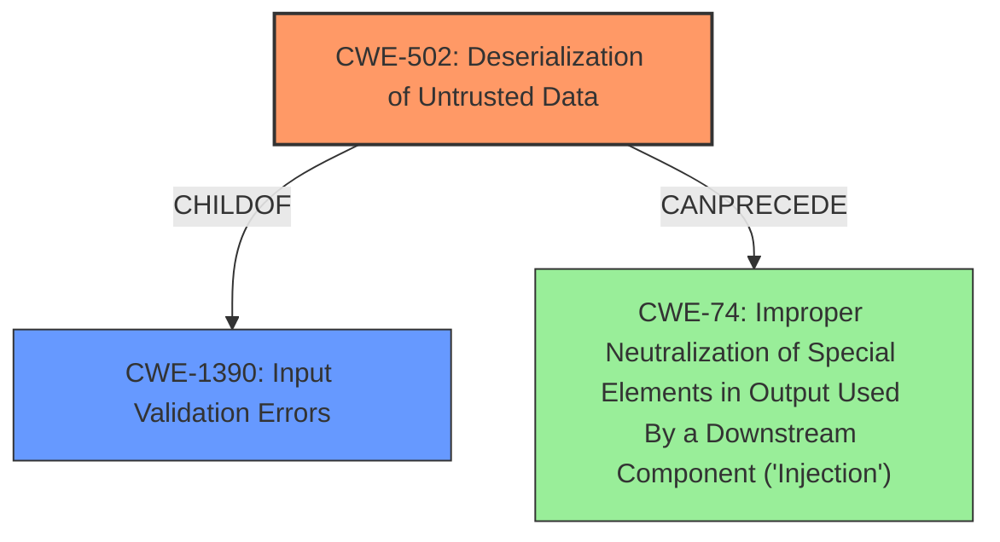

# Enhanced Analysis for CVE-2021-22557

# Summary
| CWE ID | CWE Name | Confidence | CWE Abstraction Level | CWE Vulnerability Mapping Label | CWE-Vulnerability Mapping Notes |
|---|---|---|---|---|---|
| CWE-502 | Deserialization of Untrusted Data | 1.0 | Base | Primary | Allowed |
| CWE-1390 | Input Validation Errors | 0.7 | Class | Secondary | Allowed-with-Review |

## Evidence and Confidence

*   **Confidence Score:** 1.0
*   **Evidence Strength:** HIGH

## Relationship Analysis
The primary CWE is CWE-502, which falls under the broader category of input validation issues. While CWE-1390 is a class-level CWE, it is considered to show that the deserialization issue is due to a failure to validate input.



## Vulnerability Chain
The vulnerability chain starts with the application's use of `yaml.Loader` to load YAML files. The **root cause** is the **unsafe deserialization** of YAML data, leading to arbitrary code execution. This is a clear instance of CWE-502.

## Summary of Analysis
The analysis indicates a high confidence in assigning CWE-502 as the primary weakness. The vulnerability description clearly states that the application uses `yaml.Loader` to load YAML files, which is vulnerable to code execution when processing specially crafted YAML files, indicating **unsafe deserialization**.
The evidence from the CVE Reference Links Content Summary states: "The application uses `yaml.Loader` to load YAML files, which is vulnerable to code execution when processing specially crafted YAML files," and "Unsafe deserialization of YAML data using `yaml.Loader`".

The graph relationships show that CWE-502 is a specific type of input validation error (CWE-1390), making it the more precise choice. The relationships also indicate that CWE-502 can precede injection vulnerabilities.

The selection of CWE-502 is at the optimal level of specificity, as it directly addresses the root cause of the vulnerability: **deserialization of untrusted data**.

Relevant CWE Information:

# Enhanced Context (25 CWEs)
The following CWEs were identified as potentially relevant to this vulnerability:

## CWE-335: Incorrect Usage of Seeds in Pseudo-Random Number Generator (PRNG)
**Abstraction Level**: Base
**Similarity Score**: 0.77
**Source**: dense

**Description**:
The product uses a Pseudo-Random Number Generator (PRNG) but does not correctly manage seeds.
...

## CWE-131: Incorrect Calculation of Buffer Size
**Abstraction Level**: Base
**Similarity Score**: 0.76
**Source**: dense

**Description**:
The product does not correctly calculate the size to be used when allocating a buffer, which could lead to a buffer overflow.
...

## CWE-226: Sensitive Information in Resource Not Removed Before Reuse
**Abstraction Level**: Base
**Similarity Score**: 0.76
**Source**: dense

**Description**:
The product releases a resource such as memory or a file so that it can be made available for reuse, but it does not clear or "zeroize" the information contained in the resource before the product performs a critical state transition or makes the resource available for reuse by other entities.
...

## CWE-330: Use of Insufficiently Random Values
**Abstraction Level**: Class
**Similarity Score**: 0.76
**Source**: dense

**Description**:
The product uses insufficiently random numbers or values in a security context that depends on unpredictable numbers.
...

## CWE-667: Improper Locking
**Abstraction Level**: Class
**Similarity Score**: 0.75
**Source**: dense

**Description**:
The product does not properly acquire or release a lock on a resource, leading to unexpected resource state changes and behaviors.
...

## CWE-404: Improper Resource Shutdown or Release
**Abstraction Level**: Class
**Similarity Score**: 0.75
**Source**: dense

**Description**:
The product does not release or incorrectly releases a resource before it is made available for re-use.
...

## CWE-129: Improper Validation of Array Index
**Abstraction Level**: Variant
**Similarity Score**: 0.75
**Source**: dense

**Description**:
The product uses untrusted input when calculating or using an array index, but the product does not validate or incorrectly validates the index to ensure the index references a valid position within the array.
...

## CWE-681: Incorrect Conversion between Numeric Types
**Abstraction Level**: Base
**Similarity Score**: 0.75
**Source**: dense

**Description**:
When converting from one data type to another, such as long to integer, data can be omitted or translated in a way that produces unexpected values. If the resulting values are used in a sensitive context, then dangerous behaviors may occur.
...

## CWE-909: Missing Initialization of Resource
**Abstraction Level**: Class
**Similarity Score**: 0.74
**Source**: dense

**Description**:
The product does not initialize a critical resource.
...

## CWE-125: Out-of-bounds Read
**Abstraction Level**: Base
**Similarity Score**: 0.74
**Source**: dense

**Description**:
The product reads data past the end, or before the beginning, of the intended buffer.
...

## CWE-335: Incorrect Usage of Seeds in Pseudo-Random Number Generator (PRNG)
**Abstraction Level**: Base
**Similarity Score**: 5815.23
**Source**: sparse

**Description**:
The product uses a Pseudo-Random Number Generator (PRNG) but does not correctly manage seeds.
...

## CWE-338: Use of Cryptographically Weak Pseudo-Random Number Generator (PRNG)
**Abstraction Level**: Base
**Similarity Score**: 5701.52
**Source**: sparse

**Description**:
The product uses a Pseudo-Random Number Generator (PRNG) in a security context, but the PRNG's algorithm is not cryptographically strong.
...

## CWE-330: Use of Insufficiently Random Values
**Abstraction Level**: Class
**Similarity Score**: 5192.64
**Source**: sparse

**Description**:
The product uses insufficiently random numbers or values in a security context that depends on unpredictable numbers.
...

## CWE-190: Integer Overflow or Wraparound
**Abstraction Level**: Base
**Similarity Score**: 4836.43
**Source**: sparse

**Description**:
The product performs a calculation that can
         produce an integer overflow or wraparound when the logic
         assumes that the resulting value will always be larger than
         the original value. This occurs when an integer value is
         incremented to a value that is too large to store in the
         associated representation. When this occurs, the value may
         become a very small or negative number.
...

## CWE-337: Predictable Seed in Pseudo-Random Number Generator (PRNG)
**Abstraction Level**: Variant
**Similarity Score**: 4826.49
**Source**: sparse

**Description**:
A Pseudo-Random Number Generator (PRNG) is initialized from a predictable seed, such as the process ID or system time.
...

## CWE-804: Guessable CAPTCHA
**Abstraction Level**: base
**Similarity Score**: 4.33
**Source**: graph

**Description**:
CWE-804: Guessable CAPTCHA
...

## CWE-911: Improper Update of Reference Count
**Abstraction Level**: base
**Similarity Score**: 4.33
**Source**: graph

**Description**:
CWE-911: Improper Update of Reference Count
...

## CWE-772: Missing Release of Resource after Effective Lifetime
**Abstraction Level**: base
**Similarity Score**: 4.33
**Source**: graph

**Description**:
CWE-772: Missing Release of Resource after Effective Lifetime
...

## CWE-787: Out-of-bounds Write
**Abstraction Level**: base
**Similarity Score**: 3.89
**Source**: graph

**Description**:
CWE-787: Out-of-bounds Write
...

## CWE-170: Improper Null Termination
**Abstraction Level**: base
**Similarity Score**: 3.89
**Source**: graph

**Description**:
CWE-17


## CWE Relationship Analysis

Current CWEs represent these abstraction levels: .


### Vulnerability Chain Analysis

**Chain starting from CWE-502:**
- 502 (Deserialization of Untrusted Data) - ROOT


**Chain starting from CWE-787:**
- 787 (Out-of-bounds Write) - ROOT


### CWE Relationship Diagram

```mermaid
graph TD
    classDef primary fill:#f96,stroke:#333,stroke-width:2px
    classDef secondary fill:#69f,stroke:#333
    classDef tertiary fill:#9e9,stroke:#333
```