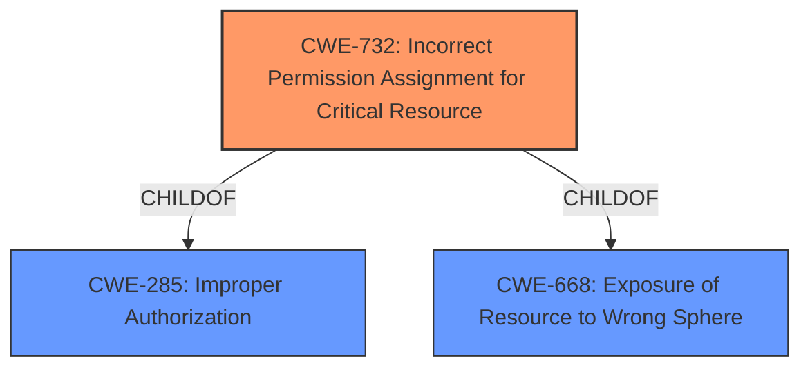

# Analysis Report for CVE-2021-22566

# Vulnerability Analysis Report: CVE-2021-22566

## Description


## Analysis (with Relationship Data)

# Summary
| CWE ID | CWE Name | Confidence | CWE Abstraction Level | CWE Vulnerability Mapping Label | CWE-Vulnerability Mapping Notes |
|---|---|---|---|---|---|
| CWE-732 | Incorrect Permission Assignment for Critical Resource | 0.9 | Class | Primary | Allowed-with-Review |

## Evidence and Confidence

*   **Confidence Score:** 0.9
*   **Evidence Strength:** HIGH

## Relationship Analysis
The primary relationship to consider is the ChildOf relationship between CWE-732 and its parents, particularly CWE-285 (Improper Authorization). While CWE-285 could be considered, CWE-732 is more specific because it involves the **incorrect assignment** of permissions, which is directly stated as the root cause (**incorrect setting of UXN/PXN bits**). No chain relationships are applicable here.



## Vulnerability Chain
The vulnerability chain is as follows:

1.  **Root Cause:** **Incorrect setting of UXN/PXN bits** within `mmu_flags_to_s1_pte_attr` (**incorrect permission assignment**, CWE-732).
2.  **Impact:** Bypass executability restrictions of kernel-mode pages from user-mode and vice versa. This allows an attacker to circumvent a mitigation, potentially making exploitation of other kernel-mode vulnerabilities easier.

## Summary of Analysis
Initially, several CWEs were considered, especially those related to memory management and access control. However, the root cause is clearly stated as an **incorrect setting of UXN/PXN bits**, which directly translates to an **incorrect permission assignment**.

*   **Evidence:** "An **incorrect setting of UXN bits** within mmu_flags_to_s1_pte_attr lead to privileged executable pages being mapped as executable from an unprivileged context."
*   **Evidence:** "An **incorrect setting of PXN bits** within mmu_flags_to_s1_pte_attr lead to unprivileged executable pages being mapped as executable from a privileged context."
*   The CVE reference summary states "The vulnerability stemmed from **incorrect handling of the UXN (User eXecute Never) and PXN (Privileged eXecute Never) bits** in the ARM64 Memory Management Unit (MMU)."

CWE-732 (Incorrect Permission Assignment for Critical Resource) is the most appropriate because it directly addresses the root cause of the vulnerability: the **incorrect assignment of execute permissions** to memory pages. The abstraction level (Class) is acceptable, and the mapping guidance allows it with review, which is appropriate given the need to carefully consider the specific context.

Other CWEs Considered but Not Used:

*   CWE-125 (Out-of-bounds Read) and CWE-787 (Out-of-bounds Write): These were considered due to the potential for memory corruption, but the primary issue is not a read or write beyond buffer boundaries but rather an incorrect permission setting leading to potential execution of unauthorized code.
*   CWE-285 (Improper Authorization): While related, CWE-732 is more specific because it emphasizes the permission assignment aspect.
*   CWE-119 (Improper Restriction of Operations within the Bounds of a Memory Buffer): This is a broader category and less precise than CWE-732, which focuses on permission assignment.
*   CWE-1260 (Improper Handling of Overlap Between Protected Memory Ranges): While memory protection is involved, the core issue is not overlapping memory ranges but incorrect permission assignments.
*   CWE-362 (Concurrent Execution using Shared Resource with Improper Synchronization ('Race Condition')) and CWE-364 (Signal Handler Race Condition): These are not relevant as concurrency or signal handling issues are not the primary cause.
*   CWE-451 (User Interface (UI) Misrepresentation of Critical Information): This is not relevant as the issue is not related to UI misrepresentation.
*   CWE-194 (Unexpected Sign Extension): Integer issues are not the root cause.
*   CWE-1284 (Improper Validation of Specified Quantity in Input): This is not related to quantity validation.


## CWE Relationship Analysis

Current CWEs represent these abstraction levels: .


### Vulnerability Chain Analysis

**Chain starting from CWE-732:**
- 732 (Incorrect Permission Assignment for Critical Resource) - ROOT


**Chain starting from CWE-787:**
- 787 (Out-of-bounds Write) - ROOT


### CWE Relationship Diagram

```mermaid
graph TD
    classDef primary fill:#f96,stroke:#333,stroke-width:2px
    classDef secondary fill:#69f,stroke:#333
    classDef tertiary fill:#9e9,stroke:#333
```


*Report generated on 2025-04-02 13:30:05*
