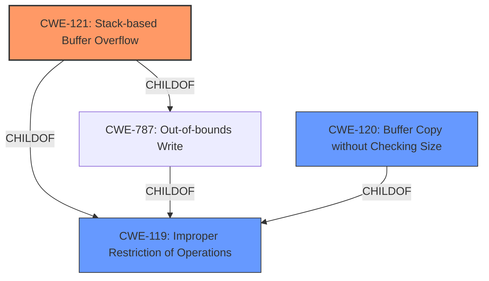

# Enhanced Analysis for CVE-2021-22637

# Summary
| CWE ID | CWE Name | Confidence | CWE Abstraction Level | CWE Vulnerability Mapping Label | CWE-Vulnerability Mapping Notes |
|---|---|---|---|---|---|
| CWE-121 | Stack-based Buffer Overflow | 1.0 | Variant | Allowed | Primary CWE |
| CWE-119 | Improper Restriction of Operations within the Bounds of a Memory Buffer | 0.7 | Class | Discouraged | Secondary Candidate |
| CWE-120 | Buffer Copy without Checking Size of Input ('Classic Buffer Overflow') | 0.6 | Base | Allowed-with-Review | Secondary Candidate |

## Evidence and Confidence

*   **Confidence Score:** 0.9
*   **Evidence Strength:** HIGH

## Relationship Analysis
The primary relationship is that CWE-121 (Stack-based Buffer Overflow) is a variant (child) of CWE-787 (Out-of-bounds Write) and CWE-119 (Improper Restriction of Operations within the Bounds of a Memory Buffer). This hierarchical structure guided the selection of the more specific CWE-121. CWE-120 is also related to CWE-119, representing a classic buffer overflow scenario.



## Vulnerability Chain
The vulnerability chain involves a **lack of input validation** leading to a **stack-based buffer overflow**, ultimately resulting in **arbitrary code execution**.

## Summary of Analysis
The initial assessment, based on the provided evidence, strongly indicates a **stack-based buffer overflow** due to insufficient input validation when processing project files. The selection of CWE-121 is primarily based on the vulnerability description explicitly mentioning "**stack-based buffer overflow**" and the CVE Reference Links Content Summary reinforcing this as the primary weakness. The relationship graph shows that CWE-121 is a variant of CWE-119, making it a more specific and appropriate choice. The evidence supports the selection of CWE-121 as it directly reflects the described vulnerability, and it is the most specific option available.

Relevant CWE Information:

# Enhanced Context (25 CWEs)
The following CWEs were identified as potentially relevant to this vulnerability:

## CWE-191: Integer Underflow (Wrap or Wraparound)
**Abstraction Level**: Base
**Similarity Score**: 0.75
**Source**: dense

## CWE-805: Buffer Access with Incorrect Length Value
**Abstraction Level**: Base
**Similarity Score**: 0.74
**Source**: dense

## CWE-606: Unchecked Input for Loop Condition
**Abstraction Level**: Base
**Similarity Score**: 0.74
**Source**: dense

## CWE-130: Improper Handling of Length Parameter Inconsistency
**Abstraction Level**: Base
**Similarity Score**: 0.74
**Source**: dense

## CWE-1325: Improperly Controlled Sequential Memory Allocation
**Abstraction Level**: Base
**Similarity Score**: 0.74
**Source**: dense

## CWE-131: Incorrect Calculation of Buffer Size
**Abstraction Level**: Base
**Similarity Score**: 0.74
**Source**: dense

## CWE-197: Numeric Truncation Error
**Abstraction Level**: Base
**Similarity Score**: 0.73
**Source**: dense

## CWE-193: Off-by-one Error
**Abstraction Level**: Base
**Similarity Score**: 0.73
**Source**: dense

## CWE-674: Uncontrolled Recursion
**Abstraction Level**: Class
**Similarity Score**: 0.72
**Source**: dense

## CWE-835: Loop with Unreachable Exit Condition ('Infinite Loop')
**Abstraction Level**: Base
**Similarity Score**: 0.72
**Source**: dense

## CWE-190: Integer Overflow or Wraparound
**Abstraction Level**: Base
**Similarity Score**: 7084.17
**Source**: sparse

## CWE-125: Out-of-bounds Read
**Abstraction Level**: Base
**Similarity Score**: 6674.05
**Source**: sparse

## CWE-1284: Improper Validation of Specified Quantity in Input
**Abstraction Level**: Base
**Similarity Score**: 6582.03
**Source**: sparse

## CWE-119: Improper Restriction of Operations within the Bounds of a Memory Buffer
**Abstraction Level**: Class
**Similarity Score**: 6432.46
**Source**: sparse

## CWE-193: Off-by-one Error
**Abstraction Level**: Base
**Similarity Score**: 6410.45
**Source**: sparse

## CWE-1339: Insufficient Precision or Accuracy of a Real Number
**Abstraction Level**: base
**Similarity Score**: 5.03
**Source**: graph

## CWE-190: Integer Overflow or Wraparound
**Abstraction Level**: base
**Similarity Score**: 5.03
**Source**: graph

## CWE-123: Write-what-where Condition
**Abstraction Level**: base
**Similarity Score**: 4.33
**Source**: graph

## CWE-120: Buffer Copy without Checking Size of Input ('Classic Buffer Overflow')
**Abstraction Level**: base
**Similarity Score**: 4.33
**Source**: graph

## CWE-170: Improper Null Termination
**Abstraction Level**: base
**Similarity Score**: 4.33
**Source**: graph

## CWE-1284: Improper Validation of Specified Quantity in Input
**Abstraction Level**: base
**Similarity Score**: 4.33
**Source**: graph

## CWE-681: Incorrect Conversion between Numeric Types
**Abstraction Level**: base
**Similarity Score**: 4.33
**Source**: graph

## CWE-195: Signed to Unsigned Conversion Error
**Abstraction Level**: variant
**Similarity Score**: 3.88
**Source**: graph

## CWE-128: Wrap-around Error
**Abstraction Level**: base
**Similarity Score**: 3.57
**Source**: graph

## CWE-787: Out-of-bounds Write
**Abstraction Level**: base
**Similarity Score**: 3.30
**Source**: graph

## CWE Details and Justification:

*   **CWE-121: Stack-based Buffer Overflow**
    *   **Match:** The vulnerability description explicitly states "**stack-based buffer overflow**". The CVE Reference Links Content Summary confirms this.
    *   **Security Implications:** Allows an attacker to overwrite data on the stack, potentially including return addresses, leading to arbitrary code execution.
    *   **Relationships:** Variant of CWE-787 (Out-of-bounds Write) and CWE-119 (Improper Restriction of Operations within the Bounds of a Memory Buffer).
    *   **Mapping Guidance:** Allowed, and it aligns with the vulnerability details.
    *   **Confidence:** 1.0

*   **CWE-119: Improper Restriction of Operations within the Bounds of a Memory Buffer**
    *   **Match:** This is a broader category that encompasses buffer overflows. The **lack of proper validation of user-supplied data length** before copying it to a fixed-length stack buffer is a form of improper restriction.
    *   **Security Implications:** Can lead to read or write operations on unexpected memory locations.
    *   **Relationships:** Class, with CWE-121 as a variant.
    *   **Mapping Guidance:** Discouraged as a primary mapping when more specific CWEs are available.
    *   **Confidence:** 0.7 - Considered as a secondary candidate due to its broader nature.

*   **CWE-120: Buffer Copy without Checking Size of Input ('Classic Buffer Overflow')**
    *   **Match:** The description alludes to copying data without proper size checks. "lack of proper validation of user-supplied data length before copying it to a fixed-length stack buffer."
    *   **Security Implications:** Direct buffer overflow due to unchecked input size.
    *   **Relationships:** ChildOf CWE-119.
    *   **Mapping Guidance:** Allowed-with-Review. It is only appropriate for "Buffer Copy" operations (not buffer reads), in which where there is no "Checking


## CWE Relationship Analysis

Current CWEs represent these abstraction levels: .


### Vulnerability Chain Analysis

**Chain starting from CWE-787:**
- 787 (Out-of-bounds Write) - ROOT


**Chain starting from CWE-123:**
- 123 (Write-what-where Condition) - ROOT


### CWE Relationship Diagram

```mermaid
graph TD
    classDef primary fill:#f96,stroke:#333,stroke-width:2px
    classDef secondary fill:#69f,stroke:#333
    classDef tertiary fill:#9e9,stroke:#333
```