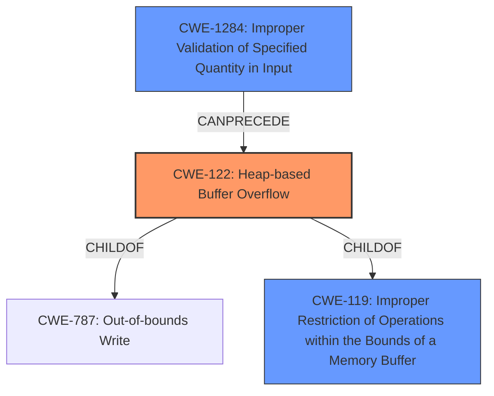

# Analysis for CVE-2021-22641

# Summary
| CWE ID | CWE Name | Confidence | CWE Abstraction Level | CWE Vulnerability Mapping Label | CWE-Vulnerability Mapping Notes |
|---|---|---|---|---|---|
| CWE-122 | Heap-based Buffer Overflow | 1.0 | Variant | Allowed | Primary CWE |
| CWE-119 | Improper Restriction of Operations within the Bounds of a Memory Buffer | 0.7 | Class | Discouraged | Secondary Candidate |
| CWE-1284 | Improper Validation of Specified Quantity in Input | 0.6 | Base | Allowed | Secondary Candidate |

## Evidence and Confidence

*   **Confidence Score:** 0.9
*   **Evidence Strength:** HIGH

## Relationship Analysis
The primary CWE is CWE-122, which is a variant of CWE-787 (Out-of-bounds Write) and CWE-119 (Improper Restriction of Operations within the Bounds of a Memory Buffer). CWE-119 is a class-level CWE and is generally discouraged when more specific CWEs like CWE-122 are available. CWE-1284 (Improper Validation of Specified Quantity in Input) can precede buffer overflows by failing to validate the size of the input.

## Vulnerability Chain
The vulnerability chain starts with **improper validation of input quantity** which leads to a **heap-based buffer overflow**, and finally results in **arbitrary code execution**.
  - CWE-1284: Improper Validation of Specified Quantity in Input (Root Cause)
  - CWE-122: Heap-based Buffer Overflow
  - Impact: Arbitrary Code Execution

## Summary of Analysis
The initial assessment identified a **heap-based buffer overflow**, which is clearly stated in both the vulnerability description and the CVE reference summary. The key phrase "heap-based buffer overflow" directly indicates CWE-122. The CVE reference summary confirms that the root cause is a **lack of proper validation of the length of user-supplied data** before copying it to a heap-based buffer. This suggests CWE-1284 (Improper Validation of Specified Quantity in Input) as a potential contributing factor.

The selection of CWE-122 is based on the explicit description of a **heap-based buffer overflow** vulnerability. The supporting evidence is the vulnerability description itself, which states "A **heap-based buffer overflow** issue has been identified..." and the CVE reference link summary which states "The primary vulnerability is a **heap-based buffer overflow**." CWE-122 is a Variant of CWE-787 (Out-of-bounds Write), providing a more specific classification than its parent. The abstraction level is appropriate as it directly reflects the nature of the vulnerability.

CWE-119 was considered but not chosen as the primary CWE because it's a more general class of weakness. While a buffer overflow falls under CWE-119 (Improper Restriction of Operations within the Bounds of a Memory Buffer), CWE-122 (Heap-based Buffer Overflow) is a more specific variant that directly matches the vulnerability description. The MITRE mapping guidance discourages the use of CWE-119 when more specific CWEs are available.

CWE-1284 was considered because the CVE reference summary indicates that the root cause is the **lack of proper validation of the length of user-supplied data**. While this contributes to the vulnerability, the primary issue is the buffer overflow itself, making CWE-122 a more direct and appropriate classification.

The final selection is based on direct evidence from the vulnerability description and the CVE reference summary, aligning with the MITRE mapping guidance to choose the most specific CWE available.

Relevant CWE Information:

# Enhanced Context (25 CWEs)
The following CWEs were identified as potentially relevant to this vulnerability:

## CWE-197: Numeric Truncation Error
**Abstraction Level**: Base
**Similarity Score**: 0.80
**Source**: dense

**Description**:
Truncation errors occur when a primitive is cast to a primitive of a smaller size and data is lost in the conversion.

**Mapping Guidance**:
- Usage: Allowed
- Rationale: This CWE entry is at the Base level of abstraction, which is a preferred level of abstraction for mapping to the root causes of vulnerabilities.

## CWE-191: Integer Underflow (Wrap or Wraparound)
**Abstraction Level**: Base
**Similarity Score**: 0.80
**Source**: dense

**Description**:
The product subtracts one value from another, such that the result is less than the minimum allowable integer value, which produces a value that is not equal to the correct result.

**Mapping Guidance**:
- Usage: Allowed
- Rationale: This CWE entry is at the Base level of abstraction, which is a preferred level of abstraction for mapping to the root causes of vulnerabilities.

## CWE-131: Incorrect Calculation of Buffer Size
**Abstraction Level**: Base
**Similarity Score**: 0.79
**Source**: dense

**Description**:
The product does not correctly calculate the size to be used when allocating a buffer, which could lead to a buffer overflow.

**Mapping Guidance**:
- Usage: Allowed
- Rationale: This CWE entry is at the Base level of abstraction, which is a preferred level of abstraction for mapping to the root causes of vulnerabilities.

## CWE-805: Buffer Access with Incorrect Length Value
**Abstraction Level**: Base
**Similarity Score**: 0.78
**Source**: dense

**Description**:
The product uses a sequential operation to read or write a buffer, but it uses an incorrect length value that causes it to access memory that is outside of the bounds of the buffer.

**Mapping Guidance**:
- Usage: Allowed
- Rationale: This CWE entry is at the Base level of abstraction, which is a preferred level of abstraction for mapping to the root causes of vulnerabilities.

## CWE-681: Incorrect Conversion between Numeric Types
**Abstraction Level**: Base
**Similarity Score**: 0.78
**Source**: dense

**Description**:
When converting from one data type to another, such as long to integer, data can be omitted or translated in a way that produces unexpected values. If the resulting values are used in a sensitive context, then dangerous behaviors may occur.

**Mapping Guidance**:
- Usage: Allowed
- Rationale: This CWE entry is at the Base level of abstraction, which is a preferred level of abstraction for mapping to the root causes of vulnerabilities.

## CWE-130: Improper Handling of Length Parameter Inconsistency
**Abstraction Level**: Base
**Similarity Score**: 0.77
**Source**: dense

**Description**:
The product parses a formatted message or structure, but it does not handle or incorrectly handles a length field that is inconsistent with the actual length of the associated data.

**Mapping Guidance**:
- Usage: Allowed
- Rationale: This CWE entry is at the Base level of abstraction, which is a preferred level of abstraction for mapping to the root causes of vulnerabilities.

## CWE-193: Off-by-one Error
**Abstraction Level**: Base
**Similarity Score**: 0.76
**Source**: dense

**Description**:
A product calculates or uses an incorrect maximum or minimum value that is 1 more, or 1 less, than the correct value.

**Mapping Guidance**:
- Usage: Allowed
- Rationale: This CWE entry is at the Base level of abstraction, which is a preferred level of abstraction for mapping to the root causes of vulnerabilities.

## CWE-124: Buffer Underwrite ('Buffer Underflow')
**Abstraction Level**: Base
**Similarity Score**: 0.76
**Source**: dense

**Description**:
The product writes to a buffer using an index or pointer that references a memory location prior to the beginning of the buffer.

**Mapping Guidance**:
- Usage: Allowed
- Rationale: This CWE entry is at the Base level of abstraction, which is a preferred level of abstraction for mapping to the root causes of vulnerabilities.

## CWE-190: Integer Overflow or Wraparound
**Abstraction Level**: Base
**Similarity Score**: 0.76
**Source**: dense

**Description**:
The product performs a calculation that can
         produce an integer overflow or wraparound when the logic
         assumes that the resulting value will always be larger than
         the original value. This occurs when an integer value is
         incremented to a value that is too large to