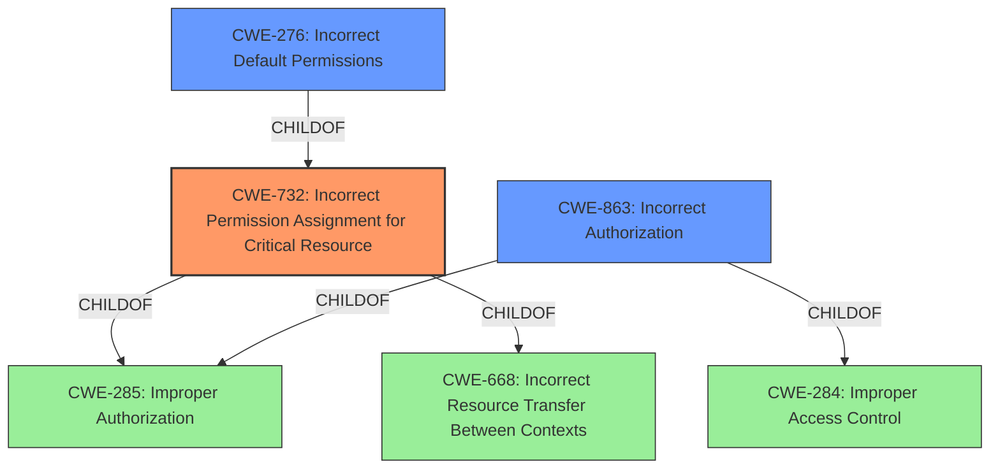

# Analysis for CVE-2021-22669

# Summary
| CWE ID | CWE Name | Confidence | CWE Abstraction Level | CWE Vulnerability Mapping Label | CWE-Vulnerability Mapping Notes |
|---|---|---|---|---|---|
| CWE-732 | Incorrect Permission Assignment for Critical Resource | 1 | Class | Primary | Allowed-with-Review |
| CWE-276 | Incorrect Default Permissions | 0.7 | Base | Secondary | Allowed |
| CWE-863 | Incorrect Authorization | 0.6 | Class | Secondary | Allowed-with-Review |

## Evidence and Confidence

*   **Confidence Score:** 0.8
*   **Evidence Strength:** HIGH

## Relationship Analysis
The primary CWE is CWE-732, which is a child of CWE-285 (Improper Authorization) and CWE-668 (Incorrect Resource Transfer Between Contexts). CWE-276 (Incorrect Default Permissions) is a child of CWE-732, indicating a more specific case of incorrect permission assignment. CWE-863 is a child of CWE-285 (Improper Authorization) and CWE-284 (Improper Access Control). The selection of CWE-732 is based on the evidence that the vulnerability involves incorrect assignment of permissions for a critical resource. CWE-276 is considered as a more specific base case of CWE-732 while CWE-863 is considered because the authorization check is not correctly performed due to the incorrect permission assignment.

## Vulnerability Chain
The chain starts with **incorrect default permissions** (CWE-276), leading to **incorrect permission assignment for a critical resource** (CWE-732), which then allows a low-privileged user to **update an administrator's password** and **escalate privileges** to administrator level.

## Summary of Analysis
The initial assessment focused on **incorrect permissions are set to default** which directly relates to CWE-732 (Incorrect Permission Assignment for Critical Resource). The **root cause** is the **incorrect default permission**, and the impact is privilege escalation.

The selection of CWE-732 is based on the following evidence:
- Vulnerability Description Key Phrases: "**rootcause:** **Incorrect permissions are set to default**"
- CVE Reference Links Content Summary: "**CWE-732: Incorrect Permission Assignment for Critical Resource**: The vulnerability lies in the fact that a low-privileged user can modify an administrator's password due to the misconfigured permissions."

CWE-276 (Incorrect Default Permissions) was considered because it is a base case of CWE-732 and aligns with the **root cause** described in the vulnerability description key phrases.

CWE-863 (Incorrect Authorization) was considered because the authorization check is not correctly performed due to the incorrect permission assignment, allowing a low-privileged user to perform actions they should not be authorized to do.

The final selection is based on the evidence that the vulnerability involves incorrect assignment of permissions for a critical resource (CWE-732) due to incorrect default permissions (CWE-276), leading to a bypass of authorization (CWE-863). CWE-732 is the most direct and specific representation of the vulnerability.

Relevant CWE Information:

# Enhanced Context (25 CWEs)
The following CWEs were identified as potentially relevant to this vulnerability:

## CWE-274: Improper Handling of Insufficient Privileges
**Abstraction Level**: Base
**Similarity Score**: 0.77
**Source**: dense

**Description**:
The product does not handle or incorrectly handles when it has insufficient privileges to perform an operation, leading to resultant weaknesses.

**Mapping Guidance**:
- Usage: Discouraged
- Rationale: This CWE entry could be deprecated in a future version of CWE.
*This CWE was not selected as it describes the handling of insufficient privileges, while the reported vulnerability is about incorrect permission assignment.*

## CWE-807: Reliance on Untrusted Inputs in a Security Decision
**Abstraction Level**: Base
**Similarity Score**: 0.77
**Source**: dense

**Description**:
The product uses a protection mechanism that relies on the existence or values of an input, but the input can be modified by an untrusted actor in a way that bypasses the protection mechanism.

**Mapping Guidance**:
- Usage: Allowed
- Rationale: This CWE entry is at the Base level of abstraction, which is a preferred level of abstraction for mapping to the root causes of vulnerabilities.
*This CWE was not selected because the vulnerability doesn't primarily involve reliance on untrusted inputs.*

## CWE-280: Improper Handling of Insufficient Permissions or Privileges 
**Abstraction Level**: Base
**Similarity Score**: 0.77
**Source**: dense

**Description**:
The product does not handle or incorrectly handles when it has insufficient privileges to access resources or functionality as specified by their permissions. This may cause it to follow unexpected code paths that may leave the product in an invalid state.

**Mapping Guidance**:
- Usage: Allowed
- Rationale: This CWE entry is at the Base level of abstraction, which is a preferred level of abstraction for mapping to the root causes of vulnerabilities.
*This CWE was not selected as it describes the handling of insufficient privileges, while the reported vulnerability is about incorrect permission assignment.*

## CWE-303: Incorrect Implementation of Authentication Algorithm
**Abstraction Level**: Base
**Similarity Score**: 0.77
**Source**: dense

**Description**:
The requirements for the product dictate the use of an established authentication algorithm, but the implementation of the algorithm is incorrect.

**Mapping Guidance**:
- Usage: Allowed
- Rationale: This CWE entry is at the Base level of abstraction, which is a preferred level of abstraction for mapping to the root causes of vulnerabilities.
*This CWE was not selected because the vulnerability is not about authentication algorithms.*

## CWE-472: External Control of Assumed-Immutable Web Parameter
**Abstraction Level**: Base
**Similarity Score**: 0.76
**Source**: dense

**Description**:
The web application does not sufficiently verify inputs that are assumed to be immutable but are actually externally controllable, such as hidden form fields.

**Mapping Guidance**:
- Usage: Allowed
- Rationale: This CWE entry is at the Base level of abstraction, which is a preferred level of abstraction for mapping to the root causes of vulnerabilities.
*This CWE was not selected because the vulnerability does not primarily involve external control of assumed-immutable web parameters.*

## CWE-639: Authorization Bypass Through User-Controlled Key
**Abstraction Level**: Base
**Similarity Score**: 0.76
**Source**: dense

**Description**:
The system's authorization functionality does not prevent one user from gaining access to another user's data or record by modifying the key value identifying the data.

**Mapping Guidance**:
- Usage: Allowed
- Rationale: This CWE entry is at the Base level of abstraction, which is a preferred level of abstraction for mapping to the root causes of vulnerabilities.
*This CWE was not selected because the vulnerability is not specifically about user-controlled keys.*

## CWE-266: Incorrect Privilege Assignment
**Abstraction Level**: Base
**Similarity Score**: 0.75
**Source**: dense

**Description**:
A product incorrectly assigns a privilege to a particular actor, creating an unintended sphere of control for that actor.

**Mapping Guidance**:
- Usage: Allowed
- Rationale: This CWE entry is at the Base level of abstraction, which is a preferred level of abstraction for mapping to the root causes of vulnerabilities.
*This CWE was not selected because while it relates to privilege assignment, it's not as precise as CWE-732.*

## CWE-1391: Use of Weak Credentials
**Abstraction Level**: Class
**Similarity Score**: 0.75
**Source**: dense

**Description**:
The product uses weak credentials (such as a default key or hard-coded password) that can be calculated, derived, reused, or guessed by an attacker.

**Mapping Guidance**:
- Usage: Allowed-with-Review