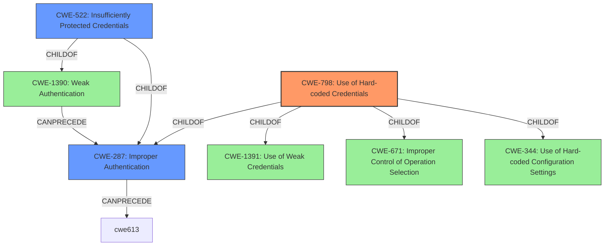

# Enhanced Analysis for CVE-2021-22681

# Summary
| CWE ID | CWE Name | Confidence | CWE Abstraction Level | CWE Vulnerability Mapping Label | CWE-Vulnerability Mapping Notes |
|---|---|---|---|---|---|
| CWE-798 | Use of Hard-coded Credentials | 1 | Base | Allowed | Primary CWE |
| CWE-522 | Insufficiently Protected Credentials | 0.8 | Class | Allowed-with-Review | Secondary Candidate |
| CWE-287 | Improper Authentication | 0.6 | Class | Discouraged | Secondary Candidate |

## Evidence and Confidence

*   **Confidence Score:** 0.9
*   **Evidence Strength:** HIGH

## Relationship Analysis
The primary CWE is CWE-798, which is a Base level CWE. CWE-798 is a child of CWE-1391 (Use of Weak Credentials) and CWE-287 (Improper Authentication). CWE-522 (Insufficiently Protected Credentials) is a class-level CWE and a child of both CWE-1390 (Weak Authentication) and CWE-287 (Improper Authentication). CWE-287 is discouraged for direct mapping, suggesting preference for more specific child CWEs like CWE-798 or CWE-522.



## Vulnerability Chain
The vulnerability chain starts with the **use of hard-coded credentials** (CWE-798), leading to **insufficient protection of credentials** (CWE-522) and ultimately resulting in an **improper authentication** (CWE-287) bypass.

## Summary of Analysis
The primary weakness is CWE-798, as evidenced by the "Root Cause of Vulnerability" section in "CVE Reference Links Content Summary" which explicitly states that the "vulnerability stems from insufficiently protected credentials within the Rockwell Automation's Studio 5000 Logix Designer software. Specifically, a **hardcoded key** is used for verifying communications with Logix controllers."

CWE-522 is a secondary weakness because the hardcoded key is "not adequately protected, allowing an unauthenticated attacker to bypass the verification mechanism." This highlights the **insufficient protection of credentials**, which aligns with CWE-522.

CWE-287 is considered but not directly mapped because it's a more general class describing **improper authentication**, and the vulnerability description points to specific issues like the use of hardcoded credentials (CWE-798) and insufficient protection of those credentials (CWE-522), making these more precise mappings. The MITRE mapping guidance for CWE-287 also discourages its use when lower-level CWEs are applicable.

The selection of CWE-798 and CWE-522 provides the optimal level of specificity, addressing both the root cause and the immediate vulnerability, and is well-supported by the provided evidence.

Relevant CWE Information:

# Enhanced Context (25 CWEs)

## CWE-693: Protection Mechanism Failure
**Rationale for Not Selecting**: This is a very high-level Pillar CWE. The vulnerability description provides more specific details about the protection mechanism failure, such as hardcoded credentials, so a more specific CWE is preferred.

## CWE-807: Reliance on Untrusted Inputs in a Security Decision
**Rationale for Not Selecting**: This CWE is not applicable as the vulnerability is not related to reliance on untrusted inputs. The issue is the hardcoded key, not untrusted input.

## CWE-74: Improper Neutralization of Special Elements in Output Used by a Downstream Component ('Injection')
**Rationale for Not Selecting**: This CWE is not applicable as the vulnerability does not involve injection. The issue is the use of hardcoded credentials.

## CWE-1391: Use of Weak Credentials
**Rationale for Not Selecting**: While this is a parent of CWE-798 and relevant, CWE-798 is more specific about the "hardcoded" nature of the credentials.

## CWE-657: Violation of Secure Design Principles
**Rationale for Not Selecting**: This CWE is too general. The description points to a specific issue (hardcoded credentials).

## CWE-303: Incorrect Implementation of Authentication Algorithm
**Rationale for Not Selecting**: This CWE is not applicable as the vulnerability is not related to an incorrect implementation of an authentication algorithm.

## CWE-345: Insufficient Verification of Data Authenticity
**Rationale for Not Selecting**: This CWE is not applicable as the vulnerability is not related to insufficient verification of data authenticity.

## CWE-1390: Weak Authentication
**Rationale for Not Selecting**: While this is a parent of CWE-522 and relevant, CWE-522 is more specific.

## CWE-798: Use of Hard-coded Credentials
**Rationale for Selecting**: This CWE accurately describes the root cause of the vulnerability. The "CVE Reference Links Content Summary" explicitly states that a "hardcoded key is used for verifying communications."

## CWE-691: Insufficient Control Flow Management
**Rationale for Not Selecting**: This CWE is not applicable as the vulnerability is not related to insufficient control flow management.

## CWE-916: Use of Password Hash With Insufficient Computational Effort
**Rationale for Not Selecting**: This CWE is not applicable as the vulnerability does not involve password hashing.

## CWE-522: Insufficiently Protected Credentials
**Rationale for Selecting**: The hardcoded key being "not adequately protected, allowing an unauthenticated attacker to bypass the verification mechanism" aligns with CWE-522.

## CWE-287: Improper Authentication
**Rationale for Selecting**: While the vulnerability allows an attacker to "bypass this verification mechanism and authenticate," CWE-798 and CWE-522 are more specific and preferred per MITRE guidance.

## CWE-613: Insufficient Session Expiration
**Rationale for Not Selecting**: This CWE is not applicable as the vulnerability is not related to session expiration.

## CWE-471: Modification of Assumed-Immutable Data (MAID)
**Rationale for Not Selecting**: This CWE is not applicable as the vulnerability is not related to modification of assumed-immutable data.

## CWE-257: Storing Passwords in a Recoverable Format
**Rationale for Not Selecting**: This CWE is not applicable as the vulnerability is not related to storing passwords in a recoverable format.

## CWE-94: Improper Control of Generation of Code ('Code Injection')
**Rationale for Not Selecting**: This CWE is not applicable as the vulnerability does not involve code injection.

## CWE-1282: Assumed-Immutable Data is Stored in Writable Memory
**Rationale for Not Selecting**: This CWE is not applicable as the vulnerability is not related to assumed-immutable data stored in writable memory.

## CWE-22: Improper Limitation of a Pathname to a Restricted Directory ('Path Traversal')
**Rationale for Not Selecting**: This CWE is not applicable as the vulnerability does not involve path traversal.

## CWE-322: Key Exchange without Entity Authentication
**Rationale for Not Selecting**: This CWE is not applicable as the vulnerability is not related to key exchange without entity authentication.

## CWE-78: Improper Neutralization of Special Elements used in an OS Command ('OS Command Injection')
**Rationale for Not Selecting**: This CWE is not applicable as the vulnerability does not involve OS command injection.

## CWE-290: Authentication Bypass by Spoofing
**Rationale for Not Selecting**: This CWE is not applicable as the vulnerability is not related to authentication bypass by spoofing.

## CWE-425: Direct Request ('Forced Browsing')
**Rationale for Not Selecting**: This CWE is not applicable as the vulnerability is not


## CWE Relationship Analysis

Current CWEs represent these abstraction levels: .


### Vulnerability Chain Analysis

**Chain starting from CWE-691:**
- 691 (Insufficient Control Flow Management) - ROOT


**Chain starting from CWE-798:**
- 798 (Use of Hard-coded Credentials) - ROOT


### CWE Relationship Diagram

```mermaid
graph TD
    classDef primary fill:#f96,stroke:#333,stroke-width:2px
    classDef secondary fill:#69f,stroke:#333
    classDef tertiary fill:#9e9,stroke:#333
```