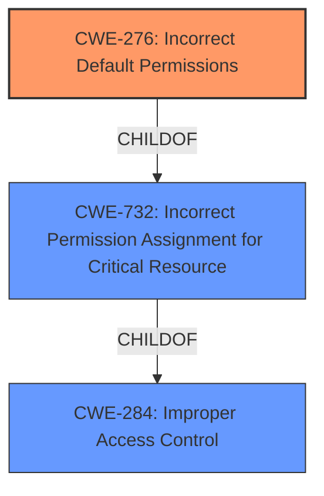

# Analysis for CVE-2021-22682

# Summary
| CWE ID | CWE Name | Confidence | CWE Abstraction Level | CWE Vulnerability Mapping Label | CWE-Vulnerability Mapping Notes |
|---|---|---|---|---|---|
| **CWE-276** | **Incorrect Default Permissions** | 0.9 | Base | Primary | Allowed |
| CWE-732 | Incorrect Permission Assignment for Critical Resource | 0.7 | Class | Secondary | Allowed-with-Review |
| CWE-284 | Improper Access Control | 0.5 | Pillar | Secondary | Discouraged |

## Evidence and Confidence

*   **Confidence Score:** 0.9
*   **Evidence Strength:** HIGH

## Relationship Analysis
The primary CWE is CWE-276, which directly addresses the **incorrect default permissions** granted during installation. This is a base-level CWE, offering the most specific representation of the **root cause**. CWE-732 and CWE-284 were considered as broader classifications. CWE-732, while related, is a class-level CWE that focuses on **incorrect permission assignment for critical resources**, but the evidence points to the default settings being the primary issue. CWE-284 is a pillar-level CWE and is too general, as it encompasses all forms of **improper access control**.

## Vulnerability Chain
The vulnerability chain starts with **Cscape being installed for all users with full permissions** (CWE-276). This leads to the possibility for unprivileged users to modify binaries and configuration files, ultimately leading to local privilege escalation.

## Summary of Analysis
The initial analysis focused on identifying the **root cause** of the vulnerability. The evidence from the "Vulnerability Description Key Phrases" and "CVE Reference Links Content Summary" sections clearly indicates that the **incorrect default permissions** are the primary issue. Specifically, the phrase "**Cscape installed for all users with full permissions**" directly aligns with the description of CWE-276. The retriever results also listed CWE-276 as a top candidate.

The relationship analysis further solidified the choice of CWE-276. While CWE-732 and CWE-284 are related, they are broader classifications. CWE-276 is a more specific, base-level CWE that directly addresses the issue of **incorrect default permissions**. The MITRE mapping guidance for CWE-276 recommends careful consideration of the name and description to ensure an appropriate fit, which aligns with the vulnerability description.

Therefore, based on the evidence, relationship analysis, and mapping guidance, CWE-276 is the most appropriate classification for this vulnerability.

Relevant CWE Information:

*   **CWE-276: Incorrect Default Permissions**
    *   **Technical Explanation:** Cscape, by default, grants all users read/write access during installation. This deviates from the principle of least privilege, allowing unintended modification of critical system files.
    *   **Security Implications and Potential Impact:** This leads to local privilege escalation, as unprivileged users can tamper with binaries and configuration files, potentially gaining elevated privileges.
    *   **Parent-Child Relationships:** CWE-276 is a child of CWE-732 (Incorrect Permission Assignment for Critical Resource) and CWE-668 (Exposure of Resource to Wrong Sphere). While related, the default permission issue is more directly addressed by CWE-276.
    *   **MITRE Mapping Guidance:** The MITRE mapping guidance recommends this CWE when installed file permissions are set to allow anyone to modify those files.
*   **CWE-732: Incorrect Permission Assignment for Critical Resource**
    *   **Technical Explanation:** Although Cscape's configuration files and binaries are critical resources, the primary issue is with the initial default permissions, not a later reassignment.
    *   **Security Implications and Potential Impact:** Similar to CWE-276, this can lead to privilege escalation through modification of resources.
    *   **Parent-Child Relationships:** CWE-732 is a child of CWE-285 (Improper Authorization) and CWE-668 (Exposure of Resource to Wrong Sphere).
    *   **MITRE Mapping Guidance:** The MITRE mapping guidance suggests caution, as it can be misused for cases where permissions are not checked at all.
*   **CWE-284: Improper Access Control**
    *   **Technical Explanation:** While the vulnerability is related to access control, CWE-284 is too broad. It's a pillar-level CWE, encompassing various forms of access control failures.
    *   **Security Implications and Potential Impact:** This can encompass a wide range of security issues, including privilege escalation.
    *   **Parent-Child Relationships:** CWE-284 is a root-level CWE and doesn't have a parent.
    *   **MITRE Mapping Guidance:** The MITRE mapping guidance discourages its use due to its high-level nature and recommends more specific CWEs.

Other CWEs Considered but Not Used:

*   CWE-269: Improper Privilege Management - This CWE is discouraged because it is often misused and conflated with privilege escalation, which is an impact, not a root cause.
*   CWE-863: Incorrect Authorization - This CWE focuses on authorization checks that are incorrectly performed. The vulnerability is about the initial permission assignment, not an authorization check.
*   CWE-278: Insecure Preserved Inherited Permissions - While permissions are being "inherited" in some sense by all users, the core issue is with the initial default permission, not a preservation of inherited insecure permissions.