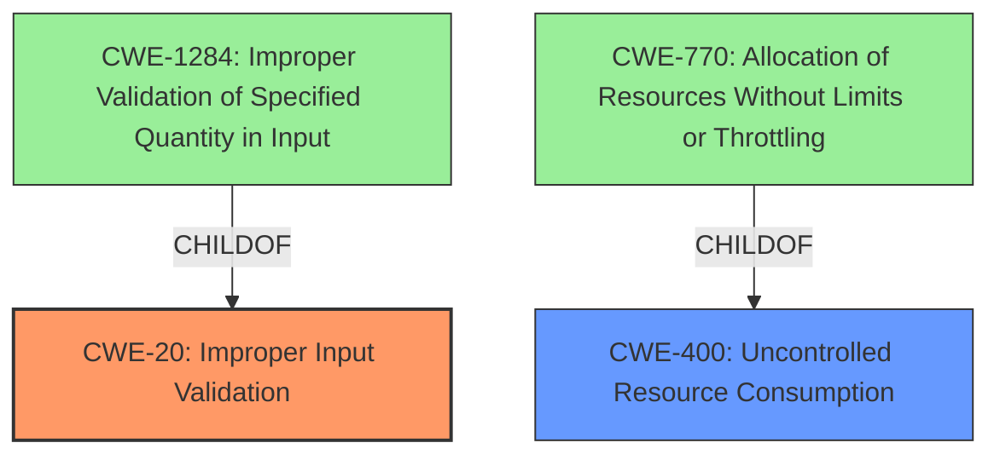

# Analysis for CVE-2021-22699

# Summary
| CWE ID | CWE Name | Confidence | CWE Abstraction Level | CWE Vulnerability Mapping Label | CWE-Vulnerability Mapping Notes |
|---|---|---|---|---|---|
| CWE-20 | Improper Input Validation | 0.9 | Class | Discouraged | Consider lower-level children such as Improper Use of Validation Framework (CWE-1173) or improper validation involving specific types or properties of input such as Specified Quantity (CWE-1284); Specified Index, Position, or Offset (CWE-1285); Syntactic Correctness (CWE-1286); Specified Type (CWE-1287); Consistency within Input (CWE-1288); or Unsafe Equivalence (CWE-1289).|
| CWE-400 | Uncontrolled Resource Consumption | 0.7 | Class | Discouraged | Closely analyze the specific mistake that is causing resource consumption, and perform a CWE mapping for that mistake. Consider children/descendants such as CWE-770: Allocation of Resources Without Limits or Throttling, CWE-771: Missing Reference to Active Allocated Resource, CWE-410: Insufficient Resource Pool, CWE-772: Missing Release of Resource after Effective Lifetime, CWE-834: Excessive Iteration, CWE-405: Asymmetric Resource Consumption (Amplification), and others. |

## Evidence and Confidence

*   **Confidence Score:** 0.8
*   **Evidence Strength:** HIGH

## Relationship Analysis
The primary relationship influencing the CWE selection is the parent-child relationship, particularly with CWE-20 **Improper Input Validation** and its potential children, and CWE-400 **Uncontrolled Resource Consumption** and its potential children. The analysis considered whether more specific child CWEs of CWE-20 or CWE-400 would provide a better representation of the vulnerability, but due to limited details, the Class level CWEs were selected.

## Vulnerability Chain
The vulnerability chain starts with **Improper Input Validation** (CWE-20), which leads to a denial-of-service (DoS) condition due to **Uncontrolled Resource Consumption** (CWE-400). The specific crafted requests exploit the **lack of proper validation**, causing the controller to consume excessive resources and become unavailable.

## Summary of Analysis
The initial assessment, based on the **Vulnerability Description Key Phrases**, identifies the **rootcause** as **Improper Input Validation**, which directly results in a denial-of-service **impact**. The vulnerability involves specific crafted requests sent over HTTP to Modicon M241/M251 logic controllers.

The Retriever Results list CWE-20 **Improper Input Validation** as the top candidate. Given the description and the **Improper Input Validation** **rootcause**, CWE-20 is selected as the primary CWE. However, since CWE-20 is a Class-level CWE, the guidance suggests considering more specific child CWEs. While CWE-1284 **Improper Validation of Specified Quantity in Input** is a strong candidate given the "**specific crafted requests**" evidence, the information is insufficient to confirm if the improper validation relates specifically to a quantity. Therefore, CWE-20 is retained.

The retriever also listed CWE-400 **Uncontrolled Resource Consumption** which results in a DoS. CWE-400 is selected to indicate that the **Improper Input Validation** leads to a consumption of limited resources.

The final decision is based on the provided evidence, which clearly points to **Improper Input Validation** as the primary **rootcause** and **Uncontrolled Resource Consumption** as the impact. The selected CWEs are at the optimal level of specificity given the available information.

Relevant CWE Information:

# Enhanced Context (25 CWEs)

## CWE-20: Improper Input Validation
**Abstraction:** Class
**Status:** Stable

### Description
The product receives input or data, but it does
        not validate or incorrectly validates that the input has the
        properties that are required to process the data safely and
        correctly.

### Extended Description
Input validation is a frequently-used technique for checking potentially dangerous inputs in order to ensure that the inputs are safe for processing within the code, or when communicating with other components. When software does not validate input properly, an attacker is able to craft the input in a form that is not expected by the rest of the application. This will lead to parts of the system receiving unintended input, which may result in altered control flow, arbitrary control of a resource, or arbitrary code execution.

### Mapping Guidance
**Usage:** Discouraged
**Rationale:** CWE-20 is commonly misused in low-information vulnerability reports when lower-level CWEs could be used instead, or when more details about the vulnerability are available [REF-1287]. It is not useful for trend analysis. It is also a level-1 Class (i.e., a child of a Pillar).
**Comments:** Consider lower-level children such as Improper Use of Validation Framework (CWE-1173) or improper validation involving specific types or properties of input such as Specified Quantity (CWE-1284); Specified Index, Position, or Offset (CWE-1285); Syntactic Correctness (CWE-1286); Specified Type (CWE-1287); Consistency within Input (CWE-1288); or Unsafe Equivalence (CWE-1289).

## CWE-400: Uncontrolled Resource Consumption
**Abstraction:** Class
**Status:** Draft

### Description
The product does not properly control the allocation and maintenance of a limited resource, thereby enabling an actor to influence the amount of resources consumed, eventually leading to the exhaustion of available resources.

### Extended Description
Limited resources include memory, file system storage, database connection pool entries, and CPU. If an attacker can trigger the allocation of these limited resources, but the number or size of the resources is not controlled, then the attacker could cause a denial of service that consumes all available resources. This would prevent valid users from accessing the product, and it could potentially have an impact on the surrounding environment. For example, a memory exhaustion attack against an application could slow down the application as well as its host operating system.

### Mapping Guidance
**Usage:** Discouraged
**Rationale:** CWE-400 is intended for incorrect behaviors in which the product is expected to track and restrict how many resources it consumes, but CWE-400 is often misused because it is conflated with the "technical impact" of vulnerabilities in which resource consumption occurs. It is sometimes used for low-information vulnerability reports. It is a level-1 Class (i.e., a child of a Pillar).
**Comments:** Closely analyze the specific mistake that is causing resource consumption, and perform a CWE mapping for that mistake. Consider children/descendants such as CWE-770: Allocation of Resources Without Limits or Throttling, CWE-771: Missing Reference to Active Allocated Resource, CWE-410: Insufficient Resource Pool, CWE-772: Missing Release of Resource after Effective Lifetime, CWE-834: Excessive Iteration, CWE-405: Asymmetric Resource Consumption (Amplification), and others.