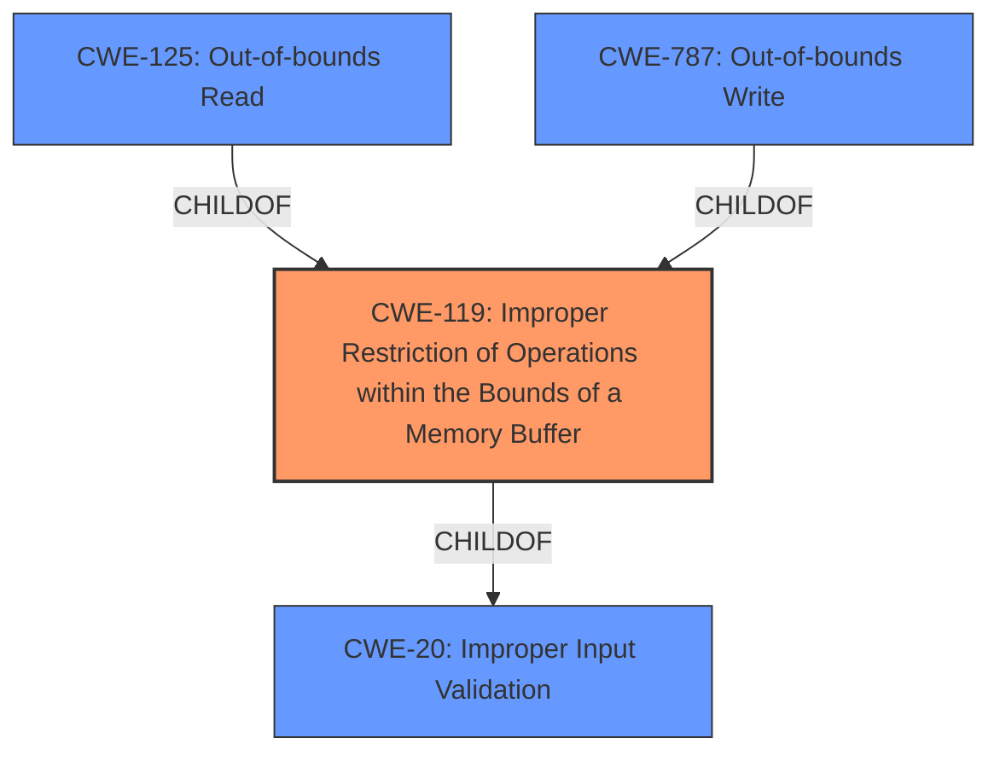

# Analysis for CVE-2021-22713

# Summary
| CWE ID | CWE Name | Confidence | CWE Abstraction Level | CWE Vulnerability Mapping Label | CWE-Vulnerability Mapping Notes |
|---|---|---|---|---|---|
| CWE-119 | Improper Restriction of Operations within the Bounds of a Memory Buffer | 1.0 | Class | Primary | Discouraged |

## Evidence and Confidence

*   **Confidence Score:** 1.0
*   **Evidence Strength:** HIGH

## Relationship Analysis
The primary CWE is CWE-119, which is a Class-level CWE. While it has child CWEs like CWE-125 and CWE-787 that are more specific, the provided information does not allow for a more granular classification.

## Vulnerability Chain
The vulnerability chain starts with a **CWE-119Improper restriction of operations within the bounds of a memory buffer** which leads to a meter reboot.

## Summary of Analysis
The vulnerability description explicitly states "**CWE-119Improper restriction of operations within the bounds of a memory buffer** vulnerability exists." The impact is that the meter reboots. The weakness is directly identified in the vulnerability description.

The retriever results also list CWE-119 as the top candidate. The mapping guidance for CWE-119 is "Discouraged" because it's a class-level CWE and lower-level CWEs are preferred. However, there isn't enough information provided to determine whether the buffer operation is a read (CWE-125) or a write (CWE-787). Therefore, sticking with CWE-119 is the most accurate choice based on the provided information, despite the discouraged usage.

Relevant CWE Information:

# Enhanced Context (25 CWEs)

## CWE-119: Improper Restriction of Operations within the Bounds of a Memory Buffer
**Abstraction:** Class
**Status:** Stable

### Description
The product performs operations on a memory buffer, but it reads from or writes to a memory location outside the buffer's intended boundary. This may result in read or write operations on unexpected memory locations that could be linked to other variables, data structures, or internal program data.

### Mapping Guidance
**Usage:** Discouraged
**Rationale:** CWE-119 is commonly misused in low-information vulnerability reports when lower-level CWEs could be used instead, or when more details about the vulnerability are available.

## CWE-125: Out-of-bounds Read
**Abstraction:** Base
**Status:** Draft

### Description
The product reads data past the end, or before the beginning, of the intended buffer.

## CWE-787: Out-of-bounds Write
**Abstraction:** Base
**Status:** Draft

### Description
The product writes data past the end, or before the beginning, of the intended buffer.