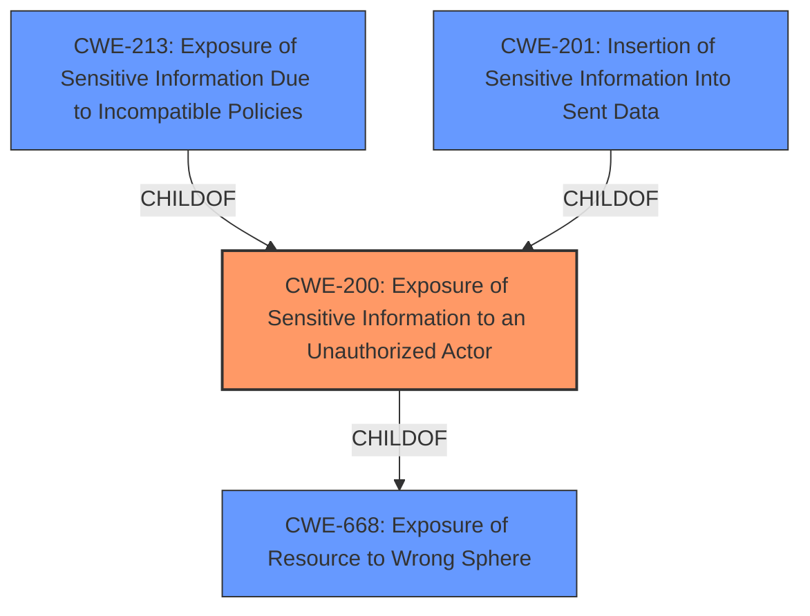

# Enhanced Analysis for CVE-2021-22721

# Summary
| CWE ID | CWE Name | Confidence | CWE Abstraction Level | CWE Vulnerability Mapping Label | CWE-Vulnerability Mapping Notes |
|---|---|---|---|---|---|
| CWE-200 | Exposure of Sensitive Information to an Unauthorized Actor | 0.9 | Class | Primary | Discouraged |

## Evidence and Confidence

*   **Confidence Score:** 0.9
*   **Evidence Strength:** HIGH

## Relationship Analysis
The primary relationship influencing the decision is the ChildOf relationship between CWE-200 and CWE-668 (Exposure of Resource to Wrong Sphere). While CWE-200 is a Class-level CWE, the vulnerability description explicitly mentions **Information Exposure**, aligning directly with CWE-200's core concept. The retriever results also rated CWE-200 highly relevant. While there are Base-level CWEs that are children of CWE-200, none were specific enough in their description to provide a better match than CWE-200.



## Vulnerability Chain
The chain of events in this vulnerability is as follows:
1.  The charging station web server receives crafted malicious parameters.
2.  Due to improper handling of these parameters, the server exposes limited knowledge of javascript code.

The root cause is the web server's failure to adequately handle malicious parameters, leading to the **Information Exposure**.

## Summary of Analysis
The initial analysis focused on the **Information Exposure** aspect described in the vulnerability description. The phrase "crafted malicious parameters are submitted to the charging station web server" indicates that the server does not properly handle these malicious parameters which leads to exposure of limited javascript code.

The final decision is to assign CWE-200 (Exposure of Sensitive Information to an Unauthorized Actor). The CWE-200 description aligns well with the **Information Exposure** vulnerability, specifically the exposure of limited knowledge of javascript code. The evidence explicitly states: "Root Cause of Vulnerability: The root cause is a CWE-200: Information Exposure vulnerability."

While CWE-200 is a Class-level CWE and is often discouraged, it is the best fit based on the available information. The description aligns directly with the vulnerability's core characteristic: **information exposure**. Given the available evidence, selecting a more specific child CWE is not possible as there is not sufficient detail to support it.

Relevant CWE Information:

# Enhanced Context (25 CWEs)
The following CWEs were identified as potentially relevant to this vulnerability:

## CWE-807: Reliance on Untrusted Inputs in a Security Decision
**Abstraction Level**: Base
**Similarity Score**: 0.78
**Source**: dense

**Description**:
The product uses a protection mechanism that relies on the existence or values of an input, but the input can be modified by an untrusted actor in a way that bypasses the protection mechanism.

**Why Not Selected:** This CWE is not selected, because the description focuses more on the reliance on untrusted input, and the vulnerability is related to information exposure.

## CWE-1289: Improper Validation of Unsafe Equivalence in Input
**Abstraction Level**: Base
**Similarity Score**: 0.77
**Source**: dense

**Description**:
The product receives an input value that is used as a resource identifier or other type of reference, but it does not validate or incorrectly validates that the input is equivalent to a potentially-unsafe value.

**Why Not Selected:** This CWE is not selected because it describes an issue with the validation of unsafe equivalence, not information exposure.

## CWE-345: Insufficient Verification of Data Authenticity
**Abstraction Level**: Class
**Similarity Score**: 0.76
**Source**: dense

**Description**:
The product does not sufficiently verify the origin or authenticity of data, in a way that causes it to accept invalid data.

**Why Not Selected:** This CWE is not selected because it describes an issue with data authenticity, not information exposure.

## CWE-74: Improper Neutralization of Special Elements in Output Used by a Downstream Component ('Injection')
**Abstraction Level**: Class
**Similarity Score**: 0.76
**Source**: dense

**Description**:
The product constructs all or part of a command, data structure, or record using externally-influenced input from an upstream component, but it does not neutralize or incorrectly neutralizes special elements that could modify how it is parsed or interpreted when it is sent to a downstream component.

**Why Not Selected:** This CWE is not selected because it describes an issue with injection, not information exposure.

## CWE-184: Incomplete List of Disallowed Inputs
**Abstraction Level**: Base
**Similarity Score**: 0.75
**Source**: dense

**Description**:
The product implements a protection mechanism that relies on a list of inputs (or properties of inputs) that are not allowed by policy or otherwise require other action to neutralize before additional processing takes place, but the list is incomplete.

**Why Not Selected:** This CWE is not selected because it describes an issue with an incomplete list of disallowed inputs, not information exposure.

## CWE-538: Insertion of Sensitive Information into Externally-Accessible File or Directory
**Abstraction Level**: Base
**Similarity Score**: 0.75
**Source**: dense

**Description**:
The product places sensitive information into files or directories that are accessible to actors who are allowed to have access to the files, but not to the sensitive information.

**Why Not Selected:** This CWE is not selected because it describes sensitive information in externally accessible files. While there is some code exposure, it doesn't appear to be placed into externally accessible files.

## CWE-668: Exposure of Resource to Wrong Sphere
**Abstraction Level**: Class
**Similarity Score**: 0.75
**Source**: dense

**Description**:
The product exposes a resource to the wrong control sphere, providing unintended actors with inappropriate access to the resource.

**Why Not Selected:** This CWE is not selected because the CWE-200 is a better fit.

## CWE-226: Sensitive Information in Resource Not Removed Before Reuse
**Abstraction Level**: Base
**Similarity Score**: 0.75
**Source**: dense

**Description**:
The product releases a resource such as memory or a file so that it can be made available for reuse, but it does not clear or "zeroize" the information contained in the resource before the product performs a critical state transition or makes the resource available for reuse by other entities.

**Why Not Selected:** This CWE is not selected because it describes an issue with resources not being cleared before reuse, not information exposure.

## CWE-657: Violation of Secure Design Principles
**Abstraction Level**: Class
**Similarity Score**: 0.75
**Source**: dense

**Description**:
The product violates well-established principles for secure design.

**Why Not Selected:** This CWE is not selected because it is too generic.

## CWE-303: Incorrect Implementation of Authentication Algorithm
**Abstraction Level**: Base
**Similarity Score**: 0.75
**Source**: dense

**Description**:
The requirements for the product dictate the use of an established authentication algorithm, but the implementation of the algorithm is incorrect.

**Why Not Selected:** This CWE is not selected because it describes an issue with authentication algorithms, not information exposure.

## CWE-79: Improper Neutralization of Input During Web Page Generation ('Cross-site Scripting')
**Abstraction Level**: Base
**Similarity Score**: 8717.35
**Source**: sparse

**Description**:
The product does not neutralize or incorrectly neutralizes user-controllable input before it is placed in output that is used as a web page that is served to other users.

**Why Not Selected:** This CWE is not selected because the issue is information exposure, not cross-site scripting.

## CWE-116: Improper Encoding or Escaping of Output
**Abstraction Level**: Class
**Similarity Score**: 8388.76
**Source**: sparse

**Description**:
The product prepares a structured message for communication with another component, but encoding or escaping of the data is either missing or done incorrectly. As a result, the intended structure of the message is not preserved.

**Why Not Selected:** This CWE is not selected because the issue is information exposure, not improper encoding/escaping.

## CWE-22: Improper Limitation of a Pathname to a Restricted Directory ('Path Traversal')
**Abstraction Level**: Base
**Similarity Score


## CWE Relationship Analysis

Current CWEs represent these abstraction levels: .


### Vulnerability Chain Analysis

**Chain starting from CWE-657:**
- 657 (Violation of Secure Design Principles) - ROOT


**Chain starting from CWE-303:**
- 303 (Incorrect Implementation of Authentication Algorithm) - ROOT


### CWE Relationship Diagram

```mermaid
graph TD
    classDef primary fill:#f96,stroke:#333,stroke-width:2px
    classDef secondary fill:#69f,stroke:#333
    classDef tertiary fill:#9e9,stroke:#333
```