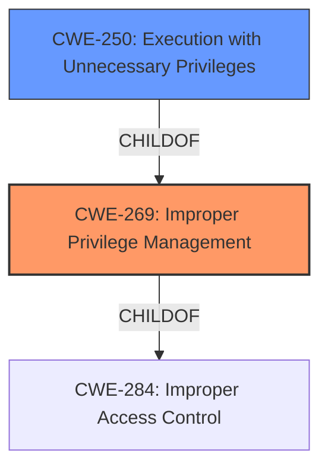

# Raw Analyzer Response for CVE-2021-22733

# Summary
| CWE ID | CWE Name | Confidence | CWE Abstraction Level | CWE Vulnerability Mapping Label | CWE-Vulnerability Mapping Notes |
|---|---|---|---|---|---|
| CWE-269 | Improper Privilege Management | 0.9 | Class | Primary | Discouraged |
| CWE-250 | Execution with Unnecessary Privileges | 0.7 | Base | Secondary | Allowed |

## Evidence and Confidence

*   **Confidence Score:** 0.8
*   **Evidence Strength:** MEDIUM

## Relationship Analysis
The primary CWE, CWE-269, is a Class-level CWE and is a child of CWE-284 (Improper Access Control), which is a Pillar-level CWE. The relationship between CWE-269 and CWE-250 is that CWE-250 (Execution with Unnecessary Privileges) is a child of CWE-269. This indicates that **improper privilege management** can lead to the execution of code with unnecessary privileges.

## Vulnerability Chain
The vulnerability chain starts with **Improper Privilege Management** (CWE-269), which leads to the ability to load unauthorized code into the system folder, resulting in shell access. This could also involve CWE-250 Execution with Unnecessary Privileges.

## Summary of Analysis
The initial assessment identified CWE-269 as the primary weakness due to the explicit mention of "**Improper Privilege Management**" in the vulnerability description. The vulnerability allows unauthorized code to be loaded, leading to shell access. This suggests that the system is not properly managing the privileges required to execute code.

CWE-269 is a Class, and the mapping guidance discourages its use due to its broad nature. However, the description directly mentions "**Improper Privilege Management**", making it a reasonable starting point. The recommendation is to look for more specific children of CWE-269.

CWE-250 (Execution with Unnecessary Privileges) is considered as a secondary CWE. If the system allows the loaded code to execute with elevated privileges, then CWE-250 would be appropriate.

The evidence for CWE-269 is the phrase "**Improper Privilege Management**" from the "Vulnerability Description Key Phrases". The evidence for CWE-250 is inferred from the statement that "unauthorized code is loaded into the system folder" which could suggest elevated privileges.

The final decision is to use CWE-269 as the primary CWE, as it is explicitly mentioned and represents the root cause. While more specific CWEs could exist, the available information is insufficient to determine them definitively. CWE-250 is listed as a secondary CWE due to the possibility of elevated privileges during code execution.

Relevant CWE Information:
- CWE-269: "The product does not properly assign, modify, track, or check privileges for an actor, creating an unintended sphere of control for that actor."
- CWE-250: "The product performs an operation at a privilege level that is higher than the minimum level required, which creates new weaknesses or amplifies the consequences of other weaknesses."