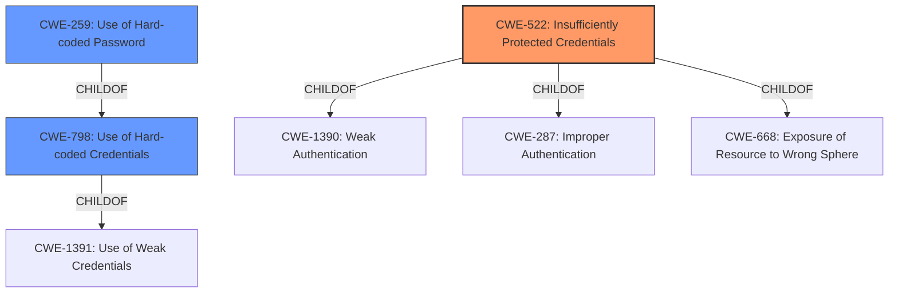

# Analysis for CVE-2021-22737

# Summary
| CWE ID | CWE Name | Confidence | CWE Abstraction Level | CWE Vulnerability Mapping Label | CWE-Vulnerability Mapping Notes |
|---|---|---|---|---|---|
| CWE-522 | Insufficiently Protected Credentials | 0.8 | Class | Allowed-with-Review | Primary CWE |
| CWE-798 | Use of Hard-coded Credentials | 0.6 | Base | Allowed | Secondary Candidate |
| CWE-259 | Use of Hard-coded Password | 0.5 | Variant | Allowed | Secondary Candidate |

## Evidence and Confidence

*   **Confidence Score:** 0.8
*   **Evidence Strength:** MEDIUM

## Relationship Analysis
The primary CWE identified is CWE-522, "Insufficiently Protected Credentials," which is a Class-level CWE. The analysis considered more specific Base and Variant CWEs such as CWE-798, "Use of Hard-coded Credentials," and CWE-259, "Use of Hard-coded Password". CWE-798 and CWE-259 are children of CWE-1391 "Use of Weak Credentials", and CWE-259 is also a child of CWE-798. While the vulnerability description indicates **insufficiently protected credentials**, it lacks specific details about how the credentials are **insufficiently protected**. Therefore, the higher-level CWE-522 is most appropriate. However, the mention of brute force attack suggests the credentials might be guessable or predictable, making CWE-798 and CWE-259 possible secondary candidates if more information becomes available.

## Vulnerability Chain
The vulnerability chain starts with the **insufficiently protected credentials** (CWE-522). An attacker can then perform a brute-force attack to discover these credentials, leading to **unauthorized access**.

## Summary of Analysis
The initial analysis focused on the provided vulnerability description and key phrases, specifically the **root cause** of "**Insufficiently Protected Credentials**". The Retriever Results highlighted CWE-522 as the top candidate, which aligns with the vulnerability description.

CWE-522's description, "The product transmits or stores authentication credentials, but it uses an insecure method that is susceptible to unauthorized interception and/or retrieval," directly matches the described vulnerability. The mention of a brute-force attack as the vector supports this assessment.

The relationship analysis indicated that more specific CWEs like CWE-798 (Use of Hard-coded Credentials) or CWE-259 (Use of Hard-coded Password) could be considered if the **insufficient protection** was due to hard-coded values. However, without further evidence, CWE-522 remains the most appropriate, as it captures the general weakness of **insufficiently protected credentials** that are susceptible to brute-force attacks.

The decision to select CWE-522 is primarily based on the explicit mention of "**Insufficiently Protected Credentials**" in the vulnerability description. The relationship analysis helps to refine the selection by considering more specific options, but the lack of concrete evidence prevents a more granular mapping.

Other CWEs Considered and Rejected:

*   CWE-200 (Exposure of Sensitive Information to an Unauthorized Actor): While unauthorized access is the impact, the root cause is the **insufficiently protected credentials**, not direct exposure of information.
*   CWE-327 (Use of a Broken or Risky Cryptographic Algorithm): There's no indication of a broken cryptographic algorithm being used.
*   CWE-208 (Observable Timing Discrepancy): This is not relevant as the vulnerability is about weak credentials, not timing attacks.
*   CWE-331 (Insufficient Entropy): This is not relevant as the vulnerability is about weak credentials, not about the lack of randomness.
*   CWE-257 (Storing Passwords in a Recoverable Format): While related, CWE-522 is a broader category that encompasses various credential protection issues.
*   CWE-256 (Plaintext Storage of a Password): This is a specific case of insufficient protection, but the description does not explicitly state passwords are in plaintext.
*   CWE-269 (Improper Privilege Management): This is not about incorrect privilege assignment, but about the credentials themselves being vulnerable.
*   CWE-347 (Improper Verification of Cryptographic Signature): There is no indication of signature verification issues.