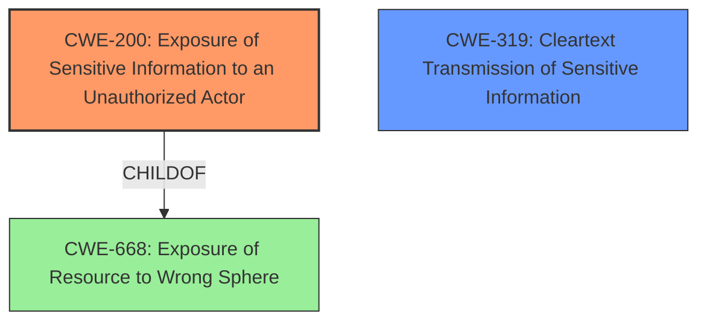

# Analysis for CVE-2021-22749

# Summary
| CWE ID | CWE Name | Confidence | CWE Abstraction Level | CWE Vulnerability Mapping Label | CWE-Vulnerability Mapping Notes |
|---|---|---|---|---|---|
| CWE-200 | Exposure of Sensitive Information to an Unauthorized Actor | 0.9 | Class | Primary | Discouraged: Used because the root cause is the product exposes sensitive information to an actor that is not explicitly authorized to have access to that information. |
| CWE-319 | Cleartext Transmission of Sensitive Information | 0.6 | Base | Secondary | Allowed: Considered as a possibility if the HTTP request was not encrypted and data sent in the clear. |

## Evidence and Confidence

*   **Confidence Score:** 0.9
*   **Evidence Strength:** HIGH

## Relationship Analysis
The primary CWE selected is CWE-200 Exposure of Sensitive Information to an Unauthorized Actor which is a Class-level CWE. It has a ChildOf relationship to CWE-668 Exposure of Resource to Wrong Sphere. The analysis considered the discouraged usage of CWE-200 and evaluated more specific children but found none that fit better than the Class-level CWE. CWE-319 Cleartext Transmission of Sensitive Information was considered as a potential secondary CWE, and it is a Base-level CWE.

## Vulnerability Chain
The vulnerability chain starts with the **weakness** in the Modicon X80 BMXNOR0200H RTU SV1.70 IR22 and prior, where the web server **exposes sensitive information** (CWE-200) upon receiving a specially crafted HTTP request. The impact is the **information leak** of RTU configuration and communication parameters.

## Summary of Analysis
The initial analysis identified CWE-200 Exposure of Sensitive Information to an Unauthorized Actor as the primary candidate. The retriever results also listed CWE-200 as the top candidate, although the retriever notes that it is a discouraged CWE. The vulnerability description and CVE reference summary both point to the root cause being an **exposure of sensitive information**.

The relationship analysis and mapping guidance were carefully considered. While CWE-200 is a Class-level CWE and is generally discouraged, the specific details of the vulnerability did not align perfectly with any of its more specific children. The key aspect is the **unauthorized exposure** of the RTU configuration, which directly matches the description of CWE-200. The vendor's recommended mitigations, such as disabling web access, using network segmentation, and configuring access control lists, also align with preventing unauthorized access to sensitive information.

The decision to use CWE-200 is primarily based on the evidence provided in the vulnerability description and the CVE reference links content summary. The CVE reference links content summary explicitly states: "The root cause is a CWE-200 vulnerability, specifically 'Exposure of Sensitive Information to an Unauthorized Actor.'" The vulnerability description also mentions an "**impact:** information leak concerning the current RTU configuration including communication parameters dedicated to telemetry" by "**attacker:** unauthorized actor."

While CWE-200 is discouraged for general use, the specific circumstances of this vulnerability, combined with the explicit mention of CWE-200 as the root cause in the CVE documentation, support its use in this case. It accurately represents the **weakness** where the product exposes sensitive information to an unauthorized actor.

Relevant CWE Information:

# Enhanced Context (25 CWEs)
The following CWEs were identified as potentially relevant to this vulnerability:

## CWE-274: Improper Handling of Insufficient Privileges
**Abstraction Level**: Base
**Similarity Score**: 0.77
**Source**: dense

**Description**:
The product does not handle or incorrectly handles when it has insufficient privileges to perform an operation, leading to resultant weaknesses.

**Mapping Guidance**:
- Usage: Discouraged
- Rationale: This CWE entry could be deprecated in a future version of CWE.

*Not Selected*: This CWE does not fit the vulnerability description because the vulnerability is not about insufficient privileges.

## CWE-668: Exposure of Resource to Wrong Sphere
**Abstraction Level**: Class
**Similarity Score**: 0.76
**Source**: dense

**Description**:
The product exposes a resource to the wrong control sphere, providing unintended actors with inappropriate access to the resource.

**Mapping Guidance**:
- Usage: Discouraged
- Rationale: CWE-668 is high-level and is often misused as a catch-all when lower-level CWE IDs might be applicable. It is sometimes used for low-information vulnerability reports [REF-1287]. It is a level-1 Class (i.e., a child of a Pillar). It is not useful for trend analysis.

*Not Selected*: While this is a parent of CWE-200, using CWE-200 is more specific and accurately describes the vulnerability.

## CWE-497: Exposure of Sensitive System Information to an Unauthorized Control Sphere
**Abstraction Level**: Base
**Similarity Score**: 0.76
**Source**: dense

**Description**:
The product does not properly prevent sensitive system-level information from being accessed by unauthorized actors who do not have the same level of access to the underlying system as the product does.

**Mapping Guidance**:
- Usage: Allowed
- Rationale: This CWE entry is at the Base level of abstraction, which is a preferred level of abstraction for mapping to the root causes of vulnerabilities.

*Not Selected*: This is more specific, referring to system-level information. The vulnerability involves RTU configuration and communication parameters, which are not necessarily system-level.

## CWE-538: Insertion of Sensitive Information into Externally-Accessible File or Directory
**Abstraction Level**: Base
**Similarity Score**: 0.76
**Source**: dense

**Description**:
The product places sensitive information into files or directories that are accessible to actors who are allowed to have access to the files, but not to the sensitive information.

**Mapping Guidance**:
- Usage: Allowed
- Rationale: This CWE entry is at the Base level of abstraction, which is a preferred level of abstraction for mapping to the root causes of vulnerabilities.

*Not Selected*: This CWE does not fit as the information is not being placed in an externally accessible file or directory.

## CWE-653: Improper Isolation or Compartmentalization
**Abstraction Level**: Class
**Similarity Score**: 0.76
**Source**: dense

**Description**:
The product does not properly compartmentalize or isolate functionality, processes, or resources that require different privilege levels, rights, or permissions.

**Mapping Guidance**:
- Usage: Allowed
- Rationale: This CWE entry is at the Base level of abstraction, which is a preferred level of abstraction for mapping to the root causes of vulnerabilities.

*Not Selected*: This CWE does not fit the vulnerability description as it does not involve improper isolation or compartmentalization.

## CWE-280: Improper Handling of Insufficient Permissions or Privileges 
**Abstraction Level**: Base
**Similarity Score**: 0.76
**Source**: dense

**Description**:
The product does not handle or incorrectly handles when it has insufficient privileges to access resources or functionality as specified by their permissions. This may cause it to follow unexpected code paths that may leave the product in an invalid state.

**Mapping Guidance**:
- Usage: Allowed
- Rationale: This CWE entry is at the Base level of abstraction, which is a preferred level of abstraction for mapping to the root causes of vulnerabilities.

*Not Selected*: This CWE does not fit the vulnerability description because the vulnerability is not about insufficient privileges.

## CWE-226: Sensitive Information in Resource Not Removed Before Reuse
**Abstraction Level**: Base
**Similarity Score**: 0.76
**Source**: dense

**Description**:
The product releases a resource such as memory or a file so that it can be made available for reuse, but it does not clear or "zeroize" the information contained in the resource before the product performs a critical state transition or makes the resource available for reuse by other entities.

**Mapping Guidance**:
- Usage: Allowed
- Rationale: This CWE entry is at the Base level of abstraction, which is a preferred level of abstraction for mapping to the root causes of vulnerabilities.

*Not Selected*: This CWE does not fit the vulnerability description as it does not involve resources being reused.

## CWE-807: Reliance on Untrusted Inputs in a Security Decision
**Abstraction Level**: Base
**Similarity Score**: 0.76
**Source**: dense

**Description**:
The product uses a protection mechanism that relies on the existence or values of an input, but the input can be modified by an untrusted actor in a way that bypasses the protection mechanism.

**Mapping Guidance**:
- Usage: Allowed
- Rationale: This