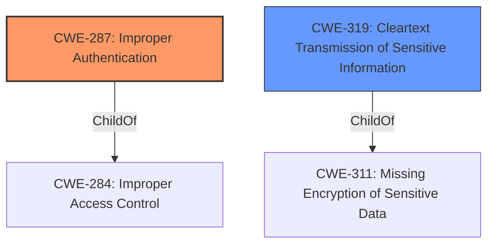

# Raw Analyzer Response for CVE-2021-22764

# Summary
| CWE ID  | CWE Name                         | Confidence | CWE Abstraction Level | CWE Vulnerability Mapping Label | CWE-Vulnerability Mapping Notes |
| :------- | :--------------------------------- | :--------- | :---------------------- | :----------------------------- | :------------------------------ |
| CWE-287  | Improper Authentication              | 1.0       | Class                   | Primary                        | Discouraged                    |
| CWE-319  | Cleartext Transmission of Sensitive Information | 0.70   | Base                   | Secondary                        | Allowed                   |

## Evidence and Confidence

*   **Confidence Score:** 0.90
*   **Evidence Strength:** HIGH

## Relationship Analysis
The primary CWE identified is CWE-287. While it is a class-level CWE and discouraged by MITRE, the provided information directly states "**CWE-287 Improper Authentication** vulnerability exists". The description and supporting evidence align well with the general concept of improper authentication.
CWE-319 is a possible secondary weakness if the HTTP request is sending credentials or tokens in cleartext.

## Vulnerability Chain
The vulnerability chain starts with **CWE-287 Improper Authentication**, leading to a potential loss of connectivity via the Modbus TCP protocol. An attacker exploits this by sending a specially crafted HTTP request. A secondary chain may exist if credentials are sent in cleartext, leading to CWE-319.

## Summary of Analysis
The initial assessment strongly points to **CWE-287 Improper Authentication**, as explicitly stated in the vulnerability description and CVE reference.

The vulnerability description states "A **CWE-287 Improper Authentication** vulnerability exists... that could cause loss of connectivity to the device via Modbus TCP protocol when an attacker sends a specially crafted HTTP request."

The CVE Reference Links Content Summary states "Root cause of vulnerability: Improper authentication vulnerability." and "Weaknesses/vulnerabilities present: Improper Authentication (CWE-287)."

Given the direct identification of CWE-287 and the lack of further specificity, it is the most appropriate primary CWE. However, since it is a class-level CWE, there is a possibility of mapping to a more specific child CWE if more information was available. The retriever results also support this with CWE-287 listed as the top combined result.

I am also adding CWE-319 as a secondary weakness, with lower confidence, as there is a possibility the HTTP request is transmitting credentials in cleartext. This would allow for a man-in-the-middle attack to capture the credentials and gain access to the device.

Relevant CWE Information:
*   CWE-287: Improper Authentication
*   CWE-319: Cleartext Transmission of Sensitive Information