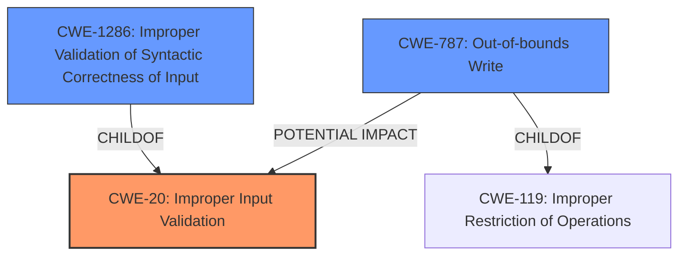

# Enhanced Analysis for CVE-2021-22765

# Summary
| CWE ID | CWE Name | Confidence | CWE Abstraction Level | CWE Vulnerability Mapping Label | CWE-Vulnerability Mapping Notes |
|---|---|---|---|---|---|
| CWE-20 | Improper Input Validation | 0.9 | Class | Primary | Discouraged, but used due to lack of more specific information. |
| CWE-1286 | Improper Validation of Syntactic Correctness of Input | 0.7 | Base | Secondary | Allowed. A more specific potential cause. |
| CWE-787 | Out-of-bounds Write | 0.6 | Base | Secondary | Allowed. A potential impact if the input validation issue allows out-of-bounds write. |

## Evidence and Confidence

*   **Confidence Score:** 0.8
*   **Evidence Strength:** MEDIUM

## Relationship Analysis
The primary weakness is **CWE-20 (Improper Input Validation)**, which is a Class-level CWE. While it is discouraged for direct mapping, its use is justified here due to the limited information available. **CWE-1286 (Improper Validation of Syntactic Correctness of Input)** is a more specific Base-level CWE and a child of **CWE-20**, representing a potential cause of the vulnerability. **CWE-787 (Out-of-bounds Write)** is a Base-level CWE and a child of **CWE-119 (Improper Restriction of Operations within the Bounds of a Memory Buffer)**, representing a potential impact if the improper input validation leads to memory corruption.



## Vulnerability Chain
The vulnerability chain starts with **CWE-20 (Improper Input Validation)**. If the syntactic correctness of the input is not validated (**CWE-1286**), it can lead to an out-of-bounds write (**CWE-787**), potentially resulting in denial of service or remote code execution.

## Summary of Analysis
The initial analysis identified **CWE-20 (Improper Input Validation)** as the primary weakness, based on the vulnerability description key phrases. The **CVE Reference Links Content Summary** confirms that the vulnerability is exploitable via a specially crafted HTTP packet. The **Retriever Results** also lists **CWE-20** as the top candidate.

The MITRE mapping guidance discourages the use of **CWE-20** when more specific CWEs are available. However, given the limited information, **CWE-20** serves as a reasonable starting point. Further analysis suggests **CWE-1286 (Improper Validation of Syntactic Correctness of Input)** as a potential cause, as the HTTP packet might not be validated for its syntax. The potential impact could be an out-of-bounds write (**CWE-787**), leading to denial of service or remote code execution.

The graph relationships show that **CWE-1286** is a child of **CWE-20**, making it a more specific potential cause. **CWE-787** is a potential impact of **CWE-20**, if the improper validation leads to memory corruption. The selected CWEs are at the optimal level of specificity given the available evidence.

Relevant CWE Information:

# Enhanced Context (25 CWEs)

## CWE-1289: Improper Validation of Unsafe Equivalence in Input
**Abstraction Level**: Base
**Similarity Score**: 0.80
**Source**: dense

**Description**:
The product receives an input value that is used as a resource identifier or other type of reference, but it does not validate or incorrectly validates that the input is equivalent to a potentially-unsafe value.

**Mapping Guidance**:
- Usage: Allowed
- Rationale: This CWE entry is at the Base level of abstraction, which is a preferred level of abstraction for mapping to the root causes of vulnerabilities.

*Not Selected:* This CWE is not selected because the description of the vulnerability does not mention unsafe equivalence.

## CWE-807: Reliance on Untrusted Inputs in a Security Decision
**Abstraction Level**: Base
**Similarity Score**: 0.77
**Source**: dense

**Description**:
The product uses a protection mechanism that relies on the existence or values of an input, but the input can be modified by an untrusted actor in a way that bypasses the protection mechanism.

**Mapping Guidance**:
- Usage: Allowed
- Rationale: This CWE entry is at the Base level of abstraction, which is a preferred level of abstraction for mapping to the root causes of vulnerabilities.

*Not Selected:* There is no explicit evidence in the vulnerability description suggesting reliance on untrusted inputs in a security decision.

## CWE-274: Improper Handling of Insufficient Privileges
**Abstraction Level**: Base
**Similarity Score**: 0.76
**Source**: dense

**Description**:
The product does not handle or incorrectly handles when it has insufficient privileges to perform an operation, leading to resultant weaknesses.

**Mapping Guidance**:
- Usage: Discouraged
- Rationale: This CWE entry could be deprecated in a future version of CWE.

*Not Selected:* The vulnerability description focuses on input validation, not privilege handling.

## CWE-183: Permissive List of Allowed Inputs
**Abstraction Level**: Base
**Similarity Score**: 0.76
**Source**: dense

**Description**:
The product implements a protection mechanism that relies on a list of inputs (or properties of inputs) that are explicitly allowed by policy because the inputs are assumed to be safe, but the list is too permissive - that is, it allows an input that is unsafe, leading to resultant weaknesses.

**Mapping Guidance**:
- Usage: Allowed
- Rationale: This CWE entry is at the Base level of abstraction, which is a preferred level of abstraction for mapping to the root causes of vulnerabilities.

*Not Selected:* There is no information to suggest that the vulnerability involves a permissive list of allowed inputs.

## CWE-703: Improper Check or Handling of Exceptional Conditions
**Abstraction Level**: Pillar
**Similarity Score**: 0.75
**Source**: dense

**Description**:
The product does not properly anticipate or handle exceptional conditions that rarely occur during normal operation of the product.

**Mapping Guidance**:
- Usage: Discouraged
- Rationale: This CWE entry is extremely high-level, a Pillar.

*Not Selected:* This is a high-level CWE and not specific enough.

## CWE-184: Incomplete List of Disallowed Inputs
**Abstraction Level**: Base
**Similarity Score**: 0.75
**Source**: dense

**Description**:
The product implements a protection mechanism that relies on a list of inputs (or properties of inputs) that are not allowed by policy or otherwise require other action to neutralize before additional processing takes place, but the list is incomplete.

**Mapping Guidance**:
- Usage: Allowed
- Rationale: This CWE entry is at the Base level of abstraction, which is a preferred level of abstraction for mapping to the root causes of vulnerabilities.

*Not Selected:* There is no information to suggest that the vulnerability involves an incomplete list of disallowed inputs.

## CWE-280: Improper Handling of Insufficient Permissions or Privileges 
**Abstraction Level**: Base
**Similarity Score**: 0.75
**Source**: dense

**Description**:
The product does not handle or incorrectly handles when it has insufficient privileges to access resources or functionality as specified by their permissions. This may cause it to follow unexpected code paths that may leave the product in an invalid state.

**Mapping Guidance**:
- Usage: Allowed
- Rationale: This CWE entry is at the Base level of abstraction, which is a preferred level of abstraction for mapping to the root causes of vulnerabilities.

*Not Selected:* The vulnerability description focuses on input validation, not privilege handling.

## CWE-1286: Improper Validation of Syntactic Correctness of Input
**Abstraction Level**: Base
**Similarity Score**: 0.75
**Source**: dense

**Description**:
The product receives input that is expected to be well-formed - i.e., to comply with a certain syntax - but it does not validate or incorrectly validates that the input complies with the syntax.

**Mapping Guidance**:
- Usage: Allowed
- Rationale: This CWE entry is at the Base level of abstraction, which is a preferred level of abstraction for mapping to the root causes of vulnerabilities.

*Selected as Secondary:* This CWE is selected because the HTTP packet is specially crafted, which means it is likely that the syntactic correctness of the input is not validated correctly.

## CWE-653: Improper


## CWE Relationship Analysis

Current CWEs represent these abstraction levels: .


### Vulnerability Chain Analysis

**Chain starting from CWE-787:**
- 787 (Out-of-bounds Write) - ROOT


**Chain starting from CWE-653:**
- 653 (Improper Isolation or Compartmentalization) - ROOT


### CWE Relationship Diagram

```mermaid
graph TD
    classDef primary fill:#f96,stroke:#333,stroke-width:2px
    classDef secondary fill:#69f,stroke:#333
    classDef tertiary fill:#9e9,stroke:#333
```