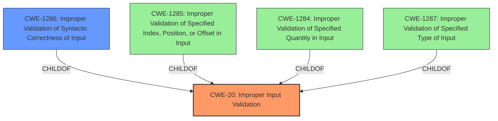

# Analysis for CVE-2021-22766

# Summary
| CWE ID | CWE Name | Confidence | CWE Abstraction Level | CWE Vulnerability Mapping Label | CWE-Vulnerability Mapping Notes |
|---|---|---|---|---|---|
| CWE-20 | Improper Input Validation | 0.75 | Class | Primary | Discouraged |
| CWE-1286 | Improper Validation of Syntactic Correctness of Input | 0.60 | Base | Secondary | Allowed |

## Evidence and Confidence

*   **Confidence Score:** 0.70
*   **Evidence Strength:** MEDIUM

## Relationship Analysis
The primary relationship influencing the selection is the parent-child relationship between CWE-20 and its more specific children, such as CWE-1286. While the description points to **Improper Input Validation**, the lack of specific details prevents pinpointing the exact nature of the validation failure. The abstraction levels guide the choice, favoring the more specific Base level (CWE-1286) if sufficient detail were available, but the high-level Class CWE-20 is used as a starting point due to limited information.

## Vulnerability Chain
The chain starts with **Improper Input Validation** (CWE-20), leading to a denial-of-service (DoS) impact.

## Summary of Analysis
The initial analysis identifies **Improper Input Validation** (CWE-20) as the primary weakness. The vulnerability description key phrases explicitly state "**rootcause:** **Improper Input Validation**" and "**impact:** denial of service".

The retriever results confirm CWE-20 as a top candidate. However, the MITRE mapping guidance discourages the use of CWE-20 due to its frequent misuse and recommends considering lower-level children.

The CVE Reference Links Content Summary indicates that the content is an archive, and the PDF is unreadable without proper extraction. Therefore, further specific details of the vulnerability cannot be extracted from the PDF, which constrains the ability to select a more specific CWE.

Given the limited information, it is best to map the vulnerability to the high-level Class CWE-20, acknowledging the **Improper Input Validation** as the **rootcause** that leads to denial of service by sending a specially crafted HTTP packet.

Other CWEs from **Complete CWE Specifications** were considered but not used:

*   CWE-1286, CWE-1285, CWE-1284, CWE-1287: These are all children of CWE-20 and represent more specific types of input validation errors. While they are potentially relevant, there isn't enough information to determine which specific type of input is being improperly validated.
*   CWE-280: This relates to improper handling of insufficient permissions, which is not directly indicated in the vulnerability description.
* CWE-119, CWE-835, CWE-190: These are related to memory buffer issues, infinite loops and integer handling respectively. While these could be a result of the described vulnerability, they are not directly linked to it.

The final decision is based on the provided evidence, acknowledging its limitations. Using CWE-20 provides a starting point, and future analysis may refine this classification with more details.

Relevant CWE Information:

# Enhanced Context (25 CWEs)
The following CWEs were identified as potentially relevant to this vulnerability:

## CWE-1286: Improper Validation of Syntactic Correctness of Input
**Abstraction:** Base
**Status:** Incomplete

### Description
The product receives input that is expected to be well-formed - i.e., to comply with a certain syntax - but it does not validate or incorrectly validates that the input complies with the syntax.

### Observed Examples
- **CVE-2016-4029:** Chain: incorrect validation of intended decimal-based IP address format (CWE-1286) enables parsing of octal or hexadecimal formats (CWE-1389), allowing bypass of an SSRF protection mechanism (CWE-918).
- **CVE-2007-5893:** HTTP request with missing protocol version number leads to crash

**Technical Explanation:**
CWE-1286 (Improper Validation of Syntactic Correctness of Input) describes a situation where the input is expected to follow a specific syntax, but the product doesn't validate or incorrectly validates it. The "specially crafted HTTP packet" could imply that the packet's syntax (e.g., headers, structure) is not properly validated.

**Justification for Selection:**
Given the vulnerability stems from a "specially crafted HTTP packet", there is a high likelihood that the syntactic correctness of the packet is not validated. For instance, missing headers, incorrect formatting, or unexpected characters within the packet could trigger the vulnerability. If there were additional details about the specific syntax errors in the HTTP packet, then this CWE would be a more accurate classification. However, this is a reasonable secondary consideration.

**Confidence:** 0.60