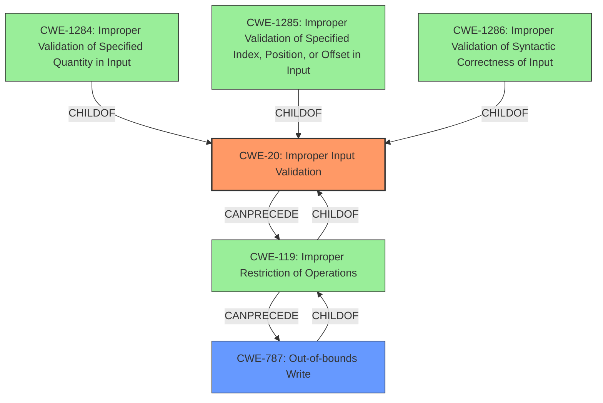

# Analysis Report for CVE-2021-22767

# Vulnerability Analysis Report: CVE-2021-22767

## Description


## Analysis (with Relationship Data)

# Summary

| CWE ID | CWE Name | Confidence | CWE Abstraction Level | CWE Vulnerability Mapping Label | CWE-Vulnerability Mapping Notes |
|---|---|---|---|---|---|
| CWE-20 | Improper Input Validation | 0.8 | Class | Primary CWE | Discouraged |
| CWE-787 | Out-of-bounds Write | 0.5 | Base | Secondary Candidate CWE | Allowed |

## Evidence and Confidence

*   **Confidence Score:** 0.8
*   **Evidence Strength:** MEDIUM

## Relationship Analysis
The primary CWE identified is CWE-20 **Improper Input Validation**. While this is a Class-level CWE and discouraged, it aligns with the provided root cause in the vulnerability description. The retriever results suggested more specific Base-level CWEs like CWE-1284, CWE-1285, and CWE-1286, all children of CWE-20, but the provided vulnerability description lacks the specificity to determine if the **improper input validation** is related to quantity, index, syntax, or type.

CWE-787 **Out-of-bounds Write** is considered as a secondary candidate because the impact section mentions potential remote code execution, which often involves memory corruption. CWE-787 is a child of CWE-119 **Improper Restriction of Operations** and is also related to CWE-20 through the chain: `CWE-20 -> CWE-119 -> CWE-787`.



## Vulnerability Chain
The vulnerability chain starts with **improper input validation** (CWE-20). This leads to a specially crafted HTTP packet being processed incorrectly, potentially resulting in denial of service or remote code execution. If remote code execution is achieved via memory corruption, it could involve an out-of-bounds write (CWE-787).

`CWE-20 (Improper Input Validation) -> Crafted HTTP Packet -> DoS / RCE (potentially CWE-787)`

## Summary of Analysis
The initial analysis identified CWE-20 **Improper Input Validation** as the primary weakness due to the "**rootcause:** **Improper Input Validation**" statement in the "Vulnerability Description Key Phrases". However, CWE-20 is a Class-level CWE, and the mapping guidance discourages its use when more specific CWEs are available. The retriever results suggested CWE-1284, CWE-1285, and CWE-1286, but the description does not specify the type of **improper input validation**.

The CVE Reference Links Content Summary states, "This document does not contain details of specific vulnerability or its root cause. Therefore, more information is required to provide an assessment related to the CVE-2021-22767." This lack of detailed information makes it difficult to move to a more specific CWE.

Given the potential for remote code execution, CWE-787 **Out-of-bounds Write** was considered as a secondary CWE. This is based on the general knowledge that remote code execution often involves memory corruption.

Therefore, CWE-20 is chosen as the primary CWE despite the discouraged usage, because the provided information does not allow for a more specific classification. CWE-787 is a plausible secondary weakness based on the potential impact.

Relevant CWE Information:

# Enhanced Context (25 CWEs)
## CWE-20: Improper Input Validation
**Abstraction:** Class
**Status:** Stable

### Description
The product receives input or data, but it does
        not validate or incorrectly validates that the input has the
        properties that are required to process the data safely and
        correctly.

### Mapping Guidance
**Usage:** Discouraged
**Rationale:** CWE-20 is commonly misused in low-information vulnerability reports when lower-level CWEs could be used instead, or when more details about the vulnerability are available [REF-1287]. It is not useful for trend analysis. It is also a level-1 Class (i.e., a child of a Pillar).
**Comments:** Consider lower-level children such as Improper Use of Validation Framework (CWE-1173) or improper validation involving specific types or properties of input such as Specified Quantity (CWE-1284); Specified Index, Position, or Offset (CWE-1285); Syntactic Correctness (CWE-1286); Specified Type (CWE-1287); Consistency within Input (CWE-1288); or Unsafe Equivalence (CWE-1289).


## CWE Relationship Analysis

Current CWEs represent these abstraction levels: .


### Vulnerability Chain Analysis

**Chain starting from CWE-787:**
- 787 (Out-of-bounds Write) - ROOT


**Chain starting from CWE-1287:**
- 1287 (Improper Validation of Specified Type of Input) - ROOT


### CWE Relationship Diagram

```mermaid
graph TD
    classDef primary fill:#f96,stroke:#333,stroke-width:2px
    classDef secondary fill:#69f,stroke:#333
    classDef tertiary fill:#9e9,stroke:#333
```


*Report generated on 2025-04-02 17:01:27*
