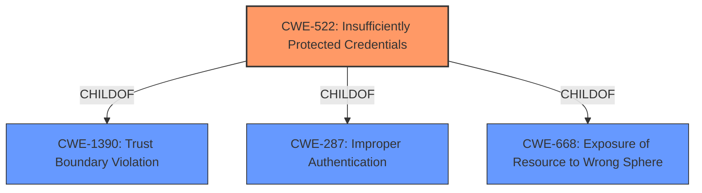

# Analysis Report for CVE-2021-22778

# Vulnerability Analysis Report: CVE-2021-22778

## Description


## Analysis (with Relationship Data)

# Summary
| CWE ID | CWE Name | Confidence | CWE Abstraction Level | CWE Vulnerability Mapping Label | CWE-Vulnerability Mapping Notes |
|---|---|---|---|---|---|
| CWE-522 | Insufficiently Protected Credentials | 1.0 | Class | Primary | Allowed-with-Review |

## Evidence and Confidence

*   **Confidence Score:** 1.0
*   **Evidence Strength:** HIGH

## Relationship Analysis
The primary CWE, CWE-522 (Insufficiently Protected Credentials), is a Class-level CWE. The analysis considered possible child CWEs that might provide a more specific classification. However, based on the available information, CWE-522 remains the most fitting.



## Vulnerability Chain
The vulnerability chain consists of the **insufficiently protected credentials** which leads to unauthorized access and modification of protected derived function blocks.
  - Root Cause: **Insufficiently Protected Credentials**
  - Impact: Read or modify protected derived function blocks by unauthorized users

## Summary of Analysis
The primary assessment is strongly based on the provided evidence.

The **Vulnerability Description Key Phrases** section explicitly identifies "**Insufficiently Protected Credentials**" as the **rootcause** of the vulnerability. This aligns directly with CWE-522.

The graph relationships show that CWE-522 has child CWEs. However, without more information, it's difficult to select a child CWE.

The selection of CWE-522 is at an appropriate level of specificity, given the available information. While CWE-522 is a Class-level CWE, the provided details do not allow for a more specific mapping to a Base or Variant level CWE.

Relevant CWE Information:

# Enhanced Context (25 CWEs)

## CWE-522: Insufficiently Protected Credentials
**Abstraction:** Class
**Status:** Incomplete

### Description
The product transmits or stores authentication credentials, but it uses an insecure method that is susceptible to unauthorized interception and/or retrieval.

### Extended Description
Not provided

### Alternative Terms
None

### Relationships
ChildOf -> CWE-1390
ChildOf -> CWE-287
ChildOf -> CWE-668

### Mapping Guidance
**Usage:** Allowed-with-Review
**Rationale:** This CWE entry is a Class and might have Base-level children that would be more appropriate
**Comments:** Examine children of this entry to see if there is a better fit
**Reasons:**
- Abstraction

### Observed Examples
- **CVE-2022-30018:** A messaging platform serializes all elements of User/Group objects, making private information available to adversaries
- **CVE-2022-29959:** Initialization file contains credentials that can be decoded using a "simple string transformation"
- **CVE-2022-35411:** Python-based RPC framework enables pickle functionality by default, allowing clients to unpickle untrusted data.

Other CWEs Considered:

*   CWE-311 (Missing Encryption of Sensitive Data): This was considered, but the vulnerability description focuses on the **protection** of credentials, not necessarily the lack of encryption.
*   CWE-290 (Authentication Bypass by Spoofing): This CWE relates to incorrectly implemented authentication schemes, which is not the primary issue described in the vulnerability.
*   CWE-523 (Unprotected Transport of Credentials): While related, the vulnerability focuses more on the storage or handling of the credentials, rather than their transport.
*   CWE-798 (Use of Hard-coded Credentials): This was not selected since the vulnerability does not state that hardcoded credentials are the root cause.


## CWE Relationship Analysis

Current CWEs represent these abstraction levels: .


### Vulnerability Chain Analysis

**Chain starting from CWE-311:**
- 311 (Missing Encryption of Sensitive Data) - ROOT


**Chain starting from CWE-287:**
- 287 (Improper Authentication) - ROOT


### CWE Relationship Diagram

```mermaid
graph TD
    classDef primary fill:#f96,stroke:#333,stroke-width:2px
    classDef secondary fill:#69f,stroke:#333
    classDef tertiary fill:#9e9,stroke:#333
```


*Report generated on 2025-04-01 16:26:07*
