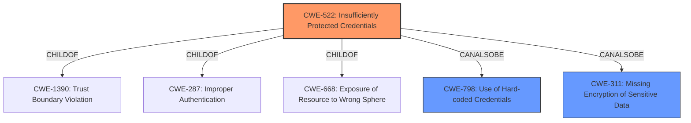

# Enhanced Analysis for CVE-2021-22781

# Summary
| CWE ID | CWE Name | Confidence | CWE Abstraction Level | CWE Vulnerability Mapping Label | CWE-Vulnerability Mapping Notes |
|---|---|---|---|---|---|
| CWE-522 | Insufficiently Protected Credentials | 0.9 | Class | Allowed-with-Review | Primary CWE |
| CWE-798 | Use of Hard-coded Credentials | 0.6 | Base | Allowed | Secondary Candidate |
| CWE-311 | Missing Encryption of Sensitive Data | 0.5 | Class | Discouraged | Secondary Candidate |

## Evidence and Confidence

*   **Confidence Score:** 0.7
*   **Evidence Strength:** MEDIUM

## Relationship Analysis
The primary CWE identified is CWE-522, "Insufficiently Protected Credentials," which is a Class-level CWE. This CWE is related to several other CWEs through hierarchical relationships. It is a child of CWE-1390, CWE-287, and CWE-668. The retriever results also suggested other CWEs such as CWE-311, CWE-290, and CWE-916. The choice of CWE-522 as the primary CWE is based on its direct relevance to the vulnerability description, which mentions "**Insufficiently Protected Credentials**". The relationships with other CWEs provide additional context but do not change the primary mapping.



## Vulnerability Chain
The vulnerability chain starts with the **insufficiently protected credentials**, leading to a leak of SMTP credentials.
1.  **Root Cause:** **Insufficiently Protected Credentials** (CWE-522)
2.  **Impact:** Leak of SMTP credentials, potentially leading to unauthorized access to mailboxes.

## Summary of Analysis
The initial assessment identified CWE-522 as the most relevant CWE due to the explicit mention of "**Insufficiently Protected Credentials**" in the vulnerability description. The description states that this vulnerability in EcoStruxure Control Expert, EcoStruxure Process Expert, and SCADAPack RemoteConnect for x70 could cause a leak of SMTP credentials used for mailbox authentication when an attacker can access a project file.

The retriever results also support this choice, with CWE-522 being the top-ranked CWE. Although CWE-522 is a Class-level CWE, the available information does not provide enough detail to map to a more specific Base-level CWE.

Other CWEs were considered but ultimately not selected as primary:

*   CWE-311 (Missing Encryption of Sensitive Data): While the vulnerability involves sensitive data (SMTP credentials), the primary issue is not the absence of encryption but the **insufficient protection** of the credentials themselves.
*   CWE-798 (Use of Hard-coded Credentials): This could be a possibility, however, the evidence is not clear if the credentials are hard-coded. It could be possible that the credentials are encrypted with a weak key.
*   CWE-290 (Authentication Bypass by Spoofing) and CWE-294 (Authentication Bypass by Capture-replay): These are not relevant because the vulnerability does not directly involve bypassing authentication through spoofing or replay attacks.
*   CWE-916 (Use of Password Hash With Insufficient Computational Effort): This is not relevant because the vulnerability does not specifically involve password hashing.
*   CWE-668 (Exposure of Resource to Wrong Sphere): This is too generic and doesn't accurately describe the root cause.
*   CWE-523 (Unprotected Transport of Credentials): This is not applicable as the vulnerability refers to **insufficient protection** and not transport.
*   CWE-119 (Improper Restriction of Operations within the Bounds of a Memory Buffer) and CWE-1257 (Improper Access Control Applied to Mirrored or Aliased Memory Regions): These are memory-related weaknesses and are not relevant to the described vulnerability.
The final decision to select CWE-522 is based on the direct match with the vulnerability description and the support from the retriever results. While a more specific Base-level CWE would be ideal, the available information does not support a more precise mapping.


## CWE Relationship Analysis

Current CWEs represent these abstraction levels: .


### Vulnerability Chain Analysis

**Chain starting from CWE-1257:**
- 1257 (Improper Access Control Applied to Mirrored or Aliased Memory Regions) - ROOT


**Chain starting from CWE-916:**
- 916 (Use of Password Hash With Insufficient Computational Effort) - ROOT


### CWE Relationship Diagram

```mermaid
graph TD
    classDef primary fill:#f96,stroke:#333,stroke-width:2px
    classDef secondary fill:#69f,stroke:#333
    classDef tertiary fill:#9e9,stroke:#333
```