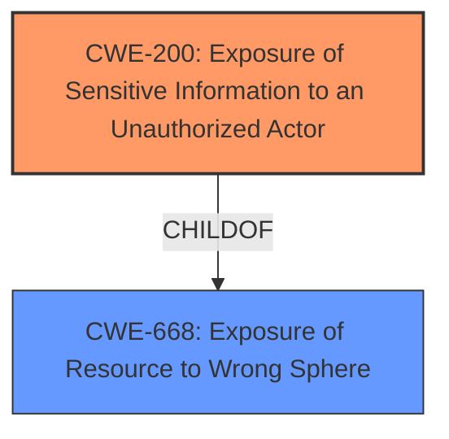

# Analysis Report for CVE-2021-22783

# Vulnerability Analysis Report: CVE-2021-22783

## Description


## Analysis (with Relationship Data)

# Summary
| CWE ID | CWE Name | Confidence | CWE Abstraction Level | CWE Vulnerability Mapping Label | CWE-Vulnerability Mapping Notes |
|---|---|---|---|---|---|
| CWE-200 | Exposure of Sensitive Information to an Unauthorized Actor | 0.8 | Class | Primary | Discouraged |
| CWE-668 | Exposure of Resource to Wrong Sphere | 0.6 | Class | Secondary | Discouraged |

## Evidence and Confidence

*   **Confidence Score:** 0.7
*   **Evidence Strength:** MEDIUM

## Relationship Analysis
The primary relationship impacting the decision is the ChildOf relationship between CWE-200 and CWE-668, where CWE-200 is a child of CWE-668. CWE-200 is a Class level CWE while several other CWEs are Base level. The relationships between the other CWEs were not as relevant given the evidence provided.



## Vulnerability Chain
The vulnerability chain starts with the **CWE-200 Information Exposure** weakness, which allows sensitive information to be exposed, leading to a session hijack.

## Summary of Analysis
The initial analysis identified **CWE-200 Information Exposure** as the primary weakness based on the "Vulnerability Description Key Phrases." The vulnerability description states "A **CWE-200 Information Exposure** vulnerability exists which could allow a session hijack when the door panel is communicating with the door."

The retriever results also suggest CWE-200 as the most likely candidate. However, the MITRE mapping guidance discourages the use of CWE-200 because it is often misused and represents a technical impact rather than a root cause.

Despite this guidance, I am including it as the primary CWE because it is explicitly stated in the vulnerability description. It is possible that more specific CWEs could be applicable with more information. Additionally, I am including CWE-668 as a secondary CWE since CWE-200 is a child of CWE-668.

Relevant CWE Information:

# Enhanced Context (25 CWEs)

## CWE-200: Exposure of Sensitive Information to an Unauthorized Actor
**Abstraction:** Class
**Status:** Draft

### Description
The product exposes sensitive information to an actor that is not explicitly authorized to have access to that information.

### Mapping Guidance
**Usage:** Discouraged
**Rationale:** CWE-200 is commonly misused to represent the loss of confidentiality in a vulnerability, but confidentiality loss is a technical impact - not a root cause error. As of CWE 4.9, over 400 CWE entries can lead to a loss of confidentiality. Other options are often available. [REF-1287].

## CWE-668: Exposure of Resource to Wrong Sphere
**Abstraction:** Class
**Similarity Score**: 0.77
**Source**: dense

**Description**:
The product exposes a resource to the wrong control sphere, providing unintended actors with inappropriate access to the resource.

### Mapping Guidance
- Usage: Discouraged
- Rationale: CWE-668 is high-level and is often misused as a catch-all when lower-level CWE IDs might be applicable. It is sometimes used for low-information vulnerability reports [REF-1287]. It is a level-1 Class (i.e., a child of a Pillar). It is not useful for trend analysis.


## CWE Relationship Analysis

Current CWEs represent these abstraction levels: .


### Vulnerability Chain Analysis

**Chain starting from CWE-200:**
- 200 (Exposure of Sensitive Information to an Unauthorized Actor) - ROOT


**Chain starting from CWE-668:**
- 668 (Exposure of Resource to Wrong Sphere) - ROOT


### CWE Relationship Diagram

```mermaid
graph TD
    classDef primary fill:#f96,stroke:#333,stroke-width:2px
    classDef secondary fill:#69f,stroke:#333
    classDef tertiary fill:#9e9,stroke:#333
```


*Report generated on 2025-04-01 19:15:21*
