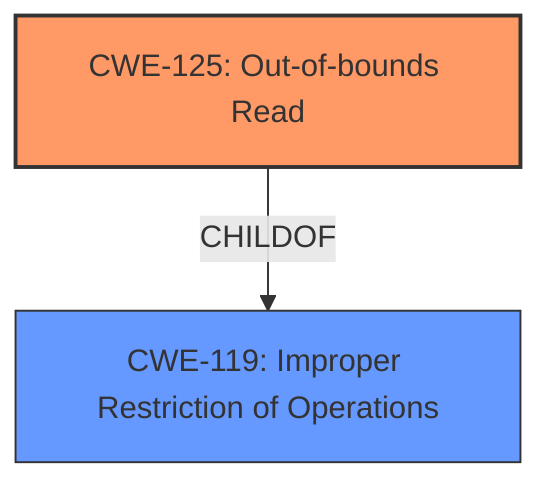

# Enhanced Analysis for CVE-2021-22789

# Summary
| CWE ID | CWE Name | Confidence | CWE Abstraction Level | CWE Vulnerability Mapping Label | CWE-Vulnerability Mapping Notes |
|---|---|---|---|---|---|
| CWE-125 | Out-of-bounds Read | 0.8 | Base | Primary | Allowed |
| CWE-119 | Improper Restriction of Operations within the Bounds of a Memory Buffer | 0.6 | Class | Secondary | Discouraged |

## Evidence and Confidence

*   **Confidence Score:** 0.8
*   **Evidence Strength:** HIGH

## Relationship Analysis
The primary CWE selected is CWE-125, which is a base level CWE and a child of CWE-119. While the initial vulnerability description mentions CWE-119, the CVE reference link content summary indicates a buffer overflow, which could lead to out-of-bounds read or write. Given that CWE-125 was the primary match for similar CVE descriptions, and given the advisory's mention of a buffer overflow, CWE-125 is a more precise match. The relationship between CWE-119 and its children influenced the decision to prefer the more specific CWE-125.



## Vulnerability Chain
The vulnerability chain starts with a specially crafted project file leading to a buffer overflow and then resulting in an out-of-bounds read, which leads to a denial of service.

## Summary of Analysis
The initial assessment was based on the vulnerability description, which indicated **CWE-119 Improper Restriction of Operations within the Bounds of a Memory Buffer**. However, the **CVE Reference Links Content Summary** provides more specific information, stating that the vulnerability is related to a potential **buffer overflow**. Further, the **CWE for similar CVE Descriptions** lists **CWE-125 Out-of-bounds Read** as the primary match. Given the additional context and the mapping guidance, **CWE-125** is a more accurate and specific classification.

The evidence supporting this decision includes:

*   Vulnerability Description Key Phrases: "**rootcause: CWE-119 Improper Restriction of Operations within the Bounds of a Memory Buffer**"
*   CVE Reference Links Content Summary: "The vulnerability is related to a potential **buffer overflow** in Schneider Electric's Modicon PAC controllers"
*   CWE for similar CVE Descriptions: "Primary CWE Match: **CWE-125**"

The selection of CWE-125 is at the optimal level of specificity because it directly addresses the out-of-bounds read condition resulting from the buffer overflow, rather than the more general "improper restriction of operations."

Relevant CWE Information:

# Enhanced Context (25 CWEs)

## CWE-345: Insufficient Verification of Data Authenticity
**Abstraction Level**: Class
**Similarity Score**: 0.78
**Source**: dense

**Description**:
The product does not sufficiently verify the origin or authenticity of data, in a way that causes it to accept invalid data.

**Mapping Guidance**:
- Usage: Discouraged
- Rationale: This CWE entry is a level-1 Class (i.e., a child of a Pillar). It might have lower-level children that would be more appropriate

*Not Selected*: This CWE is not relevant as the vulnerability stems from a buffer overflow due to a specially crafted file, not from a lack of data authenticity verification.

## CWE-226: Sensitive Information in Resource Not Removed Before Reuse
**Abstraction Level**: Base
**Similarity Score**: 0.77
**Source**: dense

**Description**:
The product releases a resource such as memory or a file so that it can be made available for reuse, but it does not clear or "zeroize" the information contained in the resource before the product performs a critical state transition or makes the resource available for reuse by other entities.

**Mapping Guidance**:
- Usage: Allowed
- Rationale: This CWE entry is at the Base level of abstraction, which is a preferred level of abstraction for mapping to the root causes of vulnerabilities.

*Not Selected*: This CWE is not relevant because the vulnerability is related to a buffer overflow, not the reuse of sensitive information.

## CWE-657: Violation of Secure Design Principles
**Abstraction Level**: Class
**Similarity Score**: 0.77
**Source**: dense

**Description**:
The product violates well-established principles for secure design.

**Mapping Guidance**:
- Usage: Discouraged
- Rationale: This CWE entry is a level-1 Class (i.e., a child of a Pillar). It might have lower-level children that would be more appropriate

*Not Selected*: This is a very general CWE and does not provide enough specificity for this vulnerability.

## CWE-668: Exposure of Resource to Wrong Sphere
**Abstraction Level**: Class
**Similarity Score**: 0.77
**Source**: dense

**Description**:
The product exposes a resource to the wrong control sphere, providing unintended actors with inappropriate access to the resource.

**Mapping Guidance**:
- Usage: Discouraged
- Rationale: CWE-668 is high-level and is often misused as a catch-all when lower-level CWE IDs might be applicable. It is sometimes used for low-information vulnerability reports [REF-1287]. It is a level-1 Class (i.e., a child of a Pillar). It is not useful for trend analysis.

*Not Selected*: This CWE is not relevant as the vulnerability is due to a buffer overflow, not exposure of a resource to the wrong sphere.

## CWE-404: Improper Resource Shutdown or Release
**Abstraction Level**: Class
**Similarity Score**: 0.76
**Source**: dense

**Description**:
The product does not release or incorrectly releases a resource before it is made available for re-use.

**Mapping Guidance**:
- Usage: Allowed-with-Review
- Rationale: This CWE entry is a Class and might have Base-level children that would be more appropriate

*Not Selected*: This CWE is not relevant as the vulnerability is due to a buffer overflow, not improper resource shutdown or release.

## CWE-807: Reliance on Untrusted Inputs in a Security Decision
**Abstraction Level**: Base
**Similarity Score**: 0.76
**Source**: dense

**Description**:
The product uses a protection mechanism that relies on the existence or values of an input, but the input can be modified by an untrusted actor in a way that bypasses the protection mechanism.

**Mapping Guidance**:
- Usage: Allowed
- Rationale: This CWE entry is at the Base level of abstraction, which is a preferred level of abstraction for mapping to the root causes of vulnerabilities.

*Not Selected*: This CWE is not relevant as the vulnerability is due to a buffer overflow, not reliance on untrusted inputs in a security decision.

## CWE-1391: Use of Weak Credentials
**Abstraction Level**: Class
**Similarity Score**: 0.76
**Source**: dense

**Description**:
The product uses weak credentials (such as a default key or hard-coded password) that can be calculated, derived, reused, or guessed by an attacker.

**Mapping Guidance**:
- Usage: Allowed-with-Review
- Rationale: This CWE entry is a Class and might have Base-level children that would be more appropriate

*Not Selected*: This CWE is not relevant as the vulnerability is due to a buffer overflow, not the use of weak credentials.

## CWE-212: Improper Removal of Sensitive Information Before Storage or Transfer
**Abstraction Level**: Base
**Similarity Score**: 0.75
**Source**: dense

**Description**:
The product stores, transfers, or shares a resource that contains sensitive information, but it does not properly remove that information before the product makes the resource available to unauthorized actors.

**Mapping Guidance**:
- Usage: Allowed
- Rationale: This CWE entry is at the Base level of abstraction, which is a preferred level of abstraction for mapping to the root causes of vulnerabilities.

*Not Selected*: This CWE is not relevant as the vulnerability is due to a buffer overflow, not improper removal of sensitive information.

## CWE-667: Improper Locking
**Abstraction Level**: Class
**Similarity Score**: 0.75
**Source**: dense

**Description**:
The product does not properly acquire or release a lock on a resource, leading to unexpected resource state changes and behaviors.

**Mapping Guidance**:
- Usage: Allowed-with-Review
- Rationale: This CWE entry is a Class and might have Base-level children that would be more appropriate

*Not Selected*: This CWE is not relevant as the vulnerability is due to a buffer overflow, not improper locking.

## CWE-274: Improper Handling of Insufficient Privileges
**Abstraction Level**: Base
**Similarity Score**: 0.75
**Source**: dense

**Description**:
The product does not handle or incorrectly handles when it has insufficient privileges to perform


## CWE Relationship Analysis

Current CWEs represent these abstraction levels: .


### Vulnerability Chain Analysis

**Chain starting from CWE-667:**
- 667 (Improper Locking) - ROOT


**Chain starting from CWE-657:**
- 657 (Violation of Secure Design Principles) - ROOT


### CWE Relationship Diagram

```mermaid
graph TD
    classDef primary fill:#f96,stroke:#333,stroke-width:2px
    classDef secondary fill:#69f,stroke:#333
    classDef tertiary fill:#9e9,stroke:#333
```