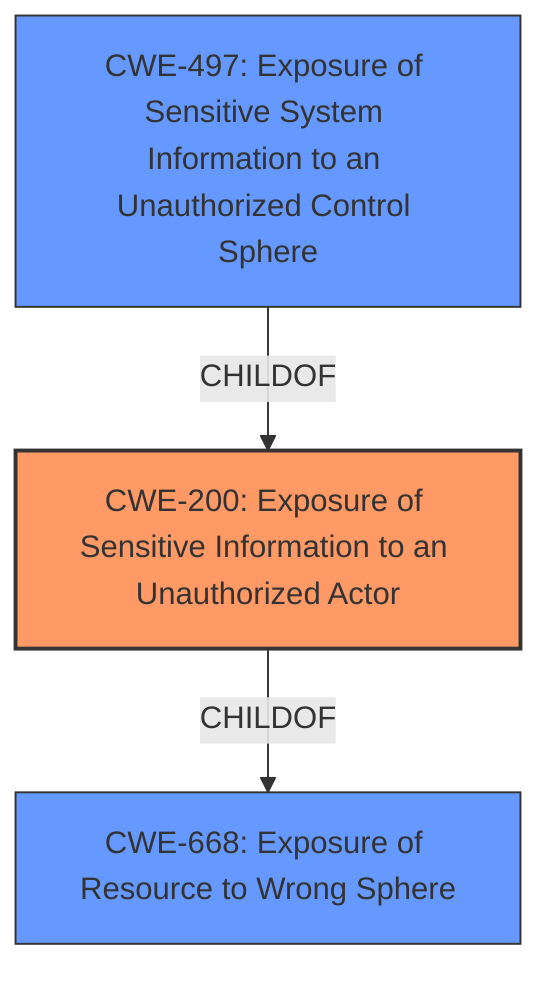

# Analysis for CVE-2021-22793

# Summary
| CWE ID  | CWE Name                                                        | Confidence | CWE Abstraction Level | CWE Vulnerability Mapping Label | CWE-Vulnerability Mapping Notes |
| :-------- | :-------------------------------------------------------------- | :--------- | :-------------------- | :------------------------------ | :------------------------------ |
| CWE-200   | Exposure of Sensitive Information to an Unauthorized Actor        | 0.9        | Class                 | Primary                         | Discouraged                   |
| CWE-668   | Exposure of Resource to Wrong Sphere                            | 0.6        | Class                 | Secondary                       | Discouraged                   |
| CWE-497   | Exposure of Sensitive System Information to an Unauthorized Control Sphere | 0.5        | Base                  | Secondary                       | Allowed                       |

## Evidence and Confidence

*   **Confidence Score:** 0.7
*   **Evidence Strength:** MEDIUM

## Relationship Analysis
The primary relationship is that CWE-497 is a child of CWE-200, indicating that exposing sensitive system information is a specific type of information exposure. CWE-668 is a higher-level class that broadly covers exposing resources to the wrong sphere. The abstraction levels influenced the choice; while CWE-497 is more specific, the evidence is not strong enough to definitively classify it as system-level information exposure.

## Vulnerability Chain
The vulnerability chain is as follows:

1.  **Root Cause:** **Exposure of Sensitive Information to an Unauthorized Actor** (CWE-200) due to an unspecified issue in AccuSine products.
2.  **Impact:** Authenticated attacker can access the device via FTP protocol.

The chain is somewhat incomplete because the exact mechanism for exposing sensitive information is not detailed in the description.

## Summary of Analysis
The initial assessment focused on the provided vulnerability description, which explicitly mentions "**Exposure of Sensitive Information to an Unauthorized Actor**". The description states, "A CWE-200 **Exposure of Sensitive Information to an Unauthorized Actor** vulnerability exist in AccuSine PCS+ / PFV+ (Versions prior to V1.6.7) and AccuSine PCSn (Versions prior to V2.2.4) that could allow an authenticated attacker to access the device via FTP protocol."

The retriever results also list CWE-200 as the top candidate. However, the mapping guidance for CWE-200 discourages its use as it is a high-level class and recommends using more specific CWEs if possible.

The next best candidate from the retriever results is CWE-497, **Exposure of Sensitive System Information to an Unauthorized Control Sphere**. This is a child of CWE-200 and a more specific base-level CWE. However, the vulnerability description does not explicitly mention that the exposed information is system-level. Accessing the device via FTP *could* lead to exposure of system information, but that's an assumption.

CWE-668, **Exposure of Resource to Wrong Sphere**, is a class-level CWE and a parent of CWE-200. While applicable, it's too broad and the mapping guidance discourages its use.

Given the explicit mention of CWE-200 in the vulnerability description and its presence as the top candidate in the retriever results, CWE-200 is selected as the primary CWE. However, its discouraged usage and the possibility of a more specific CWE necessitate considering related CWEs.

CWE-497 is considered as a secondary CWE because it is a more specific child of CWE-200 and the FTP access *could* lead to exposure of system information. CWE-668 is also considered as a secondary CWE due to its broad applicability to resource exposure.

The final decision is based on the available evidence, with a preference for specificity balanced against the mapping guidance's discouragement of CWE-200.

Relevant CWE Information:
*   **CWE-200 (Exposure of Sensitive Information to an Unauthorized Actor):** This CWE is selected as the primary weakness because the vulnerability description explicitly mentions it. The vulnerability allows an authenticated attacker to access the device via FTP, which could lead to the exposure of sensitive information. While CWE-200 is a class-level CWE and its usage is discouraged, the direct reference in the description and the lack of more specific details justify its selection.
*   **CWE-668 (Exposure of Resource to Wrong Sphere):** This CWE is considered a secondary weakness because it broadly covers the exposure of resources to the wrong control sphere. While applicable, it is a high-level class and less specific than CWE-200. The mapping guidance discourages its use.
*   **CWE-497 (Exposure of Sensitive System Information to an Unauthorized Control Sphere):** This CWE is considered as a secondary weakness because the FTP access *could* lead to exposure of system information, it's a base level CWE, which is good, but it's less clear in the description.