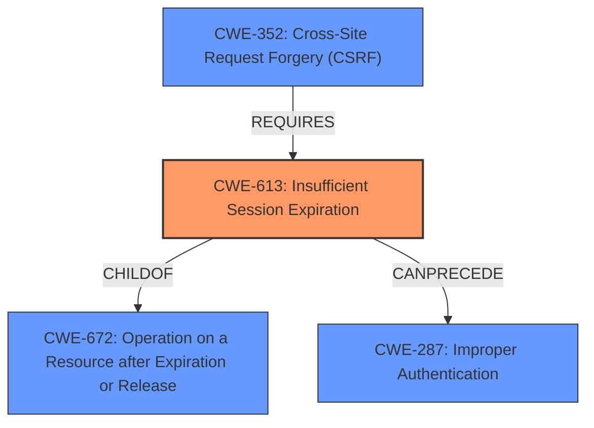

# Raw Analyzer Response for CVE-2021-22820

# Summary
| CWE ID | CWE Name | Confidence | CWE Abstraction Level | CWE Vulnerability Mapping Label | CWE-Vulnerability Mapping Notes |
|---|---|---|---|---|---|
| CWE-613 | Insufficient Session Expiration | 1.0 | Base | Allowed | Primary CWE |

## Evidence and Confidence

*   **Confidence Score:** 1.0
*   **Evidence Strength:** HIGH

## Relationship Analysis
The primary relationship impacting the decision is the direct match of the vulnerability description to the definition of CWE-613. The other CWEs were either too general (e.g., CWE-200, CWE-287) or focused on related but distinct issues (e.g., CWE-79, CWE-384).

## Vulnerability Chain
The vulnerability chain starts with the **insufficient session expiration** (CWE-613), which allows an attacker to maintain unauthorized access even after the legitimate user changes their password. The impact is the sustained unauthorized access.

## Summary of Analysis
The analysis is based on the provided vulnerability description, which explicitly states that the vulnerability is due to **insufficient session expiration**.

Evidence: "A CWE-614 **Insufficient Session Expiration** vulnerability exists that could allow an attacker to maintain an unauthorized access over a hijacked session to the charger station web server even after the legitimate user account holder has changed his password."

The graph relationships highlight that CWE-613 can lead to improper authentication (CWE-287) because the session remains valid even after a password change. It is also a requirement for CSRF (CWE-352) attacks.

The selected CWE is at the optimal level of specificity because it directly addresses the root cause described in the vulnerability description.

Relevant CWE Information:

*   **CWE-613: Insufficient Session Expiration**
    *   **Technical Explanation:** The web application does not properly invalidate sessions, allowing them to be reused even after a user has logged out or changed their password. This can occur due to various reasons, such as incorrect configuration, **failure to implement proper session management**, or relying on default settings that provide overly long session durations.
    *   **Security Implications:** An attacker can hijack a session by obtaining a valid session ID (e.g., through network sniffing, XSS, or social engineering). If the session remains active even after the legitimate user has logged out or changed their password, the attacker can continue to use the hijacked session to access the application as that user.
    *   **Relationships:** ChildOf CWE-672 (Operation on a Resource after Expiration or Release), CanPrecede CWE-287 (Improper Authentication), RequiredBy CWE-352 (Cross-Site Request Forgery).
    *   **Mapping Guidance:** Usage: Allowed. Rationale: Base level of abstraction.
    *   **Why selected:** The vulnerability description explicitly mentions **"Insufficient Session Expiration"** as the root cause.

*   **CWE-759: Use of a One-Way Hash without a Salt**
    *   Not Selected: This CWE is related to password storage, not session management.

*   **CWE-347: Improper Verification of Cryptographic Signature**
    *   Not Selected: This CWE is about cryptographic signature verification, which is not directly related to the **session expiration** issue.

*   **CWE-200: Exposure of Sensitive Information to an Unauthorized Actor**
    *   Not Selected: While unauthorized access is a consequence, CWE-200 is too broad and doesn't capture the specific flaw of **insufficient session expiration**. The **root cause** is not about exposing information, but rather **improperly managing sessions.**

*   **CWE-79: Improper Neutralization of Input During Web Page Generation ('Cross-site Scripting')**
    *   Not Selected: XSS is a different type of vulnerability that involves injecting malicious scripts into web pages. It is not directly related to the **session expiration** issue.

*   **CWE-384: Session Fixation**
    *   Not Selected: Session fixation is a different attack vector that involves forcing a user to use a known session ID. While related to session management, it's not the **root cause** described in the vulnerability, which is the **failure to expire sessions**.

*   **CWE-567: Unsynchronized Access to Shared Data in a Multithreaded Context**
    *   Not Selected: This CWE is about multithreading issues, not session management.

*   **CWE-287: Improper Authentication**
    *   Not Selected: While **insufficient session expiration** can lead to authentication issues, it's a more specific **root cause**. CWE-287 is too broad.

*   **CWE-306: Missing Authentication for Critical Function**
    *   Not Selected: This CWE is about missing authentication, not about sessions not expiring.

*   **CWE-1390: Weak Authentication**
    *   Not Selected: The problem is not with the authentication mechanism itself being weak but with the session not expiring.