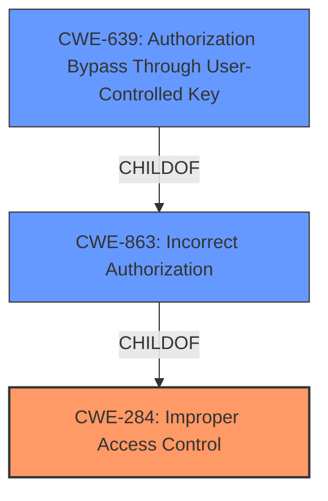

# Enhanced Analysis for CVE-2021-22853

# Summary
| CWE ID | CWE Name | Confidence | CWE Abstraction Level | CWE Vulnerability Mapping Label | CWE-Vulnerability Mapping Notes |
|---|---|---|---|---|---|
| CWE-284 | Improper Access Control | 0.8 | Pillar | Primary | Discouraged: CWE-284 is extremely high-level, a Pillar. |
| CWE-863 | Incorrect Authorization | 0.7 | Class | Secondary | Allowed-with-Review: This CWE entry is a Class and might have Base-level children that would be more appropriate. |
| CWE-639 | Authorization Bypass Through User-Controlled Key | 0.6 | Base | Secondary | Allowed: This CWE entry is at the Base level of abstraction, which is a preferred level of abstraction for mapping to the root causes of vulnerabilities. |

## Evidence and Confidence

*   **Confidence Score:** 0.7
*   **Evidence Strength:** HIGH

## Relationship Analysis
The primary relationship that influenced the selection was the hierarchical structure, especially the parent-child relationship between CWE-284, CWE-863 and CWE-639. CWE-284 is a Pillar and parent of CWE-863, which is a Class. CWE-863 is a parent of CWE-639, which is a Base level CWE. The retriever results and the vulnerability description pointed towards access control issues, making these relationships highly relevant.



## Vulnerability Chain
The vulnerability chain starts with **failures in access control**, leading to unauthorized access to sensitive user information and subsequent malfunction of the login function.
  - **Root Cause:** **fails to manage access control**
  - **Weakness:** Insufficient access control mechanisms allow unauthorized access to sensitive data.
  - **Impact:** access users login information and login function not to work

## Summary of Analysis
The initial assessment focused on the **failures in access control** highlighted in the vulnerability description and the "Broken Access Control" from the CVE Reference Links Content Summary. The Retriever results also show CWE-639, CWE-863, and CWE-284 as the top candidates.

The vulnerability description explicitly mentions that the "HR Portal of Soar Cloud System **fails to manage access control**," and remote attackers can access sensitive data via a specific data packet. This aligns with the definition of CWE-284 as a general term for when a product does not restrict or incorrectly restricts access to a resource from an unauthorized actor.

The CVE Reference Links Content Summary corroborates this, stating the root cause as "Broken Access Control" and highlighting that "Insufficient access control mechanisms allow unauthorized access to sensitive data."

The selection of CWEs was also influenced by the relationships between them. CWE-284 is a high-level category, while CWE-863 and CWE-639 are more specific. Given the information available, it's difficult to pinpoint the exact mechanism of the access control failure, so including both CWE-863 and CWE-639 as secondary considerations provides a more comprehensive view of the potential weaknesses.

Ultimately, CWE-284 was chosen as the primary CWE due to its direct alignment with the described **failure in access control**. However, the discouraged usage suggests further refinement when more information becomes available. The secondary CWEs, CWE-863 and CWE-639, offer possible refinements based on the nature of the incorrect authorization.

Relevant CWE Information:

# Enhanced Context (25 CWEs)
The following CWEs were identified as potentially relevant to this vulnerability:

## CWE-284: Improper Access Control
**Abstraction:** Pillar
**Status:** Incomplete

### Description
The product does not restrict or incorrectly restricts access to a resource from an unauthorized actor.

### Extended Description
Access control involves the use of several protection mechanisms such as:
  - Authentication (proving the identity of an actor)
  - Authorization (ensuring that a given actor can access a resource), and
  - Accountability (tracking of activities that were performed)

When any mechanism is not applied or otherwise fails, attackers can compromise the security of the product by gaining privileges, reading sensitive information, executing commands, evading detection, etc.

### Alternative Terms
Authorization: The terms "access control" and "authorization" are often used interchangeably, although many people have distinct definitions.

### Relationships
None

### Mapping Guidance
**Usage:** Discouraged
**Rationale:** CWE-284 is extremely high-level, a Pillar. Its name, "Improper Access Control," is often misused in low-information vulnerability reports or by active use of the OWASP Top Ten, such as "A01:2021-Broken Access Control". It is not useful for trend analysis.
**Comments:** Consider using descendants of CWE-284 that are more specific to the kind of access control involved.
**Reasons:**
- Frequent Misuse
- Abstraction
**Suggested Alternatives:**
- CWE-862: Missing Authorization
- CWE-863: Incorrect Authorization
- CWE-732: Incorrect Permission Assignment for Critical Resource
- CWE-306: Missing Authentication
- CWE-1390: Weak Authentication
- CWE-923: Improper Restriction of Communication Channel to Intended Endpoints


## CWE Relationship Analysis

Current CWEs represent these abstraction levels: .


### Vulnerability Chain Analysis

**Chain starting from CWE-732:**
- 732 (Incorrect Permission Assignment for Critical Resource) - ROOT


**Chain starting from CWE-306:**
- 306 (Missing Authentication for Critical Function) - ROOT


### CWE Relationship Diagram

```mermaid
graph TD
    classDef primary fill:#f96,stroke:#333,stroke-width:2px
    classDef secondary fill:#69f,stroke:#333
    classDef tertiary fill:#9e9,stroke:#333
```