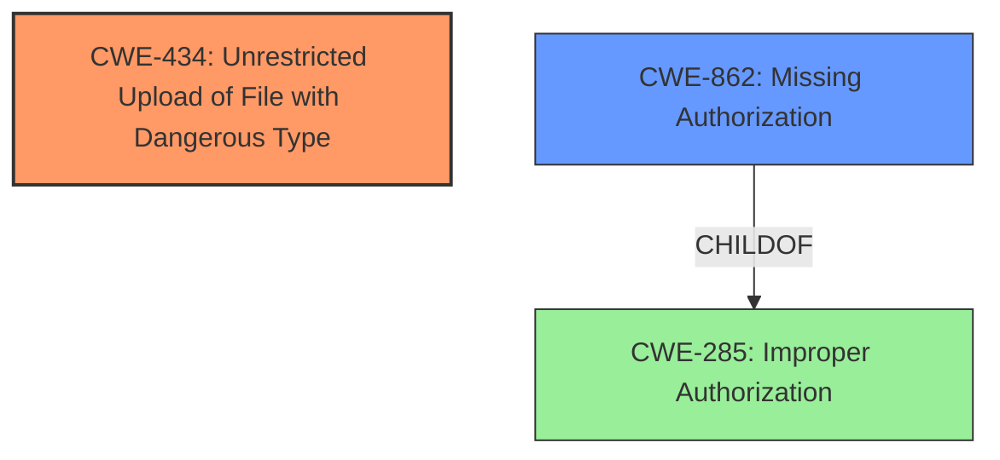

# Enhanced Analysis for CVE-2021-22858

# Summary
| CWE ID | CWE Name | Confidence | CWE Abstraction Level | CWE Vulnerability Mapping Label | CWE-Vulnerability Mapping Notes |
|---|---|---|---|---|---|
| CWE-434 | Unrestricted Upload of File with Dangerous Type | 0.9 | Base | Primary | Allowed |
| CWE-862 | Missing Authorization | 0.7 | Class | Secondary | Allowed-with-Review |

## Evidence and Confidence

*   **Confidence Score:** 0.8
*   **Evidence Strength:** MEDIUM

## Relationship Analysis
The primary CWE is CWE-434, which deals with unrestricted file uploads. This is related to the **misconfigured file upload filter** mentioned in the CVE description. A secondary CWE is CWE-862, which represents missing authorization. This is in line with the description that "attackers can access the CGE account management function without privilege for permission elevation."



## Vulnerability Chain
The vulnerability chain starts with a **misconfigured file upload filter** (leading to CWE-434) and then proceeds to a **missing authorization** check (CWE-862) when accessing account management functionality. This enables attackers to upload unrestricted files, potentially leading to remote code execution and privilege escalation.
1.  **Root Cause:** Misconfigured file upload filter
2.  **Weakness 1:** CWE-434: Unrestricted Upload of File with Dangerous Type
3.  **Weakness 2:** CWE-862: Missing Authorization
4.  **Impact:** Remote Code Execution, Privilege Escalation

## Summary of Analysis
The primary weakness is the **misconfigured file upload filter**, which leads to CWE-434 (Unrestricted Upload of File with Dangerous Type). The secondary weakness is the **lack of privilege** check to access account management leading to CWE-862 (Missing Authorization), which then allows privilege escalation and execution of arbitrary commands.

The CVE Reference Links Content Summary clearly states the "**root_cause**" as "Misconfigured file upload filter," which directly relates to CWE-434.

The vulnerability description mentions "Attackers can access the CGE account management function without privilege for permission elevation," which is why CWE-862 is being added as a secondary CWE to show the full picture.

CWE-434 is at the Base level of abstraction, which is the preferred level. CWE-862 is at the Class level, but I am selecting it because it is more descriptive than the parent, CWE-285, and a child entry isn't a more appropriate fit based on the information provided.

Relevant CWE Information:

# Enhanced Context (25 CWEs)

## CWE-434: Unrestricted Upload of File with Dangerous Type
**Abstraction:** Base
**Status:** Draft

### Description
The product allows the upload or transfer of dangerous file types that are automatically processed within its environment.

### Extended Description
Not provided

### Alternative Terms
Unrestricted File Upload: Used in vulnerability databases and elsewhere, but it is insufficiently precise. The phrase could be interpreted as the lack of restrictions on the size or number of uploaded files, which is a resource consumption issue.

### Relationships
ChildOf -> CWE-669
ChildOf -> CWE-669
PeerOf -> CWE-351
PeerOf -> CWE-436
PeerOf -> CWE-430

### Mapping Guidance
**Usage:** Allowed
**Rationale:** This CWE entry is at the Base level of abstraction, which is a preferred level of abstraction for mapping to the root causes of vulnerabilities.
**Comments:** Carefully read both the name and description to ensure that this mapping is an appropriate fit. Do not try to 'force' a mapping to a lower-level Base/Variant simply to comply with this preferred level of abstraction.
**Reasons:**
- Acceptable-Use


### Additional Notes
**[Relationship]**

This can have a chaining relationship with incomplete denylist / permissive allowlist errors when the product tries, but fails, to properly limit which types of files are allowed (CWE-183, CWE-184).


This can also overlap multiple interpretation errors for intermediaries, e.g. anti-virus products that do not remove or quarantine attachments with certain file extensions that can be processed by client systems.


### Observed Examples
- **CVE-2023-5227:** PHP-based FAQ management app does not check the MIME type for uploaded images
- **CVE-2001-0901:** Web-based mail product stores ".shtml" attachments that could contain SSI
- **CVE-2002-1841:** PHP upload does not restrict file types

**Justification:**
The CVE description states "Misconfigured file upload filter," indicating that the application does not properly restrict the types of files that can be uploaded, which aligns perfectly with the description of CWE-434. This can lead to remote code execution, as mentioned in the CVE details.

## CWE-862: Missing Authorization
**Abstraction:** Class
**Status:** Incomplete

### Description
The product does not perform an authorization check when an actor attempts to access a resource or perform an action.

### Extended Description
Not provided

### Alternative Terms
AuthZ: "AuthZ" is typically used as an abbreviation of "authorization" within the web application security community. It is distinct from "AuthN" (or, sometimes, "AuthC") which is an abbreviation of "authentication." The use of "Auth" as an abbreviation is discouraged, since it could be used for either authentication or authorization.

### Relationships
ChildOf -> CWE-285
ChildOf -> CWE-284

### Mapping Guidance
**Usage:** Allowed-with-Review
**Rationale:** This CWE entry is a Class and might have Base-level children that would be more appropriate
**Comments:** Examine children of this entry to see if there is a better fit
**Reasons:**
- Abstraction


### Additional Notes
**[Terminology]** Assuming a user with a given identity, authorization is the process of determining whether that user can access a given resource, based on the user's privileges and any permissions or other access-control specifications that apply to the resource.


### Observed Examples
- **CVE-2022-24730:** Go-based continuous deployment product does not check that a user has certain privileges to update or create an app, allowing adversaries to read sensitive repository information
- **CVE-2009-3168:** Web application does not restrict access to admin scripts, allowing authenticated users to reset administrative passwords.
- **CVE-2009-3597:** Web application stores database file under the web root with insufficient access control (CWE-219), allowing direct request.

**Justification:**
The vulnerability description states that "Attackers can access the CGE account management function without privilege for permission elevation," which indicates a **missing authorization** check. CWE-862 directly addresses this scenario where the product does not verify whether the user has the necessary privileges to perform the action.


## CWE Relationship Analysis

Current CWEs represent these abstraction levels: .


### Vulnerability Chain Analysis

**Chain starting from CWE-862:**
- 862 (Missing Authorization) - ROOT


**Chain starting from CWE-284:**
- 284 (Improper Access Control) - ROOT


### CWE Relationship Diagram

```mermaid
graph TD
    classDef primary fill:#f96,stroke:#333,stroke-width:2px
    classDef secondary fill:#69f,stroke:#333
    classDef tertiary fill:#9e9,stroke:#333
```